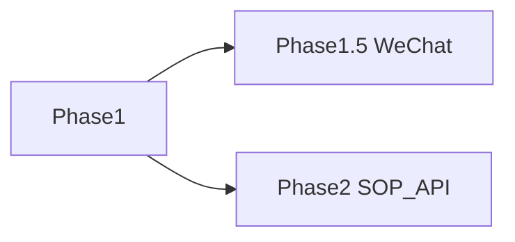

# 01 Phase 清单

Phase 是交付阶段索引（类比 Feature List）。每个 Phase 目录内再用 Feature List 列最小交付单位。

| Phase | 名称 | 状态 | 入口 | Feature List |
|-------|------|------|------|--------------|
| Phase 1 | Email 注册/登录、租户子域、文档 admin、索引、RAG Agent | 进行中 | [phase1/](phase1/) | [phase1/01-feature-list.md](phase1/01-feature-list.md) |
| Phase 1.5 | 微信登录 | 预留 | [phase2/](phase2/) | 落地时新建 |
| Phase 2 | SOP 强制验证门禁、`{subdomain}.lxzxai.com/api` 对外网关 | 预留 | [phase2/](phase2/) | 落地时新建 |

## 预留摘要

| 代号 | 名称 | Phase | 说明 |
|------|------|-------|------|
| P1.5-WeChat | 微信登录 | 1.5 | 接口预留，见 [phase2/README.md](phase2/README.md) |
| P2-SOP-Gate | SOP 强制验证门禁 | 2 | 验证成功才能发布/上传 |
| P2-API | 对外 API 网关 | 2 | `{subdomain}.lxzxai.com/api` |

## 阅读顺序

1. [00-constraints.mdc](../../.cursor/rules/00-constraints.mdc) — 全项目根本约束
2. 本文件 — Phase 索引
3. 对应 Phase 的 Feature List → 各 Feature Spec
