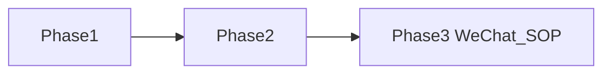

# 01 Phase 清单

Phase 是交付阶段索引（类比 Feature List）。每个 Phase 目录内再用 Feature List 列最小交付单位。

| Phase | 名称 | 状态 | 入口 | Feature List |
|-------|------|------|------|--------------|
| Phase 1 | Email 注册/登录、租户子域、文档 admin、索引、RAG Agent | 进行中 | [phase1/](phase1/) | [phase1/01-feature-list.md](phase1/01-feature-list.md) |
| Phase 2 | Office OOXML、admin 文件夹树与预览、对外 API、Embed Widget、Portal FAQ / 壳增强 | Spec 进行中 | [phase2/](phase2/) | [phase2/01-feature-list.md](phase2/01-feature-list.md) |
| Phase 3 | 微信登录、SOP 强制验证门禁 | 预留 | 落地时新建 | 落地时新建 |

## Phase 3 预留摘要

| 代号 | 名称 | Phase | 说明 |
|------|------|-------|------|
| P3-WeChat | 微信登录 | 3 | 扫码/OAuth；Phase 1/2 不做验收 |
| P3-SOP-Gate | SOP 强制验证门禁 | 3 | SOP tag 须内容校验通过才能 publish |
| P3-OCR | OCR / 扫描件 | 3+ | Phase 1 `do_ocr=false` |
| P3-HeadingDepth | 任意深标题树 | 3+ | Phase 1 仅 H1/H2 |

## 阅读顺序

1. [00-constraints.mdc](../../.cursor/rules/00-constraints.mdc) — 全项目根本约束
2. 本文件 — Phase 索引
3. 对应 Phase 的 Feature List → 各 Feature Spec
