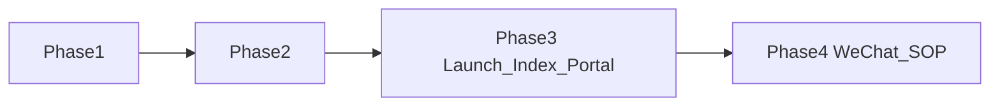

# 01 Phase 清单

Phase 是交付阶段索引（类比 Feature List）。每个 Phase 目录内再用 Feature List 列最小交付单位。  
Feature ID 全局格式：`P{phase}-F{nn}-{slug}`（见 constraints §8.0）。

| Phase | 名称 | 状态 | 入口 | Feature List |
|-------|------|------|------|--------------|
| Phase 1 | Email 注册/登录、租户子域、文档 admin、索引、RAG Agent | 进行中 | [phase1/](phase1/) | [phase1/01-feature-list.md](phase1/01-feature-list.md) |
| Phase 2 | Office OOXML、admin 文件夹树与预览、对外 API、Embed Widget、Portal FAQ / 壳 | Spec/实现进行中 | [phase2/](phase2/) | [phase2/01-feature-list.md](phase2/01-feature-list.md) |
| Phase 3 | 生产上线主 Flow、索引质量增强、Portal Cursor 风搜索、Debug Page | Spec 进行中 | [phase3/](phase3/) | [phase3/01-feature-list.md](phase3/01-feature-list.md) |
| Phase 4 | 微信登录、SOP 强制验证门禁 | 预留 | 落地时新建 | 落地时新建 |

```mermaid
flowchart LR
  P1[Phase1] --> P2[Phase2]
  P2 --> P3[Phase3 Launch_Index_Portal]
  P3 --> P4[Phase4 WeChat_SOP]
```

## Phase 4 预留摘要

| 代号 | 名称 | Phase | 说明 |
|------|------|-------|------|
| P4-WeChat | 微信登录 | 4 | 扫码/OAuth；Phase 1–3 不做验收 |
| P4-SOP-Gate | SOP 强制验证门禁 | 4 | SOP tag 须内容校验通过才能 publish |

> OCR / 索引结构增强已纳入 Phase 3 [P3-F02](phase3/features/P3-F02-index-quality.md)，不再单独挂「3+」预留。

## 阅读顺序

1. [00-constraints.mdc](../../.cursor/rules/00-constraints.mdc) — 全项目根本约束
2. 本文件 — Phase 索引
3. 对应 Phase 的 Feature List → 各 Feature Spec
