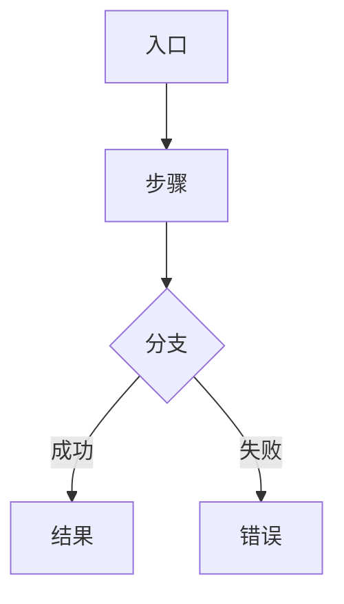

# Fxx 标题

> 一句话：这个 Feature 交付什么。

| 字段 | 值 |
|------|-----|
| **Status** | `draft` |
| **Owner** | |
| **Approved by** | |
| **Approved at** | |

> Status：`draft` → `review` → `approved` → `done`。未 `approved` 不得实现，见 [00-constraints.mdc](../../.cursor/rules/00-constraints.mdc) §8。

## 范围

- …

## 非范围

- …

## Flow

## 行为规则

1. …
2. …

## 数据与边界

> 全表强制含 `createtime` / `lastmodifiedtime`（timestamptz + trigger），见 [00-constraints.mdc](../../.cursor/rules/00-constraints.mdc) §3.1；下表可省略不写。

| 实体 | 关键字段 / 约束 |
|------|----------------|
| … | … |

## Test Cases

| ID | 步骤 | 期望 | 类型 |
|----|------|------|------|
| Fxx-T01 | Given … When … | Then … | api |
