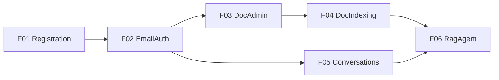

# 01 Feature 清单（Phase 1）

Phase 索引见 [../01-phase-list.md](../01-phase-list.md)。  
状态规则见 [00-constraints.mdc](../../../.cursor/rules/00-constraints.mdc) §8；**仅 `approved` / `done` 可实现**。

| ID | 名称 | Status | 域名表面 | 依赖 | Spec |
|----|------|--------|----------|------|------|
| F01 | 注册与租户子域 | `review` | `lxzxai.com` | — | [F01-registration-tenancy.md](features/F01-registration-tenancy.md) |
| F02 | Email 登录与会话 | `done` | `lxzxai.com`、`{subdomain}.lxzxai.com` | F01 | [F02-email-auth.md](features/F02-email-auth.md) |
| F03 | 文档管理 | `review` | `{subdomain}.lxzxai.com/admin` | F02 | [F03-doc-admin.md](features/F03-doc-admin.md) |
| F04 | 文档索引 | `review` | 后台 / 租户隔离 | F03 | [F04-doc-indexing.md](features/F04-doc-indexing.md) |
| F05 | 会话列表与归档 | `done` | `{subdomain}.lxzxai.com` | F02 | [F05-conversations.md](features/F05-conversations.md) |
| F06 | RAG Agent | `done` | `{subdomain}.lxzxai.com` | F04, F05 | [F06-rag-agent.md](features/F06-rag-agent.md) |

