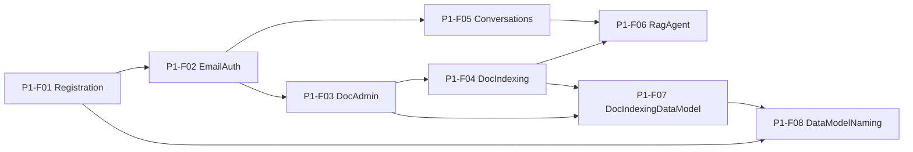

# 01 Feature 清单（Phase 1）

Phase 索引见 [../01-phase-list.md](../01-phase-list.md)。  
状态规则见 [00-constraints.mdc](../../../.cursor/rules/00-constraints.mdc) §8；**仅 `approved` / `done` 可实现**。

| ID | 名称 | Status | 域名表面 | 依赖 | Spec |
|----|------|--------|----------|------|------|
| P1-F01 | 注册与租户子域 | `review` | `lxzxai.com` | — | [P1-F01-registration-tenancy.md](features/P1-F01-registration-tenancy.md) |
| P1-F02 | Email 登录与会话 | `done` | `lxzxai.com`、`{subdomain}.lxzxai.com` | P1-F01 | [P1-F02-email-auth.md](features/P1-F02-email-auth.md) |
| P1-F03 | 文档管理 | `done` | `{subdomain}.lxzxai.com/admin` | P1-F02 | [P1-F03-doc-admin.md](features/P1-F03-doc-admin.md) |
| P1-F04 | 文档摄入与内部检索（PDF 骨架感知双路由；H1–H6 + leaf 向量） | `done` | 后台 / 租户隔离 | P1-F03 | [P1-F04-doc-ingestion.md](features/P1-F04-doc-ingestion.md) |
| P1-F05 | 会话列表与归档 | `done` | `{subdomain}.lxzxai.com` | P1-F02 | [P1-F05-conversations.md](features/P1-F05-conversations.md) |
| P1-F06 | RAG Agent | `done` | `{subdomain}.lxzxai.com` | P1-F04, P1-F05 | [P1-F06-rag-agent.md](features/P1-F06-rag-agent.md) |
| P1-F07 | 文档摄入数据模型重构（版本行 / 双状态 / `is_latest` / 富 chunk） | `done` | 后台 / 租户隔离 | P1-F03, P1-F04 | [P1-F07-doc-ingestion-data-model.md](features/P1-F07-doc-ingestion-data-model.md) |
| P1-F08 | 数据模型列命名与身份字段重构 | `done` | 全局 schema | P1-F01, P1-F07 | [P1-F08-data-model-naming-refactor.md](features/P1-F08-data-model-naming-refactor.md) |

```mermaid
flowchart LR
  P1-F01[P1-F01 Registration] --> P1-F02[P1-F02 EmailAuth]
  P1-F02 --> P1-F03[P1-F03 DocAdmin]
  P1-F03 --> P1-F04[P1-F04 DocIndexing]
  P1-F02 --> P1-F05[P1-F05 Conversations]
  P1-F04 --> P1-F06[P1-F06 RagAgent]
  P1-F05 --> P1-F06
  P1-F03 --> P1-F07[P1-F07 DocIndexingDataModel]
  P1-F04 --> P1-F07
  P1-F01 --> P1-F08[P1-F08 DataModelNaming]
  P1-F07 --> P1-F08
```
