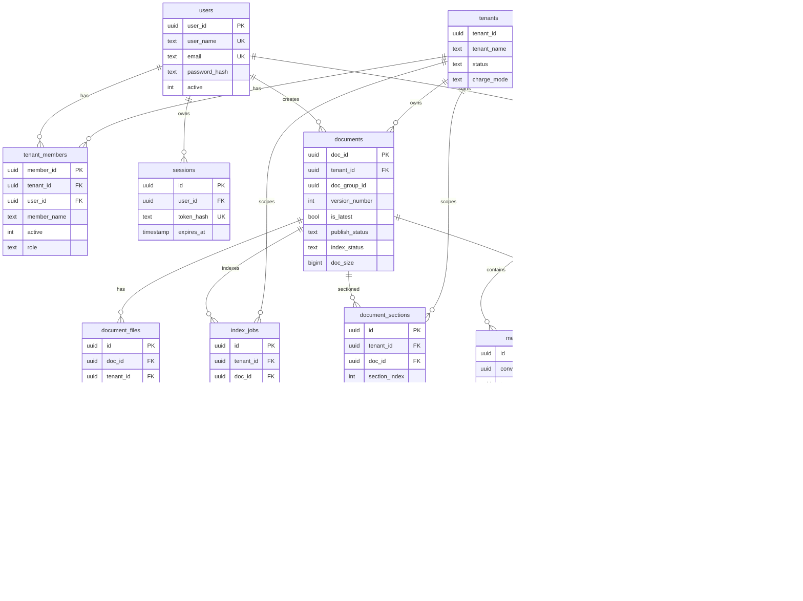

# 02 Phase 1 数据模型（共享 Schema · 租户隔离）

> 生产级多租户：**`rag_service` schema** 内共享表，业务行以 `tenant_id` 隔离（Shared Schema / Discriminator）。  
> 对齐 F01–F08 与 [00-constraints.mdc](../../../.cursor/rules/00-constraints.mdc)。  
> **F08 列命名**：身份/文档主键与业务列用显式名（`tenant_id`/`user_id`/`member_id`/`doc_id`/`chunk_id`；`tenant_name`；`doc_name`/`doc_group_id`/`version_number` 等）；**保留** `tenant_members.user_id` 与文档多版本 UK。  
> 向量列依赖扩展 **`pgvector`**。Embedding **模型与维度可配置**（Settings / 环境变量，默认 `EMBEDDING_DIM=1024`）；列类型为 `vector(EMBEDDING_DIM)`，须与所选 QWen embedding 模型一致。**变更维度须迁库并全量重建索引**；同一库内禁止混用多套维度。

## 1. 设计原则

| 原则 | 说明 |
|------|------|
| PostgreSQL Schema | 业务对象置于 **`rag_service`** schema；扩展可装于 `public` |
| 强制隔离 | 租户数据表必有 `tenant_id`；查询一律带租户谓词（含向量检索） |
| 全局身份 | `users` 全局唯一（email）；通过 `tenant_members` 归属租户 |
| 时间戳 | 全表 `create_at` / `update_at`（`timestamp` + trigger `tr_{表名}_lmt`），见 constraints §3.2 |
| 软删除 | 文档、会话等用 `deleted_at`；列表默认过滤非空 |
| 主键 | 业务表主键统一 `UUID`（`gen_random_uuid()`） |
| 注释 | 建表时对表、列执行 `COMMENT ON`（下文「注释」列即 COMMENT 文案） |
| 列顺序 | 业务列在前；审计/生命周期列置末：`created_by`（若有）→ `deleted_at`（若有）→ `create_at` → `update_at` |

### 1.1 Schema 与扩展

```sql
CREATE SCHEMA IF NOT EXISTS rag_service;
CREATE EXTENSION IF NOT EXISTS vector;   -- 通常装于 public
CREATE EXTENSION IF NOT EXISTS pgcrypto; -- gen_random_uuid
```

业务表一律 `rag_service.{table}`；**禁止**在 `public` 下建业务表。

### 1.2 共用时间戳 Trigger

```sql
CREATE OR REPLACE FUNCTION rag_service.f_common_update_at()
RETURNS TRIGGER AS $$
BEGIN
  NEW.update_at := now();
  RETURN NEW;
END;
$$ LANGUAGE plpgsql;

-- 每张业务表（例：users）：
CREATE TRIGGER tr_users_lmt
  BEFORE UPDATE ON rag_service.users
  FOR EACH ROW EXECUTE FUNCTION rag_service.f_common_update_at();
```

Trigger **命名规则**：`tr_{表名}_lmt`（不含 schema 前缀），如 `tr_tenant_members_lmt`、`tr_document_chunks_lmt`。

---

## 2. ER 图



---

## 3. 域分组与表清单

| 域 | 表名 | Spec | 说明 |
|----|------|------|------|
| 身份 / 租户 | `users` | F01 | 全局用户 |
| | `tenants` | F01 + F08 | 租户（`tenant_name` 兼 Host） |
| | `tenant_members` | F01 + F08 | 用户–租户成员（**必含 `user_id`**） |
| | `sessions` | F02 | 服务端会话（可吊销） |
| 知识库 | `documents` | F03 + F04 + F07 + F08 | 文档**版本行**（`doc_id`=版本 PK；`doc_group_id` 逻辑组；双状态；`version_number`） |
| | `document_files` | F03 | 源文件对象（FK → 版本行 `doc_id`） |
| 索引 | `index_jobs` | F04 | 索引任务队列（FK → 版本行 `doc_id`） |
| | `document_sections` | F04 | H1/H2 节（全文 + path；供检索返回） |
| | `document_chunks` | F04 + F08 | 节内 leaf + embedding（`chunk_id` / `doc_id`） |
| 数据模型 | （上表） | F07 / F08 | F07 版本行语义；F08 显式列命名与身份字段 |
| 对话 | `conversations` | F05 | 聊天会话 |
| | `messages` | F05/F06 | 消息（含 tool meta） |
| Agent | `agent_runs` | F06 | 单次 Agent 运行 |
| | `agent_run_steps` | F06 | 工具/推理轨迹（可测） |

---

## 4. 表结构明细

下列「注释」即建议的 `COMMENT ON TABLE/COLUMN` 中文说明。  
未再重复罗列的两列：每表均含 `create_at`、`update_at`（`timestamp`，`DEFAULT now()`）；各表 trigger 名 `tr_{表名}_lmt`。

### 4.1 `users` — 全局用户

**表注释**：平台用户账号；email / `user_name` 全局唯一；不直接承载租户数据。

| 字段 | 类型 | 约束 | 注释 |
|------|------|------|------|
| `user_id` | `uuid` | PK，`DEFAULT gen_random_uuid()` | 用户主键（F08；约束名 `pk_users_user_id`） |
| `user_name` | `text` | UNIQUE NOT NULL | 全局唯一用户名；注册时写入 |
| `email` | `text` | UNIQUE NOT NULL | 登录邮箱；写入前规范化为小写 |
| `password_hash` | `text` | NOT NULL | 密码不可逆哈希（argon2/bcrypt） |
| `active` | `int` | NOT NULL DEFAULT 1 | `1`=激活，`0`=禁用 |
| `create_at` | `timestamp` | NOT NULL DEFAULT now() | 创建时间；禁止 UPDATE 改写 |
| `update_at` | `timestamp` | NOT NULL DEFAULT now() | 最后修改时间；由 trigger 维护 |

**索引 / 约束**：`pk_users_user_id`；`uk_users_email`；`uk_users_user_name`。

---

### 4.2 `tenants` — 租户

**表注释**：租户组织；`tenant_name` 对应 `{tenant_name}.lxzxai.com`（原 `subdomain`）；Phase 1 注册时选定后不可改。

| 字段 | 类型 | 约束 | 注释 |
|------|------|------|------|
| `tenant_id` | `uuid` | PK | 租户主键；全库隔离键（`pk_tenants_tenant_id`） |
| `tenant_name` | `text` | UNIQUE NOT NULL | Host 子域标识；3–32；`[a-z0-9-]`；非保留字（`uk_tenants_tenant_name`） |
| `status` | `text` | NOT NULL DEFAULT `active` | `active` \| `suspended` |
| `charge_mode` | `text` | NOT NULL DEFAULT `free` | `free` \| `standard`（仅落列；无支付） |
| `create_at` | `timestamp` | NOT NULL DEFAULT now() | 创建时间 |
| `update_at` | `timestamp` | NOT NULL DEFAULT now() | 最后修改时间 |

**索引 / 约束**：`pk_tenants_tenant_id`；`uk_tenants_tenant_name`。无 `display_name`。  
**校验**：应用层 + DB `CHECK`（长度、字符类）；保留字在应用层拒绝。

---

### 4.3 `tenant_members` — 租户成员

**表注释**：用户与租户的归属；**必须**对应已注册 `users`（**禁止**缺 `user_id`）；Phase 1 注册写入 `role=owner`。

| 字段 | 类型 | 约束 | 注释 |
|------|------|------|------|
| `member_id` | `uuid` | PK | 成员关系主键（`pk_tenant_members_member_id`；独立于 `user_id`） |
| `tenant_id` | `uuid` | NOT NULL FK → `tenants.tenant_id` | 所属租户 |
| `user_id` | `uuid` | NOT NULL FK → `users.user_id` | **必填**成员用户（硬规则） |
| `member_name` | `text` | NOT NULL | 租户内显示名；默认拷贝 `users.user_name` |
| `active` | `int` | NOT NULL DEFAULT 1 | 租户内启用/禁用 |
| `role` | `text` | NOT NULL | 角色；Phase 1：`owner`（预留扩展） |
| `create_at` | `timestamp` | NOT NULL DEFAULT now() | 加入时间 |
| `update_at` | `timestamp` | NOT NULL DEFAULT now() | 最后修改时间 |

**约束**：`uk_tenant_members_tenant_id_user_id` `(tenant_id, user_id)`；`uk_tenant_members_tenant_id_member_name` `(tenant_id, member_name)`。  
**索引**：`ix_tenant_members_user_id` `(user_id)`（登录后查所属租户）。

---

### 4.4 `sessions` — 登录会话

**表注释**：服务端会话存储；cookie 仅持有会话 token；支持登出失效与 14 天 TTL / 滑动续期。

| 字段 | 类型 | 约束 | 注释 |
|------|------|------|------|
| `id` | `uuid` | PK | 会话主键 |
| `user_id` | `uuid` | NOT NULL FK → `users.user_id` | 会话所属用户 |
| `token_hash` | `text` | UNIQUE NOT NULL | cookie token 的哈希（禁止存明文 token） |
| `expires_at` | `timestamp` | NOT NULL | 过期时间；Phase 1 TTL=14 天 |
| `revoked_at` | `timestamp` | NULL | 登出或吊销时刻；非空则无效 |
| `create_at` | `timestamp` | NOT NULL DEFAULT now() | 签发时间 |
| `update_at` | `timestamp` | NOT NULL DEFAULT now() | 续期时更新 |

**索引**：`UNIQUE (token_hash)`；`(user_id)`；`(expires_at)`（清理任务）。

---

### 4.5 `documents` — 知识库文档（版本行）

**表注释**：每个**文档版本**一行；`doc_id` 为版本主键；同逻辑文档共享 `doc_group_id`。发布态（F03）与索引态（F04）分列；仅 `publish_status=published` 且 `index_status=ready` 且 `deleted_at IS NULL` 且 `is_latest=true` 的版本可被 RAG 检索。字符串列一律 **`text`**（禁止 `varchar`）。列命名见 F08。

| 字段 | 类型 | 约束 | 注释 |
|------|------|------|------|
| `doc_id` | `uuid` | PK | **版本**主键（`pk_documents_doc_id`） |
| `tenant_id` | `uuid` | NOT NULL FK → `tenants.tenant_id` | 所属租户（隔离键） |
| `doc_name` | `text` | NOT NULL DEFAULT '' | 标题（原 `title`）；submit-for-review 时必填非空 |
| `doc_tag` | `text` | NOT NULL DEFAULT '' | 分类：`news`/`sop`/`best_practice`/`knowledge_base`/`faq`（原 `tag`） |
| `doc_group_id` | `uuid` | NOT NULL | 逻辑文档组 ID；首次创建时生成；同组共享 |
| `content_sha256` | `text` | NULL | 本版本源内容哈希；同租户同 hash 且已 `ready` 可跳过冗余索引 |
| `publish_status` | `text` | NOT NULL | F03 发布态：`draft`→`review`→`published`（**不**改名为笼统 `status`；API 可短期别名） |
| `index_status` | `text` | NOT NULL | F04 索引态：`pending`/`processing`/`ready`/`failed` |
| `error_message` | `text` | NULL | 仅索引失败原因；成功为 NULL |
| `source_type` | `text` | NULL | 源类型（如扩展名 / `upload`） |
| `source_uri` | `text` | NULL | 源 URI / 存储定位 |
| `source_metadata` | `jsonb` | NULL | 扩展元数据（原 `metadata_`） |
| `source_modified_at` | `timestamp` | NULL | 可选源修改时间 |
| `embedding_provider` | `text` | NULL | 本版本 embedding 提供方（审计；仅 documents） |
| `embedding_model` | `text` | NULL | 本版本 embedding 模型名（审计；**chunks 不存此列**） |
| `embedding_dimension` | `int` | NULL | 本版本 embedding 维度 |
| `is_latest` | `boolean` | NOT NULL DEFAULT true | 组内是否当前最新版本行；同组至多一行 `true`（**应用层**维护，无 partial unique） |
| `version_number` | `int` | NOT NULL | 组内版本号，从 **1** 递增（原 `version`）；Admin 展示为 `v{N}` |
| `doc_size` | `bigint` | NOT NULL DEFAULT 0 | 本版本源文件合计字节（`document_files.size_bytes` 之和） |
| `created_by` | `uuid` | NOT NULL FK → `users.user_id` | 创建人 |
| `deleted_at` | `timestamp` | NULL | 软删除；**不**用 `publish_status=delete` |
| `create_at` | `timestamp` | NOT NULL DEFAULT now() | 创建时间 |
| `update_at` | `timestamp` | NOT NULL DEFAULT now() | 最后修改时间 |

**约束**：

- `CHECK (publish_status IN ('draft','review','published'))`
- `CHECK (index_status IN ('pending','processing','ready','failed'))`
- `CHECK (doc_tag IN (...) OR doc_tag = '')`（draft 允许空至 save）
- `uk_documents_tenant_group_version`：`UNIQUE (tenant_id, doc_group_id, version_number)`
- **禁止**仅 `UNIQUE(doc_group_id)`（会破坏多版本）；**不**建 `uk_documents_tenant_group_latest`

**索引**：Phase 1 仅保留 PK / UK（见上）；**不**建 `ix_documents_*` 二级索引（列表/去重依赖 UK 左前缀或表扫，规模后再补）。

**禁止**：无 `tenant_id` 的全局 `UNIQUE(content_sha256)`。

---

### 4.6 `document_files` — 文档源文件

**表注释**：文档版本关联的存储对象；`doc_id` FK → **版本行** `documents.doc_id`；单文件 ≤20MB；Phase 1 类型限 `.txt`/`.md`/`.pdf`（不含旧版 `.doc`/`.ppt`）；Office OOXML（`.docx`/`.xlsx`/`.pptx`）见 Phase 2 F08。

| 字段 | 类型 | 约束 | 注释 |
|------|------|------|------|
| `id` | `uuid` | PK | 文件记录主键 |
| `tenant_id` | `uuid` | NOT NULL FK → `tenants.tenant_id` | 所属租户（冗余隔离） |
| `doc_id` | `uuid` | NOT NULL FK → `documents.doc_id` | 所属**版本行**（原 `document_id`） |
| `version` | `int` | NOT NULL | 冗余版本号，与所属 `documents.version_number` 一致 |
| `storage_key` | `text` | NOT NULL | 对象存储键：`{tenant_id}/{doc_id}/{version}/{filename}` |
| `filename` | `text` | NOT NULL | 原始文件名 |
| `content_type` | `text` | NOT NULL | MIME 类型 |
| `size_bytes` | `bigint` | NOT NULL | 字节大小；CHECK ≤ 20*1024*1024 |
| `create_at` | `timestamp` | NOT NULL DEFAULT now() | 上传时间 |
| `update_at` | `timestamp` | NOT NULL DEFAULT now() | 最后修改时间 |

**索引**：`(tenant_id, doc_id)`；`(doc_id, version)`。

---

### 4.7 `index_jobs` — 索引任务

**表注释**：文档版本 publish 后的异步索引队列；`doc_id` FK → **版本行**；由 api worker 以 `FOR UPDATE SKIP LOCKED` 抢占；Phase 1 无独立消息中间件。Worker 同步推进该版本 `documents.index_status`：`pending`→`processing`→`ready`/`failed`。

| 字段 | 类型 | 约束 | 注释 |
|------|------|------|------|
| `id` | `uuid` | PK | 任务主键 |
| `tenant_id` | `uuid` | NOT NULL FK → `tenants.tenant_id` | 所属租户 |
| `doc_id` | `uuid` | NOT NULL FK → `documents.doc_id` | 目标**版本行**（原 `document_id`） |
| `version` | `int` | NOT NULL | 冗余版本号，与所属 `documents.version_number` 一致 |
| `status` | `text` | NOT NULL | 队列视角：`pending`/`running`/`succeeded`/`failed` |
| `error` | `text` | NULL | 失败原因；成功为空 |
| `attempt_count` | `int` | NOT NULL DEFAULT 0 | 已尝试次数 |
| `started_at` | `timestamp` | NULL | 开始运行时间 |
| `finished_at` | `timestamp` | NULL | 结束时间 |
| `create_at` | `timestamp` | NOT NULL DEFAULT now() | 入队时间 |
| `update_at` | `timestamp` | NOT NULL DEFAULT now() | 状态变更时间 |

**索引**：`(status, create_at)` WHERE `status = 'pending'`；`(tenant_id, doc_id, version)`。

---

### 4.8 `document_sections` — 文档节（H1/H2）

**表注释**：层级节节点；版本由 `doc_id` 表达；新版本/软删后旧节 `is_latest=false`。

| 字段 | 类型 | 约束 | 注释 |
|------|------|------|------|
| `id` | `uuid` | PK | 节主键 |
| `tenant_id` | `uuid` | NOT NULL FK → `tenants.tenant_id` | 所属租户 |
| `doc_id` | `uuid` | NOT NULL FK → `documents.doc_id` | 来源**版本行**（`ON DELETE CASCADE`） |
| `parent_id` | `uuid` | NULL FK → `document_sections.id` | H2 指向所属 H1 |
| `level` | `text` | NOT NULL | `'1'`=H1，`'2'`=H2 |
| `title` | `text` | NOT NULL | 节标题 |
| `path` | `text` | NOT NULL | 展示路径 |
| `content` | `text` | NOT NULL | **节全文** |
| `section_index` | `int` | NOT NULL | 同版本行内顺序 |
| `is_latest` | `boolean` | NOT NULL DEFAULT true | 是否仍可被检索 |
| `create_at` | `timestamp` | NOT NULL DEFAULT now() | 写入时间 |
| `update_at` | `timestamp` | NOT NULL DEFAULT now() | 最后修改时间 |

**约束**：`UNIQUE (doc_id, section_index)`。  
**索引**：`(tenant_id, is_latest)` WHERE `is_latest = true`；`(doc_id)`。

---

### 4.9 `document_chunks` — 节内 leaf 与向量

**表注释**：叶节可向量化文本块；**不**存 `embedding_model`。列命名见 F08（`chunk_id` / `doc_id`）。

| 字段 | 类型 | 约束 | 注释 |
|------|------|------|------|
| `chunk_id` | `uuid` | PK | leaf 主键（`pk_document_chunks_chunk_id`） |
| `tenant_id` | `uuid` | NOT NULL FK → `tenants.tenant_id` | 所属租户 |
| `doc_id` | `uuid` | NOT NULL FK → `documents.doc_id` | 来源**版本行** |
| `section_id` | `uuid` | NOT NULL FK → `document_sections.id` | 所属叶节 |
| `chunk_index` | `int` | NOT NULL | 文档版本内全局序号 |
| `heading_path` | `text[]` | NULL | 标题路径 |
| `content` | `text` | NOT NULL | leaf 正文 |
| `content_tsv` | `tsvector` | NULL | 全文检索向量 |
| `embedding_text` | `text` | NOT NULL | 送入 embedding 的文本（`heading_path` 拼接 + leaf `content`） |
| `chunk_type` | `text` | NOT NULL DEFAULT 'text' | 如 `text` / `table` / `mixed` |
| `token_count` | `int` | NULL | 估算 token 数 |
| `content_hash` | `text` | NULL | `sha256(content)` |
| `embedding` | `vector(N)` | NOT NULL | Embedding；`N`=`EMBEDDING_DIM` |
| `metadata_` | `jsonb` | NULL | 扩展元数据（chunk 侧仍用此名） |
| `is_latest` | `boolean` | NOT NULL DEFAULT true | 是否参与向量检索 |
| `create_at` | `timestamp` | NOT NULL DEFAULT now() | 写入时间 |
| `update_at` | `timestamp` | NOT NULL DEFAULT now() | 最后修改时间 |

**约束**：`uk_document_chunks_doc_id_chunk_index`：`UNIQUE (doc_id, chunk_index)`。  
**索引**：Phase 1 仅保留上述 UK（及 PK）；**不**保留 `document_chunks_*` 命名的二级索引；向量索引策略同 F04（规模后再补）。

**检索门禁**（F04 `search`）：`tenant_id` + leaf/section `is_latest=true` + 文档 `publish_status=published` AND `index_status=ready` AND `deleted_at IS NULL`；命中后 join `document_sections` 取 `path` + 节 `content`；同一 `section_id` 去重保留最高分。

---

### 4.10 `conversations` — 聊天会话

**表注释**：租户内用户的对话会话；默认列表仅 `active`；归档后不可发消息（4xx）。

| 字段 | 类型 | 约束 | 注释 |
|------|------|------|------|
| `id` | `uuid` | PK | 会话主键 |
| `tenant_id` | `uuid` | NOT NULL FK → `tenants.tenant_id` | 所属租户 |
| `user_id` | `uuid` | NOT NULL FK → `users.user_id` | 创建者 |
| `title` | `text` | NOT NULL DEFAULT '新会话' | 标题；可取自首条用户消息截断 |
| `status` | `text` | NOT NULL | `active` / `archived` |
| `deleted_at` | `timestamp` | NULL | 软删除 |
| `create_at` | `timestamp` | NOT NULL DEFAULT now() | 创建时间 |
| `update_at` | `timestamp` | NOT NULL DEFAULT now() | 最后活动/修改时间 |

**索引**：`(tenant_id, user_id, status)` WHERE `deleted_at IS NULL`。

---

### 4.11 `messages` — 会话消息

**表注释**：会话消息流；含 user/assistant/system/tool；排序按 `create_at` 升序；tool 轨迹可写入 `meta`。

| 字段 | 类型 | 约束 | 注释 |
|------|------|------|------|
| `id` | `uuid` | PK | 消息主键 |
| `tenant_id` | `uuid` | NOT NULL FK → `tenants.tenant_id` | 所属租户 |
| `conversation_id` | `uuid` | NOT NULL FK → `conversations.id` | 所属会话 |
| `role` | `text` | NOT NULL | `user`/`assistant`/`system`/`tool`/`summary` |
| `content` | `text` | NOT NULL | 消息正文 |
| `meta` | `jsonb` | NULL | 扩展：tool 名、参数、检索 chunk id 列表等 |
| `agent_run_id` | `uuid` | NULL FK → `agent_runs.id` | 关联的 Agent 运行（assistant/tool 可选填） |
| `create_at` | `timestamp` | NOT NULL DEFAULT now() | 写入时间（列表排序键） |
| `update_at` | `timestamp` | NOT NULL DEFAULT now() | 最后修改时间 |

**索引**：`(conversation_id, create_at)`；`(tenant_id, conversation_id)`。

---

### 4.12 `agent_runs` — Agent 运行

**表注释**：一次用户提问触发的 Agent 执行记录；用于是否检索、步数、终态可测查询。无前置意图分类。

| 字段 | 类型 | 约束 | 注释 |
|------|------|------|------|
| `id` | `uuid` | PK | 运行主键 |
| `tenant_id` | `uuid` | NOT NULL FK → `tenants.tenant_id` | 所属租户 |
| `conversation_id` | `uuid` | NOT NULL FK → `conversations.id` | 所属会话 |
| `user_message_id` | `uuid` | NULL FK → `messages.id` | 触发本轮的用户消息 |
| `used_search` | `boolean` | NOT NULL DEFAULT false | 本轮是否至少执行过一次 `search_knowledge`（观测字段） |
| `status` | `text` | NOT NULL | `running`/`completed`/`truncated`/`error` |
| `step_count` | `int` | NOT NULL DEFAULT 0 | 已执行模型步数（≤ MAX_STEPS=5） |
| `error` | `text` | NULL | 错误摘要 |
| `create_at` | `timestamp` | NOT NULL DEFAULT now() | 开始时间 |
| `update_at` | `timestamp` | NOT NULL DEFAULT now() | 结束/更新时间 |

**索引**：`(tenant_id, conversation_id, create_at DESC)`。

---

### 4.13 `agent_run_steps` — Agent 步骤轨迹

**表注释**：Agent Loop 逐步轨迹（模型输出 / tool_call / tool_result）；满足 F06「轨迹可被测试查询」。

| 字段 | 类型 | 约束 | 注释 |
|------|------|------|------|
| `id` | `uuid` | PK | 步骤主键 |
| `tenant_id` | `uuid` | NOT NULL FK → `tenants.tenant_id` | 所属租户 |
| `agent_run_id` | `uuid` | NOT NULL FK → `agent_runs.id` | 所属运行 |
| `step_index` | `int` | NOT NULL | 从 1 递增的步序号 |
| `step_type` | `text` | NOT NULL | `llm`/`tool_call`/`tool_result`/`final` |
| `tool_name` | `text` | NULL | 工具名；Phase 1 仅允许 `search_knowledge` |
| `payload` | `jsonb` | NOT NULL DEFAULT '{}' | 输入/输出摘要（避免存超大原文时可截断） |
| `create_at` | `timestamp` | NOT NULL DEFAULT now() | 步骤时间 |
| `update_at` | `timestamp` | NOT NULL DEFAULT now() | 最后修改时间 |

**约束**：`UNIQUE (agent_run_id, step_index)`（`agent_run_steps_run_index_key`）；**不**再单独建同列普通索引。

---

## 5. 外键与删除策略（建议）

### 5.1 各表 `update_at` Trigger 命名

| 表 | Trigger |
|----|---------|
| `users` | `tr_users_lmt` |
| `tenants` | `tr_tenants_lmt` |
| `tenant_members` | `tr_tenant_members_lmt` |
| `sessions` | `tr_sessions_lmt` |
| `documents` | `tr_documents_lmt` |
| `document_files` | `tr_document_files_lmt` |
| `index_jobs` | `tr_index_jobs_lmt` |
| `document_sections` | `tr_document_sections_lmt` |
| `document_chunks` | `tr_document_chunks_lmt` |
| `conversations` | `tr_conversations_lmt` |
| `messages` | `tr_messages_lmt` |
| `agent_runs` | `tr_agent_runs_lmt` |
| `agent_run_steps` | `tr_agent_run_steps_lmt` |

### 5.2 外键 ON DELETE

| 关系 | ON DELETE |
|------|-----------|
| `tenant_members` → tenants/users | `CASCADE` / `CASCADE` |
| `sessions` → users | `CASCADE` |
| 租户下属业务表 → tenants | `CASCADE`（删租户清数据；Phase 1 慎用硬删） |
| `document_files` / `index_jobs` / `document_sections` / `document_chunks` → documents | `CASCADE` |
| `document_chunks` → `document_sections` | `CASCADE` |
| `document_sections.parent_id` → `document_sections` | `CASCADE` |
| `messages` / `agent_runs` → conversations | `CASCADE` |
| `agent_run_steps` → agent_runs | `CASCADE` |
| `documents.created_by` → users | `RESTRICT` |
| `conversations.user_id` → users | `RESTRICT` |

软删除优先于硬删租户；上表 CASCADE 用于测试库重置与未来运营工具。

---

## 6. 租户隔离检查清单（实现）

1. 除 `users`、`sessions` 外，读写必带 `tenant_id`（`sessions` 经 user→member 校验 Host 租户）。  
2. `document_chunks` 向量检索与 `document_sections` 读取：**SQL 层** `WHERE tenant_id = :current` 且 `is_latest = true`，并 join 文档门禁（`publish_status=published` AND `index_status=ready` AND `deleted_at IS NULL`）；禁止先搜后滤。  
3. 所有租户表建议复合索引前缀含 `tenant_id`。  
4. Repository 基类强制注入 `tenant_id`（见架构分层）。
5. 字符串列对本 Feature 涉及表一律 `text`（禁止 `varchar`）；见 F07。

---

## 7. 与 Spec 映射

| Spec | 主要表 |
|------|--------|
| F01 | `users`, `tenants`, `tenant_members` |
| F02 | `sessions` + members 校验 |
| F03 | `documents`（`publish_status` / 版本组列表）, `document_files` |
| F04 | `index_jobs`, `document_sections`, `document_chunks`；`documents.index_status` |
| F05 | `conversations`, `messages` |
| F06 | `agent_runs`, `agent_run_steps`, `messages.meta` |
| F07 | `documents` 版本行与双状态；sections/chunks `is_latest` 与富字段（数据模型重构） |
| F08 | 显式 PK/业务列命名（`tenant_id`/`user_id`/`doc_id`/`chunk_id`、`tenant_name`、`version_number` 等）；保留 `tenant_members.user_id` 与多版本 UK |

---

## 8. 修订记录

| 日期 | 说明 |
|------|------|
| 2026-07-20 | 初稿：Phase 1 共享 schema 全量表设计 |
| 2026-07-20 | `create_at`/`update_at`（timestamp）；schema=`rag_service`；trigger `tr_{表名}_lmt` |
| 2026-07-22 | F07：`documents` 改为版本行（`document_group_id`/`version` int/`is_latest`）；双状态 `publish_status`+`index_status`；sections/chunks 用 `is_latest`、`section_index`/`chunk_index`；富 chunk 字段；字符串一律 `text` |
| 2026-07-23 | F08：五表显式列命名；`tenant_name`；`user_name`/`active`；成员保留 `user_id`；`doc_*`/`version_number`/`source_metadata`/`doc_size`；chunks `chunk_id`/`doc_id` |
| 2026-07-23 | 清理冗余索引：去掉 `documents` 的 `ix_*`、`document_chunks_*` 二级索引、`agent_run_steps_run_index_idx` |
| 2026-07-23 | 去掉 `uk_documents_tenant_group_latest` 与 `documents.source_key`；审计列（`created_by`/`deleted_at`/`create_at`/`update_at`）统一置表末 |
| 2026-07-24 | 合并 Phase 2 说明：`document_files` 类型边界（Phase 1 文本/PDF；OOXML→Phase 2 F08）；`index_jobs` worker `SKIP LOCKED` 表述；列名保持 Phase 1 F08（`doc_id`） |
