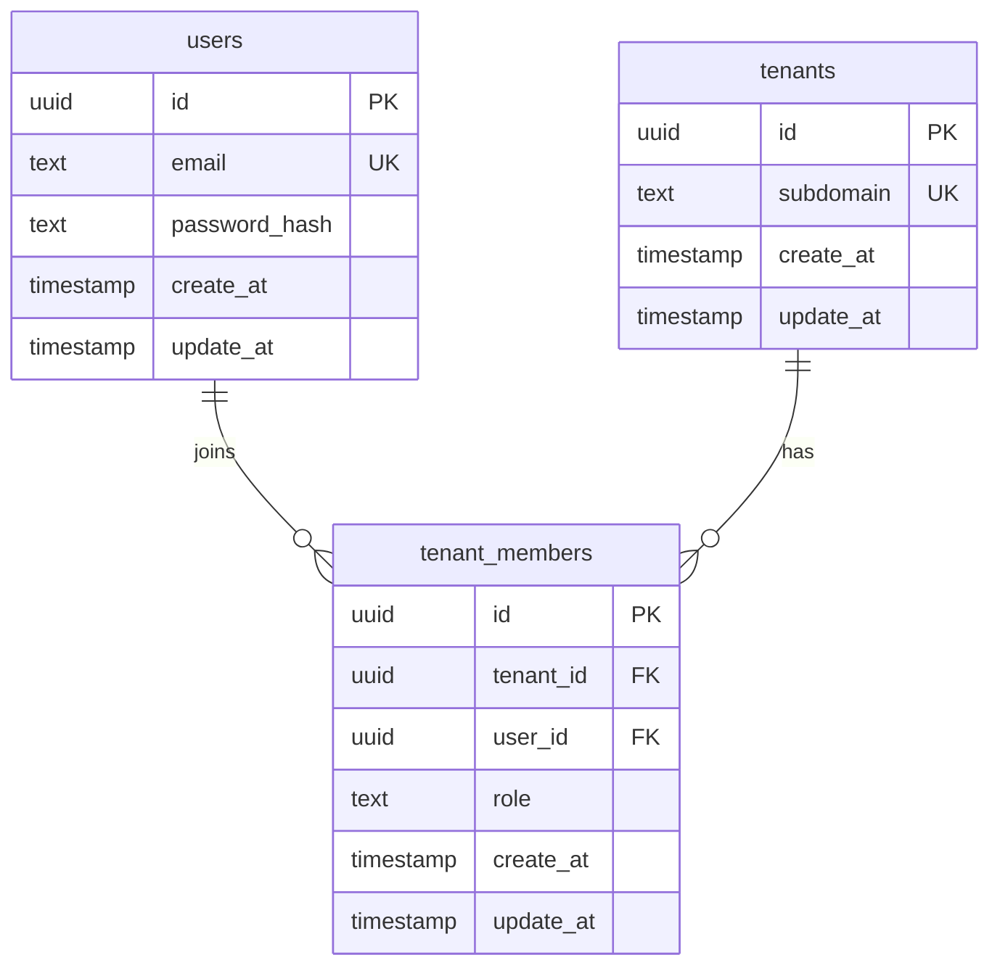

# F01 多租户表设计（注册与租户子域）

> 本文件为 [F01-registration-tenancy.md](F01-registration-tenancy.md) 的**数据模型附录**，仅覆盖 F01 直接依赖的三张表。  
> 全局约定见 [00-constraints.mdc](../../../../.cursor/rules/00-constraints.mdc) §2、§3.1–3.2；Phase 1 全量模型见 [02-data-model.md](../02-data-model.md)。

## 1. 范围

| 表 | F01 用途 |
|----|----------|
| `rag_service.users` | 全局用户；email + 密码哈希 |
| `rag_service.tenants` | 租户；`subdomain` 全局唯一 |
| `rag_service.tenant_members` | 用户–租户归属；注册时 `role=owner` |

**不在本文**：`sessions`（F02）、文档/索引/会话/Agent 等后续 Feature 表。

## 2. 关系与 ER



**注册成功一次写入**（同一事务）：

1. `INSERT users`
2. `INSERT tenants`（`subdomain` 唯一）
3. `INSERT tenant_members`（`role='owner'`）

## 3. Schema 与公共对象

```sql
CREATE SCHEMA IF NOT EXISTS rag_service;

CREATE OR REPLACE FUNCTION rag_service.f_common_update_at()
RETURNS TRIGGER AS $$
BEGIN
  NEW.update_at := now();
  RETURN NEW;
END;
$$ LANGUAGE plpgsql;
```

- 业务表均在 **`rag_service`**；禁止在 `public` 建业务表。
- 全表强制：`create_at`、`update_at`（`timestamp NOT NULL DEFAULT now()`）。
- 每表 trigger：`tr_{表名}_lmt` → 调用 `f_common_update_at()`；**仅**维护 `update_at`，不触碰 `create_at`。

## 4. 表结构

### 4.1 `rag_service.users`

**表注释**：平台用户；email 全局唯一（小写存储）；与租户多对多，经 `tenant_members` 关联。

| 字段 | 类型 | 约束 | 注释 |
|------|------|------|------|
| `id` | `uuid` | PK, `DEFAULT gen_random_uuid()` | 用户主键 |
| `email` | `text` | UNIQUE NOT NULL | 登录邮箱；写入前规范化为小写（F01-T02 不涉及 email 大小写，subdomain 须小写） |
| `password_hash` | `text` | NOT NULL | argon2/bcrypt 等不可逆哈希；禁止明文 |
| `create_at` | `timestamp` | NOT NULL DEFAULT now() | 创建时间；创建后禁止改写（应用层） |
| `update_at` | `timestamp` | NOT NULL DEFAULT now() | 最后修改时间；trigger 维护 |

**索引**

| 名称 | 列 | 说明 |
|------|-----|------|
| `users_pkey` | `id` | 主键 |
| `users_email_key` | `email` | 全局唯一（F01-T06） |

**Trigger**：`tr_users_lmt`

---

### 4.2 `rag_service.tenants`

**表注释**：租户；Host `{subdomain}.lxzxai.com` 解析到本行 `id`；Phase 1 注册选定 `subdomain` 后不可改。

| 字段 | 类型 | 约束 | 注释 |
|------|------|------|------|
| `id` | `uuid` | PK, `DEFAULT gen_random_uuid()` | 租户主键；后续业务表 `tenant_id` 指向此列 |
| `subdomain` | `text` | UNIQUE NOT NULL | 子域标识；见 §5 校验规则 |
| `display_name` | `text` | NULL | 展示名（可选；默认可由 subdomain 衍生，F01 可不暴露） |
| `create_at` | `timestamp` | NOT NULL DEFAULT now() | 创建时间 |
| `update_at` | `timestamp` | NOT NULL DEFAULT now() | 最后修改时间 |

**索引**

| 名称 | 列 | 说明 |
|------|-----|------|
| `tenants_pkey` | `id` | 主键 |
| `tenants_subdomain_key` | `subdomain` | 全局唯一（F01-T05、F01-T08） |

**Trigger**：`tr_tenants_lmt`

**DB 层 CHECK（建议）**

```sql
CONSTRAINT tenants_subdomain_length_chk CHECK (char_length(subdomain) BETWEEN 3 AND 32),
CONSTRAINT tenants_subdomain_format_chk CHECK (subdomain ~ '^[a-z0-9]([a-z0-9-]*[a-z0-9])?$')
```

保留字（`admin`、`api` 等）在**应用层**拒绝（F01-T04）；DB CHECK 不重复枚举以便扩展。

---

### 4.3 `rag_service.tenant_members`

**表注释**：用户与租户成员关系；F01 注册插入一条 `owner`；F02 起用于 Host 租户鉴权。

| 字段 | 类型 | 约束 | 注释 |
|------|------|------|------|
| `id` | `uuid` | PK, `DEFAULT gen_random_uuid()` | 成员关系主键 |
| `tenant_id` | `uuid` | NOT NULL, FK → `tenants(id)` ON DELETE CASCADE | 所属租户 |
| `user_id` | `uuid` | NOT NULL, FK → `users(id)` ON DELETE CASCADE | 成员用户 |
| `role` | `text` | NOT NULL | Phase 1 注册固定 `owner` |
| `create_at` | `timestamp` | NOT NULL DEFAULT now() | 加入时间 |
| `update_at` | `timestamp` | NOT NULL DEFAULT now() | 最后修改时间 |

**索引与约束**

| 名称 | 定义 | 说明 |
|------|------|------|
| `tenant_members_pkey` | PK(`id`) | |
| `tenant_members_tenant_user_key` | UNIQUE(`tenant_id`, `user_id`) | 同一用户在同一租户仅一条 |
| `tenant_members_user_id_idx` | (`user_id`) | 登录后查所属租户 |
| `tenant_members_tenant_id_idx` | (`tenant_id`) | 列出租户成员 |

**Trigger**：`tr_tenant_members_lmt`

**角色 CHECK**

```sql
CONSTRAINT tenant_members_role_chk CHECK (role IN ('owner'))
```

Phase 1 仅 `owner`；扩展角色时改 CHECK + Spec。

## 5. `subdomain` 校验（与 F01 对齐）

| 规则 | 来源 | 失败时期望 |
|------|------|------------|
| 小写 `[a-z0-9-]`，3–32 字符，不以 `-` 首尾 | constraints §2 | F01-T03 等 4xx，**无 tenant 行** |
| 非保留字：`www`,`admin`,`api`,`app`,`mail`,`static`,`cdn`,`lxzxai` | constraints §2 | F01-T04 |
| 全局唯一 | F01 规则 3 | F01-T05、F01-T08 |
| 写入前规范化为小写 | F01-T02 | `Acme-Co` → `acme-co` |

## 6. 建表示例（DDL 骨架）

可执行迁移（Alembic）：[`apps/api/alembic/versions/20260720_f01_registration_tenancy.py`](../../../../apps/api/alembic/versions/20260720_f01_registration_tenancy.py)。API 启动时默认执行 `alembic upgrade head`（`AUTO_MIGRATE`）。

```sql
CREATE TABLE rag_service.users (
  id            uuid PRIMARY KEY DEFAULT gen_random_uuid(),
  email         text NOT NULL UNIQUE,
  password_hash text NOT NULL,
  create_at     timestamp NOT NULL DEFAULT now(),
  update_at     timestamp NOT NULL DEFAULT now()
);
COMMENT ON TABLE rag_service.users IS '平台用户；email 全局唯一';
COMMENT ON COLUMN rag_service.users.email IS '登录邮箱，小写存储';
COMMENT ON COLUMN rag_service.users.password_hash IS '不可逆密码哈希';

CREATE TRIGGER tr_users_lmt
  BEFORE UPDATE ON rag_service.users
  FOR EACH ROW EXECUTE FUNCTION rag_service.f_common_update_at();

CREATE TABLE rag_service.tenants (
  id          uuid PRIMARY KEY DEFAULT gen_random_uuid(),
  subdomain   text NOT NULL UNIQUE,
  display_name text,
  create_at   timestamp NOT NULL DEFAULT now(),
  update_at   timestamp NOT NULL DEFAULT now(),
  CONSTRAINT tenants_subdomain_length_chk CHECK (char_length(subdomain) BETWEEN 3 AND 32),
  CONSTRAINT tenants_subdomain_format_chk CHECK (subdomain ~ '^[a-z0-9]([a-z0-9-]*[a-z0-9])?$')
);
COMMENT ON TABLE rag_service.tenants IS '租户；subdomain 对应子域 Host';
COMMENT ON COLUMN rag_service.tenants.subdomain IS '子域标识，全局唯一，Phase1 注册后不可改';

CREATE TRIGGER tr_tenants_lmt
  BEFORE UPDATE ON rag_service.tenants
  FOR EACH ROW EXECUTE FUNCTION rag_service.f_common_update_at();

CREATE TABLE rag_service.tenant_members (
  id        uuid PRIMARY KEY DEFAULT gen_random_uuid(),
  tenant_id uuid NOT NULL REFERENCES rag_service.tenants(id) ON DELETE CASCADE,
  user_id   uuid NOT NULL REFERENCES rag_service.users(id) ON DELETE CASCADE,
  role      text NOT NULL,
  create_at timestamp NOT NULL DEFAULT now(),
  update_at timestamp NOT NULL DEFAULT now(),
  CONSTRAINT tenant_members_tenant_user_key UNIQUE (tenant_id, user_id),
  CONSTRAINT tenant_members_role_chk CHECK (role IN ('owner'))
);
COMMENT ON TABLE rag_service.tenant_members IS '用户与租户成员关系';
COMMENT ON COLUMN rag_service.tenant_members.role IS 'Phase1 注册为 owner';

CREATE INDEX tenant_members_user_id_idx ON rag_service.tenant_members (user_id);
CREATE INDEX tenant_members_tenant_id_idx ON rag_service.tenant_members (tenant_id);

CREATE TRIGGER tr_tenant_members_lmt
  BEFORE UPDATE ON rag_service.tenant_members
  FOR EACH ROW EXECUTE FUNCTION rag_service.f_common_update_at();
```

## 7. 与 F01 Test Cases 映射

| 用例 | 涉及表 / 约束 |
|------|----------------|
| F01-T01 | 三表各一行；`tenant_members.role=owner` |
| F01-T02 | `tenants.subdomain` 小写存储 |
| F01-T03 | `tenants` 无行；CHECK 或应用校验 |
| F01-T04 | `tenants` 无行；保留字应用校验 |
| F01-T05 | `tenants_subdomain_key` 冲突 |
| F01-T06 | `users_email_key` 冲突；`tenants` 不插入 |
| F01-T08 | 并发仅一条 `tenants` 同 subdomain |

## 8. 实现备注

- 注册 API 使用**单事务**：任一步失败则 rollback，保证不会出现「有 user 无 tenant」或「有 tenant 无 owner」。
- F01 不实现「一用户多租户」产品能力，但模型允许多条 `tenant_members`（后续 Feature 扩展）。
- 密码字段仅 `password_hash`；禁止 `password` 列。
- 文本字段统一 `text`；email 大小写不敏感靠写入前规范化为小写 + UNIQUE 约束。
