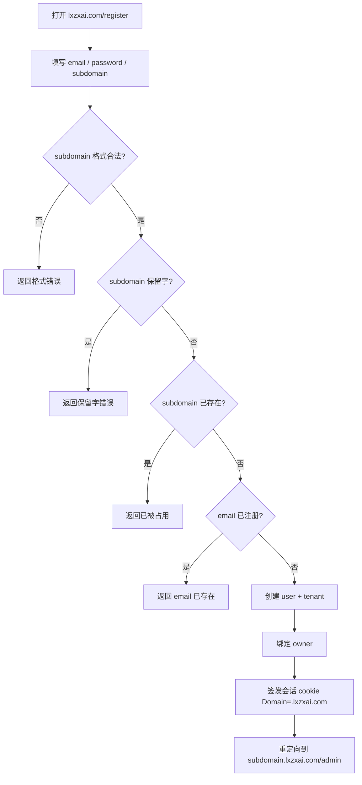

# F01 注册与租户子域

> 用户在 `lxzxai.com` 用 Email 注册，自选 `subdomain`，系统校验后创建租户并绑定 `{subdomain}.lxzxai.com`。

| 字段 | 值 |
|------|-----|
| **Status** | `review` |
| **Owner** | |
| **Approved by** | |
| **Approved at** | |

## 范围

- Email + 密码注册
- 用户选定租户 `subdomain`；格式与全局唯一性校验
- 创建 `user`、`tenant`，并建立 owner 关系
- 注册成功后引导至 `{subdomain}.lxzxai.com/admin`（会话签发见 F02）

## 非范围

- 微信注册（Phase 1.5）
- 登录与会话生命周期细节（F02）
- 文档、聊天、Agent

## Flow

## 行为规则

1. 注册入口仅在 `lxzxai.com`（主站）。
2. `subdomain` 规则见 [00-constraints.mdc](../../../../.cursor/rules/00-constraints.mdc) §2；校验失败不得创建任何租户。
3. `subdomain` 全局唯一；并发双注册同一 subdomain 时仅一个成功，另一个得「已被占用」。
4. `email` 全局唯一（大小写不敏感，存储小写）。
5. 密码至少 8 字符；存储为不可逆哈希，禁止明文落库。
6. 注册成功立即创建租户；`tenant.subdomain` 此后可改规则不在本 Feature（Phase 1：注册时一次选定，不可改）。
7. 注册成功后签发会话（与 F02 同一 cookie 约定），并 HTTP 重定向到 `https://{subdomain}.lxzxai.com/admin`。

## 数据与边界

| 实体 | 关键字段 / 约束 |
|------|----------------|
| user | `id`, `email` UNIQUE (ci), `password_hash` |
| tenant | `id`, `subdomain` UNIQUE |
| tenant_member | `tenant_id`, `user_id`, `role=owner`；注册时一条 |

时间戳列 `create_at` / `update_at` 见 [00-constraints.mdc](../../../../.cursor/rules/00-constraints.mdc) §3.2。  
表结构明细见 [F01-registration-tenancy-data-model.md](F01-registration-tenancy-data-model.md)。

## Test Cases

| ID | 步骤 | 期望 | 类型 |
|----|------|------|------|
| F01-T01 | Given 未使用的 email+subdomain When POST 注册 | Then 201；存在 user/tenant/owner；响应或后续可解析到该 subdomain | api |
| F01-T02 | Given subdomain=`Acme-Co` When 注册 | Then 存为 `acme-co` 或拒绝（实现二选一须固定：Phase 1 **规范化为小写**后存） | api |
| F01-T03 | Given subdomain=`ab`（过短） When 注册 | Then 4xx；无 tenant 行 | api |
| F01-T04 | Given subdomain=`admin` When 注册 | Then 4xx 保留字；无 tenant 行 | api |
| F01-T05 | Given subdomain 已被占用 When 另一 email 注册同 subdomain | Then 4xx 已被占用；无新 tenant | api |
| F01-T06 | Given email 已注册 When 再注册 | Then 4xx；subdomain 即使空闲也不创建 tenant | api |
| F01-T07 | Given 合法注册成功 When 跟随重定向 | Then Location 指向 `https://{subdomain}.lxzxai.com/admin`；Set-Cookie Domain 含 `.lxzxai.com` | e2e |
| F01-T08 | Given 两请求并发同 subdomain When 同时注册 | Then 恰一成功一失败；DB 中该 subdomain 仅一条 tenant | api |
