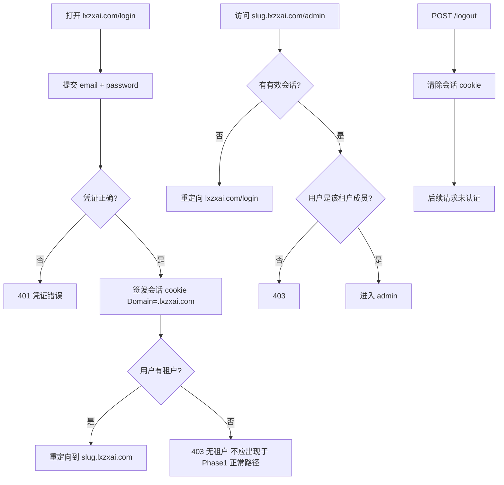

# F02 Email 登录与会话

> Email 登录/登出；主站与租户站（含 `/admin`）共用 `Domain=.lxzxai.com` 会话。

## 范围

- Email + 密码登录（主站 `lxzxai.com`）
- 登出
- 会话 cookie：`Domain=.lxzxai.com`，覆盖主站与 `{slug}.lxzxai.com`
- 未登录访问 `/admin` 或需鉴权聊天 API 时拒绝或重定向登录
- 租户站请求必须解析 Host → tenant，且当前用户为该租户成员

## 非范围

- 注册与创建租户（F01）
- 微信登录（Phase 1.5）
- 密码重置、邮箱验证（Phase 1 不做，无 Test Case）
- RBAC 细粒度角色（Phase 1：owner 即可访问本租户 admin）

## Flow

## 行为规则

1. 登录入口在 `lxzxai.com/login`；校验 email（小写）+ 密码哈希。
2. 会话 cookie：`Domain=.lxzxai.com`；`Secure`；`HttpOnly`；`SameSite=Lax`（或等价可测配置）。
3. **登录成功**后 HTTP 重定向到 `https://{slug}.lxzxai.com`（租户根路径 / 聊天入口），**不是** `/admin`。
4. 在 `{slug}.lxzxai.com` 与 `/admin` 使用同一会话；不要求二次登录。
5. Host 上的 slug 与会话用户的租户成员关系必须匹配，否则 403（防止拿 A 租户 cookie 操作 B 租户）。
6. 登出使会话失效；之后访问需鉴权资源须重新登录。
7. 错误响应不泄露「email 是否存在」以外的多余信息：统一「邮箱或密码错误」。

## 数据与边界

| 实体 | 关键字段 / 约束 |
|------|----------------|
| session | `id`/`token`, `user_id`, `expires_at`；或签名 cookie 内含 `user_id`+过期 |
| cookie | Name 固定（如 `pb_session`）；Domain=`.lxzxai.com` |

会话 TTL Phase 1 固定：**14 天**（可滑动续期，须在实现中一致并被 T 用例覆盖）。

## Test Cases

| ID | 步骤 | 期望 | 类型 |
|----|------|------|------|
| F02-T01 | Given 已注册用户 When 正确密码登录 | Then 200/302；Set-Cookie Domain=`.lxzxai.com`；Location 为 `https://{slug}.lxzxai.com`（非 `/admin`） | api |
| F02-T02 | Given 已注册用户 When 错误密码登录 | Then 401；不签发有效会话 | api |
| F02-T03 | Given 有效会话 When 访问本租户 `/admin` | Then 200（或页面可达） | e2e |
| F02-T04 | Given 有效会话 When 无 cookie 访问 `/admin` | Then 302→登录 或 401 | e2e |
| F02-T05 | Given 用户为 tenant-A 成员 When 带会话访问 tenant-B Host `/admin` | Then 403 | api |
| F02-T06 | Given 已登录 When 登出后再访 `/admin` | Then 未认证 | e2e |
| F02-T07 | Given 主站登录成功 When 请求 `{slug}.lxzxai.com` 需鉴权 API | Then 同一 cookie 通过鉴权，无需再登录 | api |
