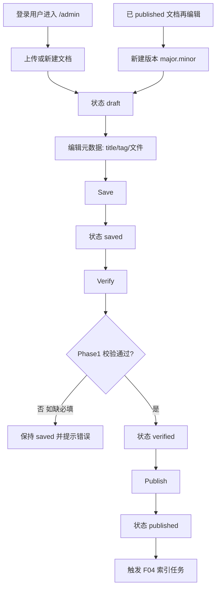

# F03 文档管理

> `{subdomain}.lxzxai.com/admin`：上传与管理文档；状态 draft → saved → verified → published；tag、版本、多文件类型。

| 字段 | 值 |
|------|-----|
| **Status** | `review` |
| **Owner** | |
| **Approved by** | |
| **Approved at** | |

## 范围

- Admin 文档 CRUD（本租户）
- 上传流程：draft / save / verify / publish
- Tag 分类：News、SOP、Best Practice、Knowledge base、FAQ（可扩展枚举）
- 版本号从 `1.0` 起
- 文件类型：txt、pdf、word（`.doc`/`.docx`）、ppt（`.ppt`/`.pptx`）
- 列表、按 tag 过滤、查看当前版本

## 非范围

- 解析/分块/embedding（F04）
- SOP 内容强制验证门禁（Phase 2：验证失败不可 publish）
- 对外 API（Phase 2）
- 公开匿名上传

## Flow

## 行为规则

1. 仅租户成员可访问本租户 `/admin` 文档 API（依赖 F02）。
2. 状态只允许按序前进：`draft → saved → verified → published`；禁止跳步（如 draft 直接 publish）。
3. **Save**：持久化标题、tag、文件（或正文）；进入 `saved`。
4. **Verify（Phase 1）**：检查必填项（title、tag、至少一份源文件）；通过 → `verified`。不做 SOP 语义校验。
5. **Publish**：仅 `verified` 可 publish → `published`；成功后必须触发索引（F04）。
6. Tag 为受控枚举：`news` | `sop` | `best_practice` | `knowledge_base` | `faq`（展示名可用英文 Title Case）。
7. 版本：首次 publish 为 `1.0`；此后每次从已发布再编辑并重新走完发布流，版本递增（Phase 1：**minor +0.1**，如 1.0→1.1；实现固定一种算法即可）。
8. 拒绝不支持的 MIME/扩展名；单文件大小上限 **20MB**。
9. 删除：Phase 1 允许软删除 `deleted_at`；若曾 published，须通知 F04 移除索引（见 F04）。

## 数据与边界

| 实体 | 关键字段 / 约束 |
|------|----------------|
| document | `id`, `tenant_id`, `title`, `tag`, `status`, `version`, `created_by`, `deleted_at` |

时间戳列 `createtime` / `lastmodifiedtime` 见 [00-constraints.mdc](../../../../.cursor/rules/00-constraints.mdc) §3.1。
| document_file | `document_id`, `storage_key`, `filename`, `content_type`, `size_bytes` |
| status | `draft` \| `saved` \| `verified` \| `published` |

## Test Cases

| ID | 步骤 | 期望 | 类型 |
|----|------|------|------|
| F03-T01 | Given 成员登录 When 上传合法 pdf 为 draft 并 save | Then status=`saved`；文件可取回 | api |
| F03-T02 | Given status=`draft` When 直接 publish | Then 4xx；仍为 draft | api |
| F03-T03 | Given status=`saved` 且缺 title When verify | Then 4xx；仍为 saved | api |
| F03-T04 | Given status=`saved` 且必填齐全 When verify | Then status=`verified` | api |
| F03-T05 | Given status=`verified` When publish | Then status=`published`；version=`1.0`；产生索引任务事件/记录 | api |
| F03-T06 | Given tag=`unknown` When save | Then 4xx | api |
| F03-T07 | Given 上传 `.exe` When save | Then 4xx | api |
| F03-T08 | Given 文件 >20MB When save | Then 4xx | api |
| F03-T09 | Given tenant-A 文档 id When tenant-B 成员 GET | Then 404 或 403 | api |
| F03-T10 | Given 已 published v1.0 When 编辑再 publish | Then 新 version>`1.0`（如 1.1）；旧版本策略在响应中可区分 | api |
| F03-T11 | Given 列表 When 按 tag=`faq` 过滤 | Then 仅返回该 tag 文档 | api |
