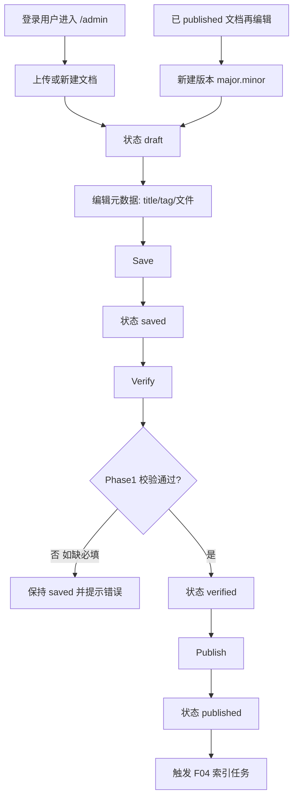

# F03 文档管理

> `{subdomain}.lxzxai.com/admin`：上传与管理文档；状态 draft → saved → verified → published；tag、版本、多文件类型；Admin 左右分栏（左列表 / 右操作）。


| 字段 | 值 |
|------|-----|
| **Status** | `review` |
| **Owner** | |
| **Approved by** | |
| **Approved at** | |

## 范围

- Admin 文档 CRUD（本租户）
- 上传流程：draft / save / verify / publish
- Tag 分类：News、SOP、Best Practice、Knowledge base、FAQ（可扩展枚举）
- 版本号从 `1.0` 起
- 文件类型：txt、pdf、word（`.doc`/`.docx`）、ppt（`.ppt`/`.pptx`）
- 列表、按 tag 过滤、查看当前版本
- **Admin 页面组织**：左侧文档列表面板 + 右侧文档操作区（见下「Admin UI」）

## 非范围

- 解析/分块/embedding（F04）
- SOP 内容强制验证门禁（Phase 2：验证失败不可 publish）
- 对外 API（Phase 2）
- 公开匿名上传
- 独立文件夹实体的完整 ACL / 跨租户共享目录（Phase 1 仅本租户内路径分组）

## Admin UI

`{subdomain}.lxzxai.com/admin` 为左右分栏，**不改变**下方状态机与 Flow；仅规定页面信息架构。

```text
┌─────────────────────┬──────────────────────────────────────┐
│  左：文档 List      │  右：文档操作（选中或新建）            │
│  - 目录树 / 列表    │  - 新建 / 编辑元数据与文件            │
│  - 状态过滤         │  - Save / Verify / Publish            │
│  - 对外发布|对内分享 │  - 删除                                │
└─────────────────────┴──────────────────────────────────────┘
```

### 左侧：文档 List

1. 展示本租户文档列表；支持**目录结构**（按 `folder_path` 树形分组；无路径文档落在根级）。
2. **按状态过滤**：`draft` | `saved` | `verified` | `published`（可多选或单选，实现固定一种；未选 = 全部未删除）。
3. **展现维度**（与 status 正交的列表视图，**不是**新状态）：
   - **对外发布**：仅 `status=published`（已对外可检索/发布侧）。
   - **对内分享**：`status ∈ {draft, saved, verified}`（租户内编辑中、尚未 publish）。
4. 可叠加按 tag 过滤；点击一项 → 右侧加载该文档。
5. 提供「新建」入口；新建时右侧进入空白表单，左侧可不选中或高亮新建态。

### 右侧：文档操作

1. **未选中**：空态或引导新建。
2. **新建（Add）**：创建文档，初始 `status=draft`；version 在首次 publish 前可为占位/`null`，**首次 publish 定为 `1.0`**（与行为规则一致）。
3. **更新（Update）**：编辑 title / tag / `folder_path` / 源文件；经 Save（及后续 Verify / Publish）持久化。已 `published` 再编辑并重新走完发布流 → 版本递增，并触发 F04 向量更新（见行为规则 7、5）。
4. **删除（Delete）**：软删除当前文档；若曾 `published`，须通知 F04 移除向量索引。
5. 状态推进控件（Save / Verify / Publish）仅按规则 2–5 启用，禁止跳步。

## Flow



## 行为规则

1. 仅租户成员可访问本租户 `/admin` 文档 API（依赖 F02）。
2. 状态只允许按序前进：`draft → saved → verified → published`；禁止跳步（如 draft 直接 publish）。
3. **Save**：持久化标题、tag、`folder_path`、文件（或正文）；进入 `saved`。
4. **Verify（Phase 1）**：检查必填项（title、tag、至少一份源文件）；通过 → `verified`。不做 SOP 语义校验。
5. **Publish**：仅 `verified` 可 publish → `published`；成功后必须触发索引（F04）。
6. Tag 为受控枚举：`news` | `sop` | `best_practice` | `knowledge_base` | `faq`（展示名可用英文 Title Case）。
7. 版本：首次 publish 为 `1.0`；此后每次从已发布再编辑并重新走完发布流，版本递增（Phase 1：**minor +0.1**，如 1.0→1.1；实现固定一种算法即可）。
8. 拒绝不支持的 MIME/扩展名；单文件大小上限 **20MB**。
9. 删除：Phase 1 允许软删除 `deleted_at`；若曾 published，须通知 F04 移除索引（见 F04）。
10. **Admin UI**：`/admin` 必须为左 List / 右操作分栏；列表支持状态过滤、「对外发布」「对内分享」视图与目录树；右侧承载新建/更新/删除及状态推进（见「Admin UI」）。
11. `folder_path`：可选；仅允许本租户内相对路径分段（如 `sop/onboarding`）；禁止 `..` 与绝对路径；用于左侧树分组，不改变状态机。

## 数据与边界

| 实体 | 关键字段 / 约束 |
|------|----------------|
| document | `id`, `tenant_id`, `title`, `tag`, `status`, `version`, `folder_path`（可选）, `created_by`, `deleted_at` |

时间戳列 `create_at` / `update_at` 见 [00-constraints.mdc](../../../../.cursor/rules/00-constraints.mdc) §3.2。
| document_file | `document_id`, `storage_key`, `filename`, `content_type`, `size_bytes` |
| status | `draft` \| `saved` \| `verified` \| `published` |

列表查询支持：`status`、`tag`、展现维度 `audience=external|internal`（external → published；internal → draft|saved|verified）。

## Test Cases

| ID | 步骤 | 期望 | 类型 |
|----|------|------|------|
| F03-T01 | Given 成员登录 When 上传合法 pdf 为 draft 并 save | Then status=`saved`；文件可取回 | api |
| F03-T02 | Given status=`draft` When 直接 publish | Then 4xx；仍为 draft | api |
| F03-T03 | Given status=`saved` 且缺 title When verify | Then 4xx；仍为 saved | api |
| F03-T04 | Given status=`saved` 且必填齐全 When verify | Then status=`verified` | api |
| F03-T05 | Given status=`verified` When publish | Then status=`published`；version=`1.0`；产生索引任务事件/记录 | api |
| F03-T06 | Given tag=`unknown` When save | Then 4xx | api |
| F03-T07 | Given 上传 `.exe` When save | Then 4xx | api |
| F03-T08 | Given 文件 >20MB When save | Then 4xx | api |
| F03-T09 | Given tenant-A 文档 id When tenant-B 成员 GET | Then 404 或 403 | api |
| F03-T10 | Given 已 published v1.0 When 编辑再 publish | Then 新 version>`1.0`（如 1.1）；旧版本策略在响应中可区分 | api |
| F03-T11 | Given 列表 When 按 tag=`faq` 过滤 | Then 仅返回该 tag 文档 | api |
| F03-T12 | Given 成员打开 `/admin` | Then 页面为左文档列表 + 右操作区 | e2e |
| F03-T13 | Given 存在 published 与 draft 文档 When 切「对外发布」 | Then 列表仅 published | e2e |
| F03-T14 | Given 同上 When 切「对内分享」 | Then 列表仅 draft/saved/verified | e2e |
| F03-T15 | Given 列表按 status=`verified` 过滤 | Then 仅返回 verified | api |
| F03-T16 | Given 文档 `folder_path=sop/hr` When 打开列表 | Then 左侧树在 `sop` → `hr` 下可见该文档 | e2e |
| F03-T17 | Given 选中文档 When 右侧删除 | Then 列表不再展示；若曾 published 则索引不可检索（与 F04 对齐） | e2e |
