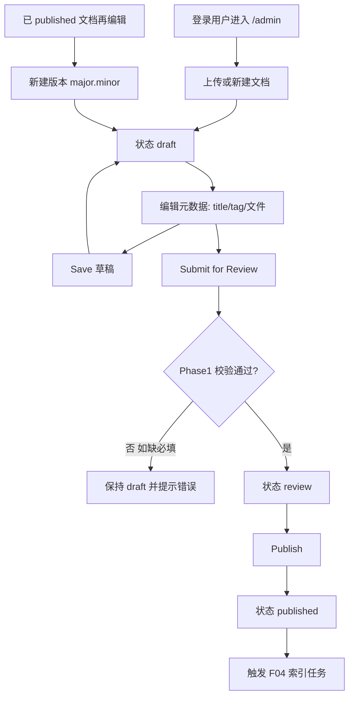
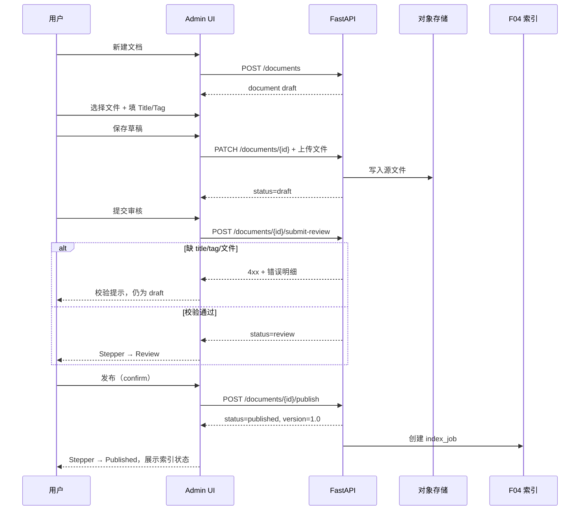

# F03 文档管理

> `{subdomain}.lxzxai.com/admin`：上传与管理文档；状态 draft → review → published；tag、版本、多文件类型；Admin 左右分栏（左列表 / 右操作）。


| 字段 | 值 |
|------|-----|
| **Status** | `done` |
| **Owner** | |
| **Approved by** | team |
| **Approved at** | 2026-07-21 |

## 范围

- Admin 文档 CRUD（本租户）
- 上传流程：draft / save / submit for review / publish
- Tag 分类：News、SOP、Best Practice、Knowledge base、FAQ（可扩展枚举）
- 版本号从 `1.0` 起
- 文件类型：`.txt` / `.md` / `.pdf` / `.docx` / `.pptx`（不支持旧版 `.doc` / `.ppt`，须另存为 OOXML）
- 列表、按 tag 过滤、查看当前版本
- Admin UI 见 [F03-doc-admin-ui.md](F03-doc-admin-ui.md)（左右分栏：左列表 / 右操作）

## 非范围

- 解析/分块/embedding（F04）
- SOP 内容强制验证门禁（Phase 2：验证失败不可 publish）
- 对外 API（Phase 2）
- 公开匿名上传
- 独立文件夹实体的完整 ACL / 跨租户共享目录（Phase 1 仅本租户内路径分组）

## Admin UI

`{subdomain}.lxzxai.com/admin` 为左右分栏，**不改变**下方状态机与 Flow；细节见 [F03-doc-admin-ui.md](F03-doc-admin-ui.md)。

```text
┌─────────────────────┬──────────────────────────────────────┐
│  左：文档 List      │  右：文档操作（选中或新建）            │
│  - 目录树 / 列表    │  - 新建 / 编辑元数据与文件            │
│  - 状态过滤         │  - 保存草稿 / 提交审核 / 发布         │
│  - 对外发布|对内分享 │  - 删除                                │
└─────────────────────┴──────────────────────────────────────┘
```

### 左侧：文档 List

1. 展示本租户文档列表；支持**目录结构**（按 `folder_path` 树形分组；无路径文档落在根级）。
2. **按状态过滤**：`draft` | `review` | `published`（可多选或单选，实现固定一种；未选 = 全部未删除）。
3. **展现维度**（与 status 正交的列表视图，**不是**新状态）：
   - **对外发布**：仅 `status=published`（已对外可检索/发布侧）。
   - **对内分享**：`status ∈ {draft, review}`（租户内编辑中、尚未 publish）。
4. 可叠加按 tag 过滤；点击一项 → 右侧加载该文档。
5. 提供「新建」入口；新建时右侧进入空白表单，左侧可不选中或高亮新建态。

### 右侧：文档操作

1. **未选中**：空态或引导新建。
2. **新建（Add）**：创建文档，初始 `status=draft`；version 在首次 publish 前可为占位/`null`，**首次 publish 定为 `1.0`**（与行为规则一致）。
3. **更新（Update）**：编辑 title / tag / `folder_path` / 源文件；经保存草稿（及后续提交审核 / 发布）持久化。已 `published` 再编辑并重新走完发布流 → 版本递增，并触发 F04 向量更新（见行为规则 7、5）。
4. **删除（Delete）**：软删除当前文档；若曾 `published`，须通知 F04 移除向量索引。
5. 状态推进控件（保存草稿 / 提交审核 / 发布）仅按规则 2–5 启用，禁止跳步。

## Flow

高层流程（用户视角）：

```text
上传文档（draft）  →  审核/校验（review）  →  发布（published）→ 索引（F04）
```



## 端到端流程（上传 → 审核 → 发布）

### 总览

| 阶段 | 用户理解 | status | 核心动作 | 进入下一阶段条件 |
|------|----------|--------|----------|------------------|
| **1. 上传文档** | 把资料放进系统、可先不完整 | `draft` | 新建、选文件、填元数据、**保存草稿** | 用户主动点「提交审核」 |
| **2. 审核/校验** | 确认信息齐全、可发布 | `review` | **提交审核**（结构校验）→ 通过后待发布 | 用户点「发布」并 confirm |
| **3. 发布** | 正式进知识库、可被 RAG 检索 | `published` | **发布** → 触发 F04 索引 | — |

Phase 1 的「审核/校验」= **自动结构校验**（title、tag、文件）；不做人工审批、不做 SOP 语义校验（Phase 2 扩展）。

### 阶段 1：上传文档（draft）

**目标**：创建文档记录，上传源文件，填写或稍后补全元数据。

| 步骤 | 用户操作 | 系统行为 | 校验 |
|------|----------|----------|------|
| 1.1 | 点「新建文档」 | 创建 `document`（status=`draft`，version 待定） | — |
| 1.2 | 选择本地文件（可多选） | 前端校验扩展名与 20MB；通过后上传至存储，写入 `document_file` | 类型、大小（F03-T07/T07b/T08） |
| 1.3 | 填写 Title、Tag（可选） | 表单本地状态更新 | Tag 若填则须为合法枚举（F03-T06） |
| 1.4 | 点「保存草稿」 | `PATCH` 持久化 title/tag/文件关联；**status 仍为 `draft`** | 文件规则同上；title/tag 可不填 |
| 1.5 | 关闭页面后再打开 | 从列表选中，加载已保存的 draft 与文件列表 | — |

**说明**：

- 同一 draft 可多次「保存草稿」，适合分步填写。
- 此阶段 **不可发布**；强行调用 publish API → 4xx（F03-T02）。
- 列表 badge 显示「草稿」。

### 阶段 2：审核/校验（draft → review）

**目标**：确认文档满足发布前最低要求，锁定为「待发布」状态。

| 步骤 | 用户操作 | 系统行为 | 校验 |
|------|----------|----------|------|
| 2.1 | 点「提交审核」 | 前端预检 → 调用 submit-for-review API | 见下表 |
| 2.2 | 校验失败 | status 保持 `draft`；返回缺失项列表 | 4xx + 字段错误（F03-T03） |
| 2.3 | 校验通过 | status → `review`；持久化当前快照 | F03-T04 |

**Submit for Review 校验清单（Phase 1）**：

| 项 | 规则 | 失败提示示例 |
|----|------|--------------|
| title | 非空、去首尾空格后长度 ≥ 1 | 「请填写文档标题」 |
| tag | 必须为受控枚举之一 | 「请选择文档分类」 |
| 源文件 | 至少 1 个已通过类型/大小校验的文件 | 「请至少上传一份文档」 |

**Phase 2 预留**（本阶段扩展，不改 status 枚举）：

- `tag=sop` 时增加 SOP 内容/格式语义校验；失败则不可进入 `review`。

**review 状态下**：

- 主表单只读展示（或禁用编辑）；避免未校验修改直接进入发布。
- 若产品允许改内容：任意修改 title/tag/文件 → **自动回退 `draft`**，须重新提交审核（行为规则 §10）。
- 可用 CTA：**发布**；不可用：保存草稿、提交审核（除非已回退 draft）。

### 阶段 3：发布（review → published）

**目标**：文档正式生效，进入知识库并触发向量索引。

| 步骤 | 用户操作 | 系统行为 | 校验 |
|------|----------|----------|------|
| 3.1 | 点「发布」 | 弹出 confirm：version、tag、文件数、索引提示 | 仅 `review` 可点 |
| 3.2 | confirm 取消 | 无变更 | — |
| 3.3 | confirm 确认 | status → `published`；version 首次=`1.0`；写入 index_job（F04） | F03-T05 |
| 3.4 | 发布成功 | Stepper 到 Published；展示索引状态区（pending → running → succeeded/failed） | — |

**发布后**：

- 该 version 的文档可被 F06 RAG 检索（须 F04 job=succeeded）。
- 列表 badge 显示「已发布」+ version（如 `1.0`）。
- 索引失败时：文档仍为 `published`，但检索不到内容（见 F04）；UI 在 `IndexJobStatusCard` 展示 failed + error。

### 已发布文档的再编辑（published → draft → …）

| 步骤 | 用户操作 | 系统行为 |
|------|----------|----------|
| 4.1 | 点「编辑新版本」 | 基于当前 published 创建新 draft（如 v1.0 → 待发布 v1.1） |
| 4.2 | 修改内容并保存草稿 | status=`draft`，重复阶段 1～3 |
| 4.3 | 再次发布成功 | version 递增（如 `1.1`）；旧 version chunk 由 F04 替换（F03-T10、F04-T05） |

### 端到端时序（首版发布）



### API 动作与 status 对照（实现参考）

| 动作 | 方法（建议） | 前置 status | 成功后 status |
|------|--------------|-------------|---------------|
| 创建文档 | `POST /documents` | — | `draft` |
| 保存草稿 | `PATCH /documents/{id}` | `draft` | `draft` |
| 上传/删除文件 | `POST/DELETE .../files` | `draft`（review 改文件应先回退 draft） | 不变或回退 `draft` |
| 提交审核 | `POST /documents/{id}/submit-review` | `draft` | `review` |
| 发布 | `POST /documents/{id}/publish` | `review` | `published` |
| 编辑新版本 | `POST /documents/{id}/new-version` | `published` | `draft` |

路径前缀与鉴权同 F05：经 `/backend/v1/...`，Host → tenant_id，需登录成员。

## 行为规则

1. 仅租户成员可访问本租户 `/admin` 文档 API（依赖 F02）。
2. 状态只允许按序前进：`draft → review → published`；禁止跳步（如 draft 直接 publish）。
3. **Save（草稿）**：持久化标题、tag、`folder_path`、文件（或正文）；**status 保持 `draft`**。Phase 1 不强制 title/tag/文件齐全。
4. **Submit for Review**：仅 `draft` 可提交；检查必填项（title、tag、至少一份源文件）；通过 → `review`。Phase 1 不做 SOP 语义校验；Phase 2 在此步或 publish 前增加 SOP 门禁。
5. **Publish**：仅 `review` 可 publish → `published`；成功后必须触发索引（F04）。
6. Tag 为受控枚举（存储值 → 界面展示名）：`news` 公告动态 | `sop` 标准操作规程 | `best_practice` 最佳实践 | `knowledge_base` 知识库 | `faq` 常见问题。填写说明见 [F03-doc-admin-ui.md](F03-doc-admin-ui.md) §字段中文说明。
7. 版本：首次 publish 为 `1.0`；此后每次从已发布再编辑并重新走完发布流，版本递增（Phase 1：**minor +0.1**，如 1.0→1.1；实现固定一种算法即可）。
8. 允许扩展名仅 `.txt` / `.pdf` / `.docx` / `.pptx`；拒绝其它类型（含 `.exe`）及旧版 `.doc` / `.ppt`（须提示另存为 OOXML）；单文件大小上限 **20MB**。
9. 删除：Phase 1 允许软删除 `deleted_at`；若曾 published，须通知 F04 移除索引（见 F04）。
10. **`review` 中若修改元数据或文件**：status 回退为 `draft`，须重新 Submit for Review（防止未校验内容直接 publish）。
11. **Admin UI**：`/admin` 必须为左 List / 右操作分栏；列表支持状态过滤、「对外发布」「对内分享」视图与目录树；右侧承载新建/更新/删除及状态推进（见「Admin UI」与 [F03-doc-admin-ui.md](F03-doc-admin-ui.md)）。
12. `folder_path`：可选；仅允许本租户内相对路径分段（如 `sop/onboarding`）；禁止 `..` 与绝对路径；用于左侧树分组，不改变状态机。

## 数据与边界

| 实体 | 关键字段 / 约束 |
|------|----------------|
| document | `id`, `tenant_id`, `title`, `tag`, `status`, `version`, `folder_path`（可选）, `created_by`, `deleted_at` |

时间戳列 `create_at` / `update_at` 见 [00-constraints.mdc](../../../../.cursor/rules/00-constraints.mdc) §3.2。
| document_file | `document_id`, `storage_key`, `filename`, `content_type`, `size_bytes` |
| status | `draft` \| `review` \| `published` |

列表查询支持：`status`、`tag`、展现维度 `audience=external|internal`（external → published；internal → draft|review）。

## Test Cases

| ID | 步骤 | 期望 | 类型 |
|----|------|------|------|
| F03-T01 | Given 成员登录 When 上传合法 pdf 为 draft 并 save | Then status=`draft`；文件可取回 | api |
| F03-T02 | Given status=`draft` When 直接 publish | Then 4xx；仍为 draft | api |
| F03-T03 | Given status=`draft` 且缺 title When submit for review | Then 4xx；仍为 draft | api |
| F03-T04 | Given status=`draft` 且必填齐全 When submit for review | Then status=`review` | api |
| F03-T05 | Given status=`review` When publish | Then status=`published`；version=`1.0`；产生索引任务事件/记录 | api |
| F03-T06 | Given tag=`unknown` When save | Then 4xx | api |
| F03-T07 | Given 上传 `.exe` When save | Then 4xx | api |
| F03-T07b | Given 上传 `.doc` 或 `.ppt` When save | Then 4xx；提示另存为 `.docx` / `.pptx` | api |
| F03-T08 | Given 文件 >20MB When save | Then 4xx | api |
| F03-T09 | Given tenant-A 文档 id When tenant-B 成员 GET | Then 404 或 403 | api |
| F03-T10 | Given 已 published v1.0 When 编辑再 publish | Then 新 version>`1.0`（如 1.1）；旧版本策略在响应中可区分 | api |
| F03-T11 | Given 列表 When 按 tag=`faq` 过滤 | Then 仅返回该 tag 文档 | api |
| F03-T12 | Given 成员打开 `/admin` | Then 页面为左文档列表 + 右操作区 | e2e |
| F03-T13 | Given 存在 published 与 draft 文档 When 切「对外发布」 | Then 列表仅 published | e2e |
| F03-T14 | Given 同上 When 切「对内分享」 | Then 列表仅 draft/review | e2e |
| F03-T15 | Given 列表按 status=`review` 过滤 | Then 仅返回 review | api |
| F03-T16 | Given 文档 `folder_path=sop/hr` When 打开列表 | Then 左侧树在 `sop` → `hr` 下可见该文档 | e2e |
| F03-T17 | Given 选中文档 When 右侧删除 | Then 列表不再展示；若曾 published 则索引不可检索（与 F04 对齐） | e2e |
