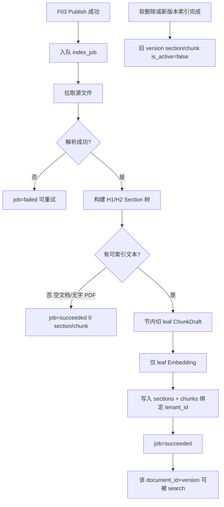
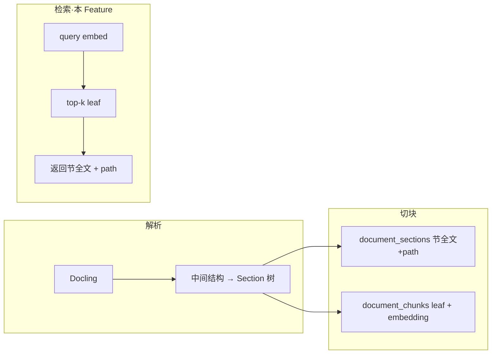

# F04 文档索引

> 仅对 `published` 文档解析、按 **H1/H2 节树** 分块、embedding（仅 leaf），写入 PostgreSQL/pgvector；提供内部 **向量检索**（命中 leaf → 返回 **所属节全文 + path**）；按租户隔离。

| 字段 | 值 |
|------|-----|
| **Status** | `review` |
| **Owner** | |
| **Approved by** | |
| **Approved at** | |

## 范围

- 消费「文档已 publish」事件（或等价轮询 `index_job`）
- 解析 `.txt` / `.pdf` / `.docx` / `.pptx`（与 F03 一致；不解析旧版 `.doc` / `.ppt`）
- **解析引擎**：Docling；`do_ocr=false`；表格以 Markdown 表保留在文本中
- **层级感知切块**：从解析结果构建 **H1 / H2** 节树；更深标题并入最近的 H2 叶节；节内再按可配置 token 切出 leaf chunk
- **仅 leaf** 写入 embedding / pgvector；节全文与 `path` 存于 `document_sections`
- **内部检索** `search(tenant_id, query, top_k)`：active leaf 向量 top-k → 组装节全文 + `path`（供 F06 `search_knowledge` 调用）
- 文档软删除或新版本索引成功后：旧 version 的 section / chunk **`is_active=false`**

## 非范围

- Admin UI 与状态机（F03）
- Agent 对话与 Agent Loop / `search_knowledge` 工具编排（F06；F06 只调用本 Feature 的 `search`）
- 未 publish 文档的预览索引
- **OCR** / 扫描件文字识别（无文字层 PDF 见行为规则：空成功）
- **任意深**目录树（Phase 1 仅 H1/H2）
- Dify 式 Parent-child 的「Full Doc」整篇 parent、或仅扁平 General 切块（无节树）
- 持久化第三方解析器原生对象树（仅落自家 `document_sections` / `document_chunks`）
- 对外 REST 检索网关（Phase 2）

## Flow

## 行为规则

1. **门禁**：`status != published` 的文档不得产生可检索态（`is_active=true`）的 section / chunk。
2. 所有 section / chunk 必须带 `tenant_id`；写库与 **search** 均强制 `tenant_id` 过滤。
3. 同一 `document_id` 新版本索引成功后，旧版本 section 与 chunk **必须** `is_active=false`（禁止用物理删除作为唯一手段）；软删除文档同理。
4. **解析失败**（文件损坏、Docling 无法打开等）：job `failed`，文档仍 `published`，无 active section/chunk；可重试（Phase 1：至少一条可测重试路径）。
5. **无字 / 空文档**：空 txt、或无文字层且未做 OCR 的 PDF → 解析结果为空 → job **`succeeded`**，**0** section/chunk；search 无命中。（与「损坏失败」区分。）
6. **解析与表结构**：
   - 引擎固定 Docling；PDF：`do_ocr=false`，表结构提取开启；导出文本中表格为 Markdown 表。
   - 多文件文档：按 `document_files` 顺序解析后合并进同一版本的节树（文件间可插入分隔，避免表粘连）。
7. **节树（层级）**：
   - Phase 1 仅识别 **H1 / H2**（或 Docling/Markdown 等价一级、二级标题）。
   - 更深标题（H3+）**并入**最近的 H2 叶节（无 H2 则并入所属 H1）。
   - 无任何标题：整篇（或整文件合并结果）作为 **单节**，`path` 可用文档 title 或文件名。
   - 若 H1 下存在 H2：叶节以 **H2** 为准；H1 仅含导言、且导言非空时可另成叶节（`path` = 该 H1 标题），否则不单独建空 H1 叶节。
   - 每节存储 **`path`**（如 `退款政策 > 时效`）与 **节全文** `content`（含该节下段落与 Markdown 表）。
8. **切块（可配置，仅节内）**：
   - 对每个叶节全文再切 leaf：目标长度与重叠经 Settings（默认 `CHUNK_TARGET_TOKENS=800`，`CHUNK_OVERLAP_TOKENS=100`）。
   - **禁止**跨 H2（叶节）边界合并正文后再切。
   - 空节不产生 leaf；整文档无文本 → 0 chunk（见规则 5）。
   - 运行时只读配置；禁止同进程混用多套分块参数写同一批 chunk。
9. **Embedding（可配置）**：仅对 **leaf** `document_chunks` 调用单一 QWen 兼容接口；模型名与维度经配置（如 `EMBEDDING_MODEL`、`EMBEDDING_DIM`，默认维度 `1024`）。同一部署一套维度；列类型与配置一致；改维度须迁库 + 全量重建。节全文 **不**单独向量化。
10. **检索契约**（本 Feature 实现）：`search(tenant_id, query, top_k) → Hit[]`
    - 用 query embedding 在 **active leaf** 上 top-k（且对应文档仍 published、未软删）；
    - 每条命中映射到所属叶节，返回至少：`document_id`、`chunk_id`（命中的 leaf id）、`section_id`、`path`、`content`（**节全文**）、`score`；
    - **同一节**因多个 leaf 命中时去重，只保留最高分一条（结果中同一 `section_id` 至多一次）；
    - `tenant_id` 仅来自调用方上下文，禁止由不可信输入覆盖。
11. 旧版本失效策略固定为 **`is_active=false`**；检索只使用 `is_active=true` 的 leaf，并只返回对应 active 节。

## 流水线中间对象（实现约定，非对外 API）

| 对象 | 用途 |
|------|------|
| 解析出口 | 映射为自家节树（非 Docling 原生对象直接下游） |
| 叶节 | 含 `path`、节全文；写入 `document_sections` |
| `ChunkDraft` | 节内 leaf：`content` + `ordinal` + `section` 关联；写入 `document_chunks` 并 embed |

## 数据与边界

| 实体 | 关键字段 / 约束 |
|------|----------------|
| index_job | `id`, `tenant_id`, `document_id`, `version`, `status`(`pending`\|`running`\|`succeeded`\|`failed`), `error` |
| document_section | `id`, `tenant_id`, `document_id`, `version`, `parent_id`（可选，H2→H1）, `level`（1\|2）, `title`, `path`, `content`（节全文）, `ordinal`, `is_active` |
| document_chunk（leaf） | `id`, `tenant_id`, `document_id`, `version`, `section_id`, `ordinal`, `content`（leaf 文本）, `embedding vector(EMBEDDING_DIM)`, `is_active` |

时间戳列 `create_at` / `update_at` 见 [00-constraints.mdc](../../../../.cursor/rules/00-constraints.mdc) §3.2。明细见 [02-data-model.md](../02-data-model.md)。

内部检索（非对外 Phase 2 API）：

`search(tenant_id, query, top_k) → Hit[]`，其中 `Hit.content` = 节全文，`Hit.path` = 节路径。

## Test Cases

| ID | 步骤 | 期望 | 类型 |
|----|------|------|------|
| F04-T01 | Given 文档 publish When 索引 job 跑完 | Then job=succeeded；存在 active leaf chunks；embedding 非空；存在对应 active sections（含非空 `path` 与节 `content`） | api |
| F04-T02 | Given status=`review` 未 publish When 强行请求索引 | Then 不产生 active section/chunk | api |
| F04-T03 | Given tenant-A 已索引文档 When tenant-B 调用 search 相同 query | Then 0 条 A 的命中 | api |
| F04-T04 | Given 空 txt publish When 索引 | Then job=succeeded；0 section/chunk；search 无命中 | api |
| F04-T05 | Given v1.0 已索引 When v1.1 索引成功 | Then 仅 v1.1 section/chunk active；search 不返回 v1.0 | api |
| F04-T06 | Given 已索引文档软删除 When search | Then 无该文档命中 | api |
| F04-T07 | Given 损坏/无法打开文件 When 索引 | Then job=failed；无 active section/chunk | api |
| F04-T08 | Given 已索引语料含独特短语 When search 该短语 | Then top-k 命中；返回的 `content` 为节全文且含该短语，`path` 非空 | api |
| F04-T09 | Given 无文字层 PDF（不 OCR）When 索引 | Then job=succeeded；0 section/chunk | api |
| F04-T10 | Given 含 H1 与两个 H2 且各含独特短语的文档 When 索引 | Then leaf 不跨 H2；两节 `path` 可区分；各短语只出现在对应节 `content` | api |
| F04-T11 | Given 同上 When search 仅出现在 H2-B 的短语 | Then 命中返回 H2-B 节全文与对应 `path`；`content` 不含 H2-A 专属正文 | api |
| F04-T12 | Given 同节内多 leaf 均可被同一 query 命中 When search | Then 同一 `section_id` 在结果中至多出现一次 | api |
