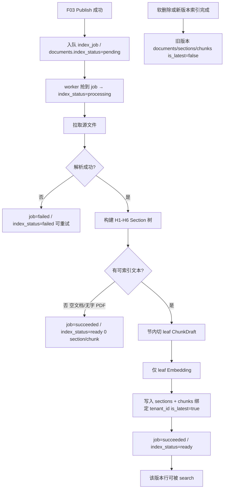
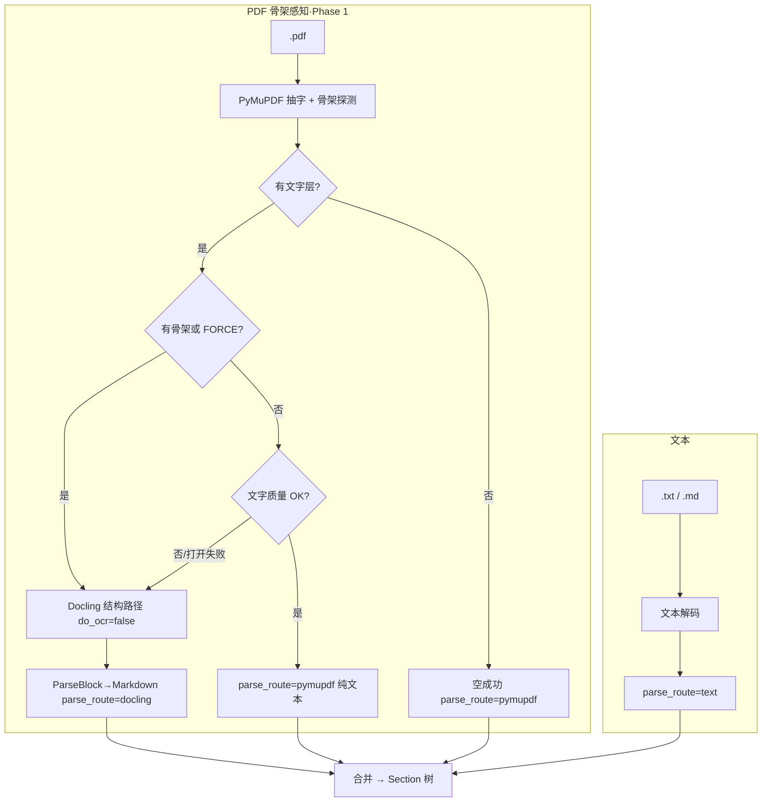
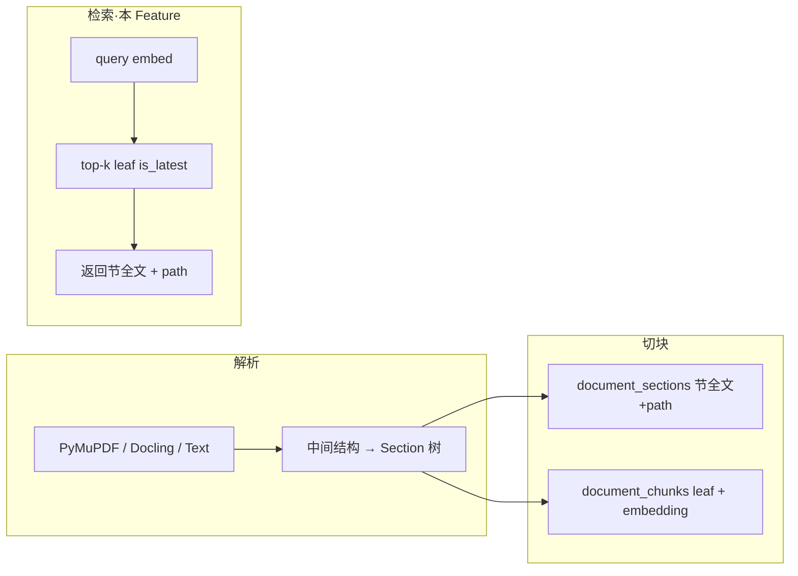

# F04 文档索引

> 仅对 `published` 文档解析、按 **H1–H6 节树** 分块、embedding（仅 leaf），写入 PostgreSQL/pgvector；提供内部 **向量检索**（命中 leaf → 返回 **所属节全文 + path**）；按租户隔离。

| 字段 | 值 |
|------|-----|
| **Status** | `done` |
| **Owner** | |
| **Approved by** | team |
| **Approved at** | 2026-07-22 |

> **数据模型依赖**：列名与版本行语义以 [02-data-model.md](../02-data-model.md) 与 [F07-doc-indexing-data-model.md](F07-doc-indexing-data-model.md) 为准（`is_latest` 替代原 `is_active`；`index_status`；`section_index`/`chunk_index`；富 chunk 字段）。本 Feature 索引/检索行为仍有效；持久化重构由 F07 验收。

## 范围

- 消费「文档已 publish」事件（或等价轮询 `index_job`）
- 解析 `.txt` / `.md` / `.pdf`（与 F03 Phase 1 一致；**不含** Office OOXML，见 Phase 2 [F08](../../phase2/features/F08-office-ooxml.md)）
- **PDF 骨架感知双路由**：有骨架 → **Docling 结构路径**（打标签：H1/H2/H3…、段落、表格、图片占位；`do_ocr=false`）；无骨架纯文字 → **PyMuPDF**；无骨架但文字质量差/打开失败时可 fallback Docling
- **Office 解析**：不在本 Feature；`.docx` / `.xlsx` / `.pptx` → F08（轻量库：`python-docx` / `python-pptx` / `openpyxl`；非 Docling）
- **层级感知切块**：从解析结果（结构 Markdown）构建 **H1–H6** 节树；超过 H6 的标题并入最近 H6 叶节；节内再按可配置 token 切出 leaf chunk
- **仅 leaf** 写入 embedding / pgvector；节全文与 `path` 存于 `document_sections`
- 推进版本行 **`index_status`**：`pending` → `processing` → `ready` / `failed`
- **内部检索** `search(tenant_id, query, top_k)`：`is_latest` leaf 向量 top-k → 组装节全文 + `path`（供 F06 `search_knowledge` 调用）
- 文档软删除或新版本索引成功后：旧 version 的 section / chunk / documents **`is_latest=false`**

## 非范围

- Admin UI 与发布状态机（F03）
- 文档版本行 schema / 双状态列迁移与富 chunk 字段落地（F07）
- Agent 对话与 Agent Loop / `search_knowledge` 工具编排（F06；F06 只调用本 Feature 的 `search`）
- 未 publish 文档的预览索引
- **OCR** / 扫描件文字识别（无文字层 PDF 见行为规则：空成功；双路由 **不** 为扫描件开启 OCR）
- 中文专用 OCR 后端（如 PaddleOCR）、云服务兜底（如 LlamaParse）——留 Phase 1.5+ 评估
- **超过 H6** 的无限深目录树（本 Feature 上限 H6；更深并入 H6）
- Dify 式 Parent-child 的「Full Doc」整篇 parent、或仅扁平 General 切块（无节树）
- 持久化第三方解析器原生对象树（仅落自家 `document_sections` / `document_chunks`）
- 对外 REST 检索网关（Phase 2 F11）
- Office OOXML 解析（Phase 2 F08）

## Flow

> Office（`.docx` / `.xlsx` / `.pptx`）解析图见 [F08](../../phase2/features/F08-office-ooxml.md)。

## 行为规则

1. **门禁（写）**：`publish_status != published` 的文档不得产生可检索态（`is_latest=true`）的 section / chunk。Publish 入队时版本行 `index_status=pending`。
2. **门禁（读 / search）**：仅当文档同时满足 `publish_status=published` AND `index_status=ready` AND `deleted_at IS NULL` AND leaf/section **`is_latest=true`**，且强制 `tenant_id` 过滤，方可命中。
3. 所有 section / chunk 必须带 `tenant_id`；写库与 **search** 均强制 `tenant_id` 过滤。
4. 同一 `document_group_id` 新版本索引成功后，旧版本 **documents / sections / chunks** **必须** `is_latest=false`（禁止用物理删除作为唯一手段）；软删除文档同理。
5. Worker 状态：抢到 job → `index_status=processing`；成功 → `ready`（并写 documents 上 embedding 审计字段）；失败 → `failed` + `error_message`；job 表 `status` 仍维护（队列视角）。
6. **解析失败**（文件损坏、PyMuPDF 与 Docling 均无法打开/转换等）：job `failed`，文档仍 `published`，`index_status=failed`，无 `is_latest` section/chunk；可重试（Phase 1：至少一条可测重试路径）。
7. **无字 / 空文档**：空 txt、或无文字层且未做 OCR 的 PDF → 解析结果为空 → job **`succeeded`**，`index_status=ready`，**0** section/chunk；search 无命中。（与「损坏失败」区分。）
8. **解析与表结构**：
   - **`.txt` / `.md`**：按字节解码为文本（UTF-8 优先，可回退 gb18030 / latin-1）；`parse_route=text`。
   - **`.pdf`（骨架感知双路由）**：
     1. **PyMuPDF 抽字 + 骨架探测**：outline/bookmarks（`PDF_SKELETON_MIN_TOC`，默认 1）和/或字号标题候选（`PDF_SKELETON_MIN_HEADING_CANDIDATES`，默认 3）；`PDF_FORCE_STRUCTURE=true` 强制结构路径。
     2. **无文字层**：空成功，`parse_route=pymupdf`，**不** OCR。
     3. **有骨架（或 force）→ 结构路径 Docling**：`do_ocr=false`；识别并打标签 **H1/H2/H3…、段落、表格、图片**（图为占位/题注，不 OCR）；经 `ParseBlock` → Markdown；`parse_route=docling`。Docling 未安装 → 按规则 6 **failed**（禁止悄悄退回 flat PyMuPDF 冒充结构成功）。
     4. **无骨架 + 有字 → PyMuPDF 纯文本**：`parse_route=pymupdf`。质量门限（`PDF_FAST_*`）仅作无骨架路径辅助：乱码/质量差或打开失败时可 fallback Docling。
     5. **不得**仅因「字符够多」把有骨架 PDF 压成扁平原文。
   - **`.docx` / `.xlsx` / `.pptx`**：不在 Phase 1；见 F08。
   - **多文件文档**：按 `document_files` 顺序解析后合并进同一版本的节树（文件间可插入分隔，避免表粘连）；每文件独立选路由并写结构化日志（含 `skeleton` 信号）。
9. **节树（层级）**：
   - 索引叶节为 Markdown **H1–H6**（或等价）；标题栈建树：正文归属于最近一层打开的标题；同级或更浅标题出现时关闭更深节。超过 H6（若出现）**并入**最近 H6 叶节。
   - 无任何标题：整篇（或整文件合并结果）作为 **单节**，`path` 可用文档 title 或文件名。
   - 父标题在首个子标题之前的非空导言可单独成叶节（`path` = 该父标题路径）；空正文节不落库。
   - **编号大纲归一化（业界层级）**：标题匹配 `^\d+(\.\d+)*`（如 `2.1.1 …`）时，建树前按编号深度补齐缺失父级并映射为 H1–H6（`level = min(depth, 6)`）。仅有编号叶、无显式父标题时，`path` 形如 `2 > 2.1 > 2.1.1 …`。**若已有非编号父标题**（如 `# 第二章 索引优化策略`），不得再插入同级或更浅的纯编号合成父级（如 `# 2`）；叶节 `path` 须保留该非编号祖先。空正文父节仍可不落库，但子节 `path` / `heading_path` 须含其标题。
   - **中文章标题（业界）**：标题匹配 `第…章`（中文数字或阿拉伯数字，如 `第二章…` / `第2章…`）时，无论解析器输出的 Markdown 井号层级（常见 Docling 全为 `##`），一律提升为 **H1**；并视为覆盖对应章号 `N` 的命名祖先（不得再插合成 `# N`）。书名等其它非章标题仍按原井号层级处理。
   - **正文净化**：节/leaf 写入前做 HTML 实体还原（`&gt;`→`>`）及常见 Markdown 转义清理（`\_`→`_`），避免检索噪声。
   - 每节存储 **`path`**（如 `退款政策 > 时效 > 细则`）与 **节全文** `content`；`level` 为 text `'1'`…`'6'`；`parent_id` 指向路径上更浅一节；序号列 **`section_index`**。
10. **切块（可配置，仅节内）**：
   - 对每个叶节全文再切 leaf：目标长度与重叠经 Settings（默认 `CHUNK_TARGET_TOKENS=800`，`CHUNK_OVERLAP_TOKENS=100`）。
   - **禁止**跨叶节边界合并正文后再切。
   - **表感知（超预算时）**：节长超过目标时，先按 Markdown 表边界切开（表前/表后）；**整表尽量作为独立 leaf**，不对表做字符滑窗横切。纯正文段再用目标长度 + overlap 滑窗。未超预算的短节可整节一条（含正文+表的 `mixed`）。
   - **超大单表**：仍优先整表一条；若单表显著超过目标，可按「表头 + 分隔行 + 若干数据行」组分片（每片保留表头），仍禁止从单元格中部切断。
   - 空节不产生 leaf；整文档无文本 → 0 chunk（见规则 7）。
   - 运行时只读配置；禁止同进程混用多套分块参数写同一批 chunk。
   - leaf 序号列 **`chunk_index`**（文档版本内全局）；写富字段（`heading_path`、`embedding_text`、`chunk_type`、`content_hash` 等）；**不**在 chunk 上存 `embedding_model`。
11. **Embedding（可配置）**：仅对 **leaf** `document_chunks` 调用单一 QWen 兼容接口；送入模型的文本为 **`embedding_text`** = `heading_path` 以 ` > ` 拼接 + 换行 + leaf `content`（无 path 时退化为仅 `content`）；`content` 列仍存纯正文。模型名与维度经配置（如 `EMBEDDING_MODEL`、`EMBEDDING_DIM`，默认维度 `1024`）。成功后审计字段写在 **`documents`**（`embedding_model` / `embedding_dimension` / provider）。同一部署一套维度；列类型与配置一致；改维度须迁库 + 全量重建。节全文 **不**单独向量化。
12. **检索契约**（本 Feature 实现）：`search(tenant_id, query, top_k) → Hit[]`
    - 用 query embedding 在 **`is_latest` leaf** 上 top-k（且对应文档 `publish_status=published`、`index_status=ready`、未软删）；
    - 每条命中映射到所属叶节，返回至少：`document_id`、`chunk_id`（命中的 leaf id）、`section_id`、`path`、`content`（**节全文**）、`score`；
    - **同一节**因多个 leaf 命中时去重，只保留最高分一条（结果中同一 `section_id` 至多一次）；
    - `tenant_id` 仅来自调用方上下文，禁止由不可信输入覆盖。
13. 旧版本失效策略固定为 **`is_latest=false`**；检索只使用 `is_latest=true` 的 leaf，并只返回对应 `is_latest` 节。
14. **可观测性**：索引 job 成功/失败日志须含 `document_id`、`version`（int）、每源文件的 `parse_route`（Phase 1：`text` | `pymupdf` | `docling`；Phase 2 F08 另增 `docx` | `pptx` | `xlsx`）与 PDF **`skeleton=true|false`**（及 reason）；Settings：`PDF_SKELETON_MIN_TOC`、`PDF_SKELETON_MIN_HEADING_CANDIDATES`、`PDF_FORCE_STRUCTURE`；无骨架辅助门限 `PDF_FAST_*`。

## 流水线中间对象（实现约定，非对外 API）

| 对象 | 用途 |
|------|------|
| 骨架探测 | TOC / 字号候选 → `has_skeleton`；只读，不写库 |
| `ParseBlock` | 结构路径中间块：`heading(level)` / `paragraph` / `table` / `image` → Markdown |
| 解析出口 | 映射为自家节树（非 Docling 原生对象直接下游） |
| `parse_route` | 单文件解析路径：`text` / `pymupdf` / `docling`（F08：`docx` / `pptx` / `xlsx`）；写结构化日志 |
| 叶节 | 含 `path`、节全文、`section_index`、text `level`；写入 `document_sections` |
| `ChunkDraft` | 节内 leaf：`content` + `chunk_index` + `section` 关联（及 `heading_path` / `embedding_text` 等）；写入 `document_chunks` 并 embed |

## 数据与边界

| 实体 | 关键字段 / 约束 |
|------|----------------|
| documents（版本行，索引相关） | `doc_id`, `tenant_id`, `doc_group_id`, `version_number`（int）, `is_latest`, `publish_status`, `index_status`(`pending`\|`processing`\|`ready`\|`failed`), `error_message`, `embedding_*`（审计） |
| index_job | `id`, `tenant_id`, `doc_id`（→ 版本行）, `version`（int）, `status`(`pending`\|`running`\|`succeeded`\|`failed`), `error` |
| document_section | `id`, `tenant_id`, `doc_id`, `parent_id`（可选，指向更浅父节）, `level`（text `'1'`…`'6'`）, `title`, `path`, `content`（节全文）, `section_index`, `is_latest` |
| document_chunk（leaf） | `chunk_id`, `tenant_id`, `doc_id`, `section_id`, `chunk_index`, `heading_path`, `content`, `embedding_text`, `chunk_type`, `token_count`, `content_hash`, `embedding vector(EMBEDDING_DIM)`, `metadata_`, `is_latest`（**无** `embedding_model`） |

时间戳列 `create_at` / `update_at` 见 [00-constraints.mdc](../../../../.cursor/rules/00-constraints.mdc) §3.2。明细见 [02-data-model.md](../02-data-model.md)。

内部检索（非对外 Phase 2 API）：

`search(tenant_id, query, top_k) → Hit[]`，其中 `Hit.content` = 节全文，`Hit.path` = 节路径。

**检索门禁**：`publish_status=published` AND `index_status=ready` AND `deleted_at IS NULL` AND section/chunk `is_latest=true` AND `tenant_id` 匹配。

## Test Cases

| ID | 步骤 | 期望 | 类型 |
|----|------|------|------|
| F04-T01 | Given 文档 publish When 索引 job 跑完 | Then job=succeeded；`index_status=ready`；存在 `is_latest` leaf chunks；embedding 非空；存在对应 `is_latest` sections（含非空 `path` 与节 `content`） | api |
| F04-T02 | Given `publish_status`=`review` 未 publish When 强行请求索引 | Then 不产生 `is_latest` section/chunk | api |
| F04-T03 | Given tenant-A 已索引文档 When tenant-B 调用 search 相同 query | Then 0 条 A 的命中 | api |
| F04-T04 | Given 空 txt publish When 索引 | Then job=succeeded；`index_status=ready`；0 section/chunk；search 无命中 | api |
| F04-T05 | Given `version=1` 已索引 When `version=2` 索引成功 | Then 仅 v2 documents/sections/chunks `is_latest=true`；search 不返回 v1 | api |
| F04-T06 | Given 已索引文档软删除 When search | Then 无该文档命中（section/chunk `is_latest=false`） | api |
| F04-T07 | Given 损坏/无法打开文件 When 索引 | Then job=failed；`index_status=failed`；无 `is_latest` section/chunk | api |
| F04-T08 | Given 已索引语料含独特短语 When search 该短语 | Then top-k 命中；返回的 `content` 为节全文且含该短语，`path` 非空 | api |
| F04-T09 | Given 无文字层 PDF（不 OCR）When 索引 | Then job=succeeded；`index_status=ready`；0 section/chunk | api |
| F04-T10 | Given 含 H1 与两个 H2 且各含独特短语的文档 When 索引 | Then leaf 不跨叶节；两节 `path` 可区分；各短语只出现在对应节 `content`；`section_index` 唯一 | api |
| F04-T11 | Given 同上 When search 仅出现在 H2-B 的短语 | Then 命中返回 H2-B 节全文与对应 `path`；`content` 不含 H2-A 专属正文 | api |
| F04-T20 | Given 含 H1/H2/H3 且 H3 含独特短语的文档 When 建节树/索引 | Then 存在 path 含三级（`H1 > H2 > H3`）的叶节；该短语仅在该 H3 节 `content`；不并入 H2 | unit |
| F04-T12 | Given 同节内多 leaf 均可被同一 query 命中 When search | Then 同一 `section_id` 在结果中至多出现一次 | api |
| F04-T13 | Given 无骨架、含可提取文字层的 PDF（独特短语）When 解析/索引 | Then `parse_route=pymupdf`；`skeleton=false`；search 可命中该短语 | unit |
| F04-T14 | Given 无骨架且文字质量不达标（或打开失败）When 解析 | Then fallback Docling；`parse_route=docling` | unit |
| F04-T15 | （已迁至 F08）Office `.docx` / `.pptx` / `.xlsx` 解析与索引 | 见 [F08](../../phase2/features/F08-office-ooxml.md) | — |
| F04-T16 | Given 有 TOC/骨架的 PDF When 解析 | Then `skeleton=true`；`parse_route=docling`；导出含多级 heading（及表/图标签若存在） | unit |
| F04-T17 | Given 判定有骨架但 Docling 不可用 When 索引 | Then job/index failed；不写入「假结构成功」的单节 flat 结果冒充结构路径 | unit |
| F04-T18 | Given 仅有编号小标题（如 `## 2.1.1` / `## 2.1.2`，无显式父标题）When 建节树 | Then 自动补父级；叶节 `path` 含 `>`（如 `2 > 2.1 > 2.1.1 …`）；正文 `&gt;`/`\_` 已净化 | unit |
| F04-T19 | Given 叶节 `path` 非空 When 写入 chunk | Then `embedding_text` 以 path 为前缀且含 leaf `content`；向量对 `embedding_text` 计算；`content` 不含强制拼上的 path 前缀 | unit |
| F04-T22 | Given `# 第二章…` + 编号 `## 2.1` / `## 2.1.1`（章下无导言）When 建节树 | Then 不插入合成 `# 2`；叶节 `path` 以 `第二章…` 开头；可不落库空章行 | unit |
| F04-T24 | Given Docling 扁平 `## 书名` + `## 第二章…` + `## 2.1` / `## 2.1.1` When 建节树 | Then `第二章` 提升为 H1；不插入合成 `# 2`；叶节 `path` 以 `第二章…` 开头（不以 `2 >` 开头） | unit |
| F04-T23 | Given 节内长正文 + Markdown 表且总长超过目标 When 切 leaf | Then 在表前/表后切开；表 leaf 含完整表（含表头行）；正文 leaf 不含被横切的半表；纯正文才滑窗 | unit |
