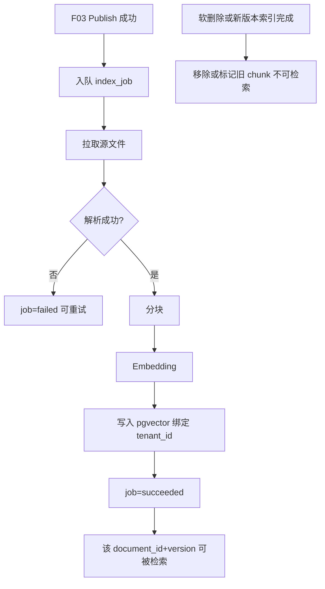

# F04 文档索引

> 仅对 `published` 文档解析、分块、embedding，写入 PostgreSQL/pgvector；按租户隔离。

| 字段 | 值 |
|------|-----|
| **Status** | `review` |
| **Owner** | |
| **Approved by** | |
| **Approved at** | |

## 范围

- 消费「文档已 publish」事件（或等价轮询任务）
- 解析 txt / pdf / word / ppt 文本
- 分块、调用 embedding（与 QWen 生态兼容的 embedding 接口，实现固定一种）
- 向量写入 pgvector；元数据含 `tenant_id`、`document_id`、`version`、`chunk_id`
- 文档软删除或新版本发布后：旧索引失效/替换
- 检索查询接口供 F06 使用（内部）：按 tenant + query embedding top-k

## 非范围

- Admin UI 与状态机（F03）
- Agent 对话与意图（F06）
- 未 publish 文档的预览索引

## Flow

## 行为规则

1. **门禁**：`status != published` 的文档不得产生可检索 chunk。
2. 所有 chunk 必须带 `tenant_id`；检索强制过滤 `tenant_id = 当前租户`。
3. 同一 `document_id` 新版本索引成功后，旧版本 chunk 不可再被检索（删除或 `is_active=false`）。
4. 解析失败：job `failed`，文档仍保持 `published`，但检索不到内容；可重试（Phase 1：至少支持手动/自动重试一次的可测路径）。
5. 分块：固定策略（如目标 ~500–1000 tokens、重叠），须在实现中常量配置并被单元测试覆盖边界（空文档 → 0 chunk）。
6. Embedding 维度固定；表结构使用 pgvector 列。

## 数据与边界

| 实体 | 关键字段 / 约束 |
|------|----------------|
| index_job | `id`, `tenant_id`, `document_id`, `version`, `status`(`pending`\|`running`\|`succeeded`\|`failed`), `error` |
| chunk | `id`, `tenant_id`, `document_id`, `version`, `ordinal`, `content`, `embedding vector`, `is_active` |

时间戳列 `createtime` / `lastmodifiedtime` 见 [00-constraints.md](../../00-constraints.md) §3.1。

内部检索 API（非对外 Phase 2 API）：`search(tenant_id, query, top_k) → chunks[]`。

## Test Cases

| ID | 步骤 | 期望 | 类型 |
|----|------|------|------|
| F04-T01 | Given 文档 publish When 索引 job 跑完 | Then job=succeeded；存在 active chunks；embedding 非空 | api |
| F04-T02 | Given status=`verified` 未 publish When 强行请求索引 | Then 不产生 active chunks | api |
| F04-T03 | Given tenant-A 已索引文档 When tenant-B search 相同 query | Then 0 条 A 的 chunk | api |
| F04-T04 | Given 空 txt publish When 索引 | Then job=succeeded；0 chunks；search 无命中 | api |
| F04-T05 | Given v1.0 已索引 When v1.1 索引成功 | Then 仅 v1.1 chunks active；search 不返回 v1.0 | api |
| F04-T06 | Given 已索引文档软删除 When search | Then 无该文档 chunk | api |
| F04-T07 | Given 损坏/无法解析文件 When 索引 | Then job=failed；无 active chunks | api |
| F04-T08 | Given 已索引语料含独特短语 When search 该短语 | Then top-k 命中含该短语的 chunk | api |
