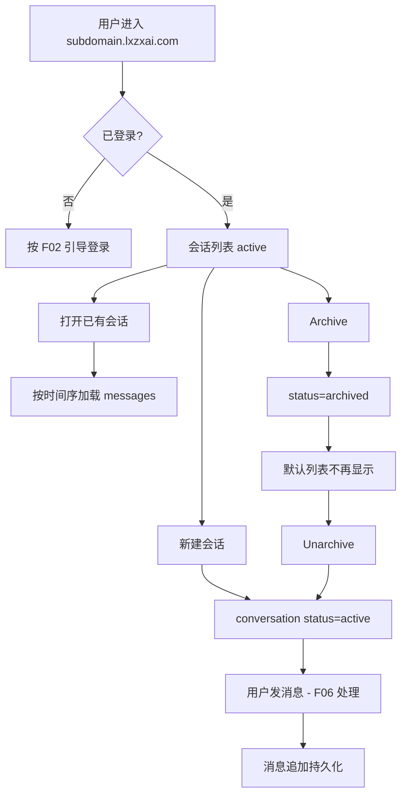

# F05 会话列表与归档

> `{subdomain}.lxzxai.com`：聊天会话的创建、列表、归档与消息持久化（供 F06 使用）。

| 字段 | 值 |
|------|-----|
| **Status** | `review` |
| **Owner** | |
| **Approved by** | |
| **Approved at** | |

## 范围

- 创建会话、列出会话、打开会话历史
- 归档 / 取消归档
- 消息落库（user / assistant / system / tool 角色）
- 租户隔离；需登录（Phase 1：租户成员使用聊天）

## 非范围

- Agent 推理、检索、工具调用（F06）
- 匿名公开访客聊天（不做）
- 会话导出、分享链接

## Flow

## 行为规则

1. 会话与消息均带 `tenant_id` + `user_id`（创建者）；不可跨租户读写。
2. 新建会话：`status=active`，可有可选 `title`（默认「新会话」或首条用户消息截断）。
3. 默认列表仅 `active`；归档列表或带 `?status=archived` 可查归档。
4. Archive：`active → archived`；Unarchive：`archived → active`。
5. 消息追加只允许在 `active` 会话；向 `archived` 发消息 → 4xx（或自动 unarchive——Phase 1 **固定为 4xx**）。
6. 消息字段：`role`, `content`；排序默认按 `createtime` 升序；tool 相关扩展字段由 F06 写入但不破坏本 Feature 的列表/历史 API。
7. 删除会话：Phase 1 软删除；列表不可见。

## 数据与边界

| 实体 | 关键字段 / 约束 |
|------|----------------|
| conversation | `id`, `tenant_id`, `user_id`, `title`, `status`(`active`\|`archived`), `deleted_at` |
| message | `id`, `conversation_id`, `tenant_id`, `role`, `content`, 可选 `meta` JSON |

时间戳列 `createtime` / `lastmodifiedtime` 见 [00-constraints.mdc](../../../../.cursor/rules/00-constraints.mdc) §3.1。

## Test Cases

| ID | 步骤 | 期望 | 类型 |
|----|------|------|------|
| F05-T01 | Given 成员登录 When 创建会话 | Then 201；status=`active`；出现在默认列表 | api |
| F05-T02 | Given 会话 A 有 3 条消息 When GET 历史 | Then 按 `createtime` 升序返回 3 条 | api |
| F05-T03 | Given active 会话 When archive | Then 默认列表不可见；archived 列表可见 | api |
| F05-T04 | Given archived 会话 When POST 消息 | Then 4xx | api |
| F05-T05 | Given archived 会话 When unarchive | Then 回到默认列表；可再发消息 | api |
| F05-T06 | Given tenant-A 会话 id When tenant-B GET | Then 404 或 403 | api |
| F05-T07 | Given 软删除会话 When 列表 | Then 不可见 | api |
