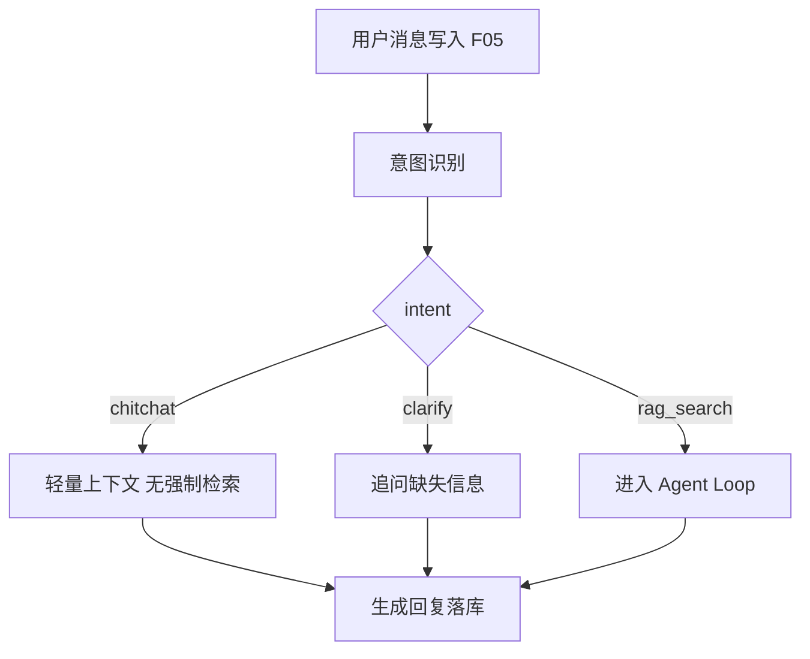

# F06 RAG Agent

> 租户站 RAG Agent：意图路由、上下文组装、多轮记忆与压缩、工具调用、Agent Loop；LLM = QWen；检索走 F04。

| 字段 | 值 |
|------|-----|
| **Status** | `review` |
| **Owner** | |
| **Approved by** | |
| **Approved at** | |

## 范围

- 在 `active` 会话中接收用户消息并回复（依赖 F05）
- 意图识别与路由（至少：`rag_search` / `chitchat` / `clarify`）
- 上下文组装：system prompt + 历史 + 规则 + 检索片段
- 长对话压缩（超出窗口时）
- 工具调用：至少 `search_knowledge`（封装 F04 search）
- Agent Loop：多步工具 → 观察 → 再推理，直至终止
- 流式或非流式响应均可，但须可测最终 assistant 消息落库

## 非范围

- 文档上传与发布（F03/F04）
- 会话列表 UI 细节（F05）
- 对外 REST API 网关（Phase 2）
- 非 RAG 业务工作流编排（仅预留路由扩展点）

## Flow

### 请求主路径

### Agent Loop

## 行为规则

1. **租户隔离**：所有检索与 prompt 注入仅限当前 Host 对应 `tenant_id`。
2. **LLM**：QWen；超时与重试策略固定（Phase 1：超时 **60s**；工具失败不无限重试，计入 loop）。
3. **意图**：
   - `rag_search`：需要知识库答案 → 走 Agent Loop，应调用 `search_knowledge`（除非历史已足够且策略允许跳过——Phase 1：**首次 rag_search 必须至少调用一次工具**）。
   - `chitchat`：寒暄；不强制检索。
   - `clarify`：槽位不足；回复追问，不编造知识库事实。
4. **上下文组装**顺序（可测）：
   1. system prompt（租户级可配置默认值）
   2. 规则（如「只依据检索结果作答；无依据则说明不知道」）
   3. 压缩后的对话历史
   4. 本轮工具结果 / 检索片段
5. **记忆与压缩**：当历史 token（或消息数）超过阈值（Phase 1：消息数 **>20** 或实现中的 token 上限）时，将更早轮次压缩为一条 `system`/`summary` 消息再参与组装；压缩后近期 N 条原文保留（N=6）。
6. **Agent Loop**：
   - `MAX_STEPS = 5`（含最终回答那一步的模型调用）
   - 终止：`final_answer`、或步数耗尽、或不可恢复错误
   - 工具名白名单：Phase 1 仅 `search_knowledge`
7. **search_knowledge**：参数含 `query`；内部调用 F04；只返回 active published chunks。
8. 无检索命中时：回答须表明知识库无相关内容，**禁止编造**文档事实（可用固定话术 + 测试断言关键子串/分类器桩）。
9. 每轮用户消息与最终 assistant 消息必须经 F05 持久化；tool 轨迹可写入 `message.meta` 或独立表，须可被测试查询。

## 数据与边界

| 实体 / 配置 | 关键字段 / 约束 |
|-------------|----------------|
| agent_run | `id`, `conversation_id`, `tenant_id`, `intent`, `steps`, `status` |

时间戳列 `createtime` / `lastmodifiedtime` 见 [00-constraints.mdc](../../../../.cursor/rules/00-constraints.mdc) §3.1。
| 配置常量 | `MAX_STEPS=5`, `HISTORY_COMPRESS_AFTER_MESSAGES=20`, `KEEP_RECENT_MESSAGES=6`, `LLM_TIMEOUT_S=60` |
| 工具 | `search_knowledge(query: string) -> {chunks: [...]}` |

## Test Cases

| ID | 步骤 | 期望 | 类型 |
|----|------|------|------|
| F06-T01 | Given 租户有含「退货窗口 30 天」的已索引文档 When 用户问退货政策 | Then intent 为 rag_search；至少一次 search_knowledge；回复含 30 天或等价依据；消息落库 | api |
| F06-T02 | Given 知识库无相关内容 When 用户问不存在主题 | Then 调用检索后回复表明无相关内容；不出现伪造书名/条款号（固定禁用模式可测） | api |
| F06-T03 | Given 用户说「你好」 When 发送 | Then intent=chitchat；可不调用 search_knowledge；有礼貌回复落库 | api |
| F06-T04 | Given 模糊问题缺关键槽位 When 发送 | Then intent=clarify；回复为追问；无胡说事实 | api |
| F06-T05 | Given 会话已有 25 条消息 When 再问 | Then 发生压缩（存在 summary 或历史组装长度受控）；仍能回答且近期消息保留 | api |
| F06-T06 | Given 模型连续请求工具 When 步数将超 MAX_STEPS | Then 在第 5 步内终止并给出总结性回复；status 可区分 completed/truncated | api |
| F06-T07 | Given tenant-A 索引语料 When 在 tenant-B 会话问相同问题 | Then 检索不到 A 的内容 | api |
| F06-T08 | Given archived 会话 When 发消息触发 Agent | Then 4xx（与 F05 一致）；无 agent_run 成功完成 | api |
| F06-T09 | Given QWen/工具超时桩 When 请求 | Then 错误回复落库；loop 终止；不挂死 | api |
| F06-T10 | Given 白名单外工具名被模型返回 When loop | Then 忽略或报错并终止；不执行任意代码/外部调用 | unit |
