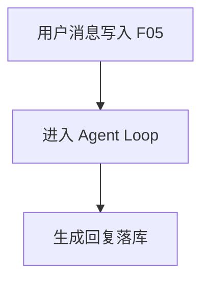
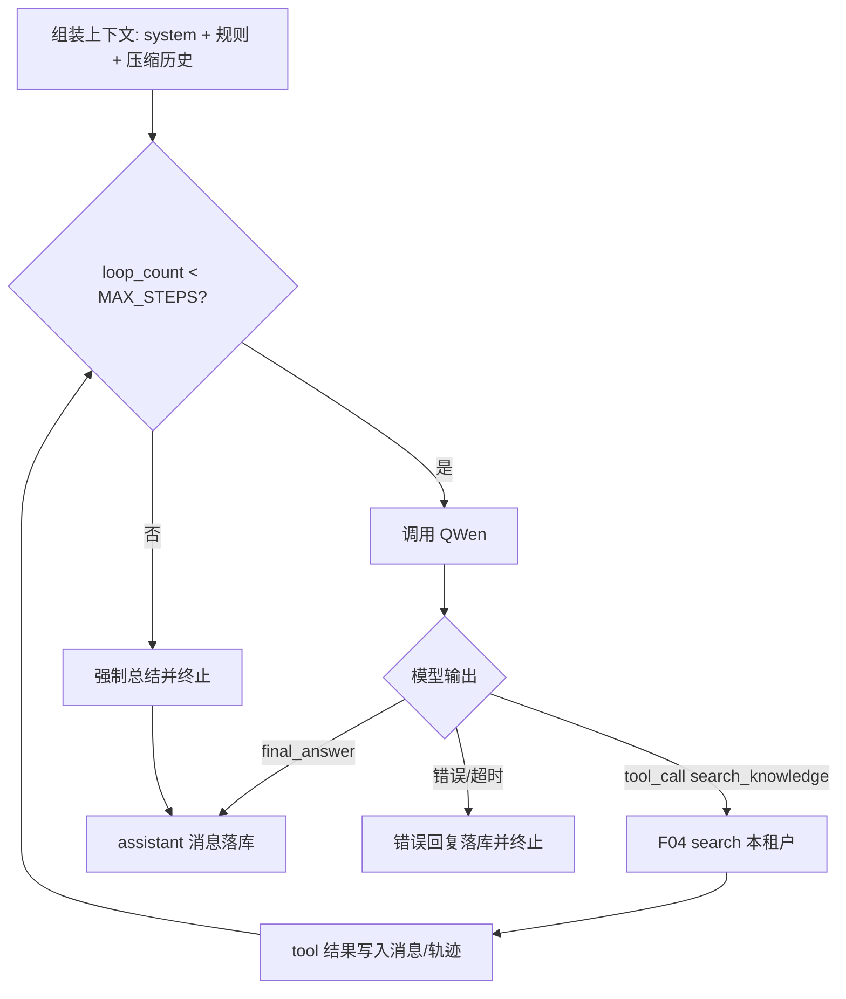

# F06 RAG Agent

> 租户站通用 RAG Agent：上下文组装、多轮记忆与压缩、工具调用、Agent Loop；LLM = QWen；检索走 **F04 `search`**。  
> **不做**前置意图分类：每轮用户消息一律进入 Agent Loop，由模型决定是否调用 `search_knowledge` 及检索 query。

| 字段 | 值 |
|------|-----|
| **Status** | `done` |
| **Owner** | |
| **Approved by** | |
| **Approved at** | |

## 范围

- 在 `active` 会话中接收用户消息并回复（依赖 F05）
- 上下文组装：system prompt + 历史 + 规则 + 检索片段
- 长对话压缩（超出窗口时）
- 工具调用：至少 `search_knowledge`（封装 **F04 `search`**：active leaf top-k → 节全文 + `path`）
- Agent Loop：多步工具 → 观察 → 再推理，直至终止
- 流式或非流式响应均可，但须可测最终 assistant 消息落库

## 非范围

- 前置意图分类 / 路由（`rag_search` / `chitchat` / `clarify` 等）
- 文档上传与发布（F03）
- **解析 / 分块 / embedding / index_job / 向量 `search`**（F04）
- 会话列表 UI 细节（F05）
- 对外 REST API 网关（Phase 2）
- 非 RAG 业务工作流编排（仅预留路由扩展点）

## Flow

### 请求主路径

### Agent Loop

行为由 Loop 内模型自然产生（非前置标签）：

| 用户输入 | 典型模型行为 |
|----------|--------------|
| 知识库相关问题 | 调用 `search_knowledge`，再据片段作答 |
| 寒暄（如「你好」） | 可不调用工具，直接礼貌回复 |
| 信息不足、无法检索 | 可追问澄清；不编造知识库事实 |
| 知识库无命中 | 明确说明无相关内容；禁止编造 |

## 行为规则

1. **租户隔离**：所有检索与 prompt 注入仅限当前 Host 对应 `tenant_id`。
2. **LLM**：QWen；超时与重试策略固定（Phase 1：超时 **60s**；工具失败不无限重试，计入 loop）。
3. **无前置意图分类**：每轮用户消息一律进入 Agent Loop；是否检索、检索 query、是否追问，均由模型在 Loop 内决定。用户消息本身即本轮任务；`search_knowledge` 的 `query` 由模型填写（可改写用户原话）。
4. **上下文组装**顺序（可测）：
   1. system prompt（租户级可配置默认值）
   2. 规则（如「只依据检索结果作答；无依据则说明不知道」）
   3. 压缩后的对话历史
   4. 本轮工具结果 / 检索片段
5. **记忆与压缩**：当历史 token（或消息数）超过阈值（Phase 1：消息数 **>20** 或实现中的 token 上限）时，将更早轮次压缩为一条 `system`/`summary` 消息再参与组装；压缩后近期 N 条原文保留（N=6）。
6. **Agent Loop**：
   - `MAX_STEPS = 5`（含最终回答那一步的模型调用）
   - 终止：`final_answer`、或步数耗尽、或不可恢复错误
   - 工具名白名单：Phase 1 仅 `search_knowledge`
7. **search_knowledge**：参数含 `query`；内部调用 **F04 `search`**；只返回 active published 命中；每条为 **节全文 + `path`**（形状见 F04）；`tenant_id` 仅来自请求上下文，不得由模型参数传入。
8. 无检索命中时：回答须表明知识库无相关内容，**禁止编造**文档事实（可用固定话术 + 测试断言关键子串/分类器桩）。
9. 每轮用户消息与最终 assistant 消息必须经 F05 持久化；tool 轨迹可写入 `message.meta` 或独立表，须可被测试查询。

## 数据与边界

| 实体 / 配置 | 关键字段 / 约束 |
|-------------|----------------|
| agent_run | `id`, `conversation_id`, `tenant_id`, `used_search`, `steps`, `status` |

时间戳列 `create_at` / `update_at` 见 [00-constraints.mdc](../../../../.cursor/rules/00-constraints.mdc) §3.2。
| 配置常量 | `MAX_STEPS=5`, `HISTORY_COMPRESS_AFTER_MESSAGES=20`, `KEEP_RECENT_MESSAGES=6`, `LLM_TIMEOUT_S=60` |
| 工具 | `search_knowledge(query: string) -> {chunks: [{document_id, chunk_id, section_id, path, content, score}, ...]}`（`content`=节全文） |

- `used_search`：本轮是否至少执行过一次 `search_knowledge`（观测字段，非路由前置条件）。

## Test Cases

| ID | 步骤 | 期望 | 类型 |
|----|------|------|------|
| F06-T01 | Given 租户有含「退货窗口 30 天」的已索引文档 When 用户问退货政策 | Then 至少一次 search_knowledge；`used_search=true`；回复含 30 天或等价依据；消息落库 | api |
| F06-T02 | Given 知识库无相关内容 When 用户问不存在主题 | Then 调用检索后回复表明无相关内容；不出现伪造书名/条款号（固定禁用模式可测） | api |
| F06-T03 | Given 用户说「你好」 When 发送 | Then 进入 Agent Loop；可不调用 search_knowledge；有礼貌回复落库 | api |
| F06-T04 | Given 模糊问题缺关键信息 When 发送 | Then 回复为追问或说明信息不足；无胡说知识库事实 | api |
| F06-T05 | Given 会话已有 25 条消息 When 再问 | Then 发生压缩（存在 summary 或历史组装长度受控）；仍能回答且近期消息保留 | api |
| F06-T06 | Given 模型连续请求工具 When 步数将超 MAX_STEPS | Then 在第 5 步内终止并给出总结性回复；status 可区分 completed/truncated | api |
| F06-T07 | Given tenant-A 索引语料 When 在 tenant-B 会话问相同问题 | Then 检索不到 A 的内容 | api |
| F06-T08 | Given archived 会话 When 发消息触发 Agent | Then 4xx（与 F05 一致）；无 agent_run 成功完成 | api |
| F06-T09 | Given QWen/工具超时桩 When 请求 | Then 错误回复落库；loop 终止；不挂死 | api |
| F06-T10 | Given 白名单外工具名被模型返回 When loop | Then 忽略或报错并终止；不执行任意代码/外部调用 | unit |
| F06-T11 | Given 任意用户消息 When 触发 Agent | Then 无独立意图分类步骤；不存在 `rag_search`/`chitchat`/`clarify` 路由分支 | unit |
