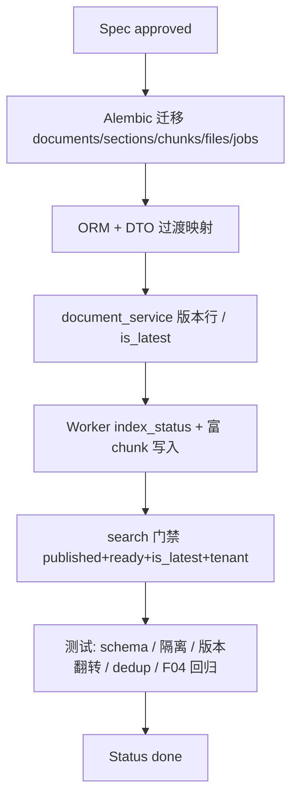

# F07 文档索引数据模型重构

> 将 F03/F04 持久化对齐为多租户**文档版本行** + 双状态（`publish_status` / `index_status`）+ 统一 `is_latest` + 富 `document_chunks`；字符串列一律 `text`；schema 仍为 `rag_service`。

| 字段 | 值 |
|------|-----|
| **Status** | `done` |
| **Owner** | |
| **Approved by** | team |
| **Approved at** | 2026-07-22 |

> Status：`draft` → `review` → `approved` → `done`。未 `approved` 不得实现，见 [00-constraints.mdc](../../../../.cursor/rules/00-constraints.mdc) §8。

## 范围

- Alembic + ORM：`documents` 版本行（`id`=版本 PK、`document_group_id`、`version` int、`is_latest`）
- 双状态：`status` → `publish_status`；新增 `index_status`、`error_message`
- 源/内容/embedding 审计字段落在 **documents**（`source_*`、`content_sha256`、`embedding_*`、`metadata_`）
- `document_sections`：`ordinal`→`section_index`；`is_active`→`is_latest`；`level` 为 text `'1'`|`'2'`；去掉冗余 text 版本文档列
- `document_chunks`：`ordinal`→`chunk_index`；`is_active`→`is_latest`；富字段；**无** `embedding_model`
- `document_files` / `index_jobs`：`version` 为 int；FK → 版本行
- 租户作用域唯一约束与同租户 content 去重/跳过
- 适配 document_service / worker / search / Admin DTO（`status` 过渡别名）
- 同步 [02-data-model.md](../02-data-model.md)、F03/F04 数据边界（已 Spec-first）

## 非范围

- 将 PostgreSQL schema 改名为 `rag`
- 取消 F03 `draft`/`review`/`published` 或重做 Admin UI
- 跨租户共享知识库 / 全局 content 去重
- Phase 2 对外检索网关；改 embedding 维度默认值（仍 1024 可配置）
- 用物理删除替代版本失效（旧版本置 `is_latest=false`）
- 改写 F04 解析双路由 / H1-H2 切块算法本身（本 Feature 改持久化与门禁列名）

## Flow

## 行为规则

1. 业务表仍在 **`rag_service`**；全表 `create_at`/`update_at` + `tr_{表名}_lmt`；字符串列一律 **`text`**（禁止 `varchar`）。
2. 每行 `documents` 是一个**版本**：`id`=版本 PK；逻辑文档用 `document_group_id`；`version` 为 int（从 1 递增）；Admin 展示 `v{N}`（见 F03）。
3. **`publish_status`**（`draft`|`review`|`published`）与 **`index_status`**（`pending`|`processing`|`ready`|`failed`）不得合并为单一枚举；`error_message` 仅索引失败。
4. API 过渡期可继续暴露 JSON 字段 `status` → 映射 `publish_status`；内部 ORM/库列用清晰名。
5. 列名统一 **`is_latest`**（不用 `is_active`）于 documents / document_sections / document_chunks。
6. 约束：`UNIQUE (tenant_id, document_group_id, version)`；部分唯一 `(tenant_id, document_group_id) WHERE is_latest`；禁止无租户的全局 hash/source 唯一。
7. 同租户 `content_sha256` 已有 `ready` latest → 可跳过冗余索引；跨租户相同 hash **不**共享、不跳过。
8. sections：`UNIQUE (document_id, section_index)`；`level` text `'1'`|`'2'`；版本由 `document_id` 表达。
9. chunks：`UNIQUE (document_id, chunk_index)`；含 `heading_path`、`embedding_text`、`chunk_type`、`content_hash`、`content_tsv`（可空）、`metadata_` 等；**禁止** chunk 上的 `embedding_model`。
10. 新版本索引成功：旧 versions 的 documents/sections/chunks 一律 `is_latest=false`；新版本对应行 `is_latest=true` 且 `index_status=ready`。
11. **检索门禁**：`publish_status=published` AND `index_status=ready` AND `deleted_at IS NULL` AND section/chunk `is_latest=true` AND `tenant_id` 强制过滤。
12. 删除版本行：`document_chunks` / `document_sections` `ON DELETE CASCADE`（ORM `cascade="all, delete-orphan"` 或等价）。
13. F04-T01–T15 / F03 publish 相关用例在新列名下须仍绿（回归）。

## 数据与边界

> 全表强制含 `create_at` / `update_at`（`timestamp` + trigger `tr_{表名}_lmt`），见 [00-constraints.mdc](../../../../.cursor/rules/00-constraints.mdc) §3.2；明细以 [02-data-model.md](../02-data-model.md) §4.5–4.9 为准。

| 实体 | 关键字段 / 约束 |
|------|----------------|
| documents | `id`（版本 PK）, `tenant_id`, `document_group_id`, `version` int, `is_latest`, `publish_status`, `index_status`, `error_message`, `source_*`, `content_sha256`, `embedding_*`, `metadata_`, `title`, `tag`, `created_by`, `deleted_at`；`UNIQUE (tenant_id, document_group_id, version)`；partial unique WHERE `is_latest` |
| document_files | `document_id`→版本行, `version` int, … |
| index_jobs | `document_id`→版本行, `version` int, queue `status`, … |
| document_sections | `section_index`, `level` text, `is_latest`, `path`, `content`, …；`UNIQUE (document_id, section_index)`；无冗余 version text 列 |
| document_chunks | `chunk_index`, `heading_path`, `content`, `content_tsv`, `embedding_text`, `chunk_type`, `section_id`, `token_count`, `content_hash`, `embedding`, `metadata_`, `is_latest`；**无** `embedding_model`；`UNIQUE (document_id, chunk_index)` |

## Test Cases

| ID | 步骤 | 期望 | 类型 |
|----|------|------|------|
| F07-T01 | Given 迁移已应用 When 检查 `documents`/`document_sections`/`document_chunks`/`document_files`/`index_jobs` 列类型 | Then 字符串列为 `text`（无 `varchar`）；存在 `create_at`/`update_at` 与 `tr_*_lmt`；`documents.version` 为 int | unit |
| F07-T02 | Given 租户成员新建文档 When 持久化 | Then 插入版本行：`document_group_id` 新、`version=1`、`is_latest=true`、含 `tenant_id`；`publish_status=draft` | api |
| F07-T03 | Given tenant-A 与 tenant-B 各有文档（可相同 `document_group_id` 或 `content_sha256` 值）When 任一方查询/检索 | Then 互不可见、不可变对方行（租户隔离） | api |
| F07-T04 | Given 版本行 publish 且 index job 入队 When 读库 | Then `publish_status=published` 且 `index_status` 为 `pending` 或 `processing` | api |
| F07-T05 | Given 已 published 版本 When 索引失败 | Then `publish_status` 仍为 `published`；`index_status=failed`；`error_message` 非空 | api |
| F07-T06 | Given 索引成功 When 读 documents 与 chunks | Then `index_status=ready`；documents 上 `embedding_model`/`embedding_dimension`（及 provider 若有）已填；chunks **无** `embedding_model` 列 | api |
| F07-T07 | Given 同组 `version=1` 已 ready When `version=2` 索引成功 | Then v2 documents/sections/chunks `is_latest=true`；v1 三表对应行均为 `is_latest=false` | api |
| F07-T08 | Given 同租户已有 `content_sha256` 且 `index_status=ready` 的 latest When 再发布相同内容 | Then 按实现策略跳过冗余 embedding/index 工作 | api |
| F07-T09 | Given tenant-A 与 tenant-B 发布相同 `content_sha256` When 双方索引 | Then 各自拥有独立版本行与可检索 chunk；互不 search 命中对方内容 | api |
| F07-T10 | Given 索引 worker 写入 H1/H2 节 When 读 sections | Then 每节 `section_index` 在 `document_id` 内唯一；`level` 为 text（如 `'1'`/`'2'`） | api |
| F07-T11 | Given 索引 worker 写入 leaf When 读 chunks | Then 含 `tenant_id`、单调 `chunk_index`、非空 `embedding_text`、`heading_path` 与父节对齐、`is_latest=true`；无 `embedding_model` | api |
| F07-T12 | Given 删除某一 `documents` 版本行 When 查依赖 | Then 其 `document_chunks`（及按 FK 的 sections）被 CASCADE 删除 | api |
| F07-T13 | Given tenant-A 已有 published+ready 语料 When tenant-A search 独特短语 / tenant-B 同 query | Then A 命中含节 `content`+`path`；B 无 A 的命中 | api |
| F07-T14 | Given F07 迁移与适配完成 When 跑 F04-T01–T15（及 F03 publish 关键路径） | Then 在新列名（`is_latest`/`index_status`/`section_index`/`chunk_index`/`version` int）下全部通过 | api |
| F07-T15 | Given 审阅 [02-data-model.md](../02-data-model.md) §4.5–4.9 When 对照锁定命名 | Then 文档列出 `version`/`is_latest`/`section_index`/`chunk_index`/text `level`；chunks **无** `embedding_model` | unit |
