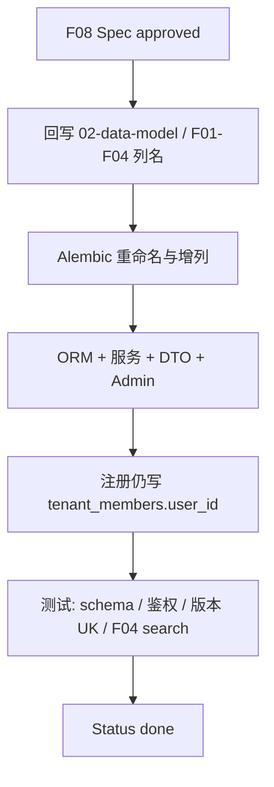

# F08 数据模型列命名与身份字段重构

> 在 F07 版本行 / 双状态基础上，统一主键与业务列命名（`tenant_id` / `user_id` / `doc_id` / `chunk_id` 等），扩展租户/用户/成员状态字段；**保留** `tenant_members.user_id` 与文档多版本唯一约束；时间戳仍为 `create_at` / `update_at`。

| 字段 | 值 |
|------|-----|
| **Status** | `done` |
| **Owner** | |
| **Approved by** | team |
| **Approved at** | 2026-07-23 |

> Status：`draft` → `review` → `approved` → `done`。未 `approved` 不得实现，见 [00-constraints.mdc](../../../../.cursor/rules/00-constraints.mdc) §8。

## 范围

- 回写 [02-data-model.md](../02-data-model.md) 与受影响的 F01–F04 / F07 数据边界（列名）
- Alembic + ORM：下列五表（及相关 FK 引用列）按本 Spec 重命名/增列
- 适配注册 / 登录鉴权 / 文档 API / 索引 worker / search / Admin DTO
- 破坏性迁移可接受（开发期）；迁移后须回归 F01–F07 关键路径

### 表级变更摘要

#### 1. `tenants`

| 变更 | 说明 |
|------|------|
| `id` → **`tenant_id`** | PK |
| `subdomain` → **`tenant_name`** | `text` NOT NULL；**全局唯一**；兼 Host 二级域名 `{tenant_name}.lxzxai.com` |
| 新增 **`status`** | `text`；租户状态（枚举见行为规则） |
| 新增 **`charge_mode`** | `text`；计费模式（枚举见行为规则） |
| 删除 `display_name` | 若存在则去掉；展示可用 `tenant_name` |
| 时间戳 | **`create_at` / `update_at`**（禁止 `created_at`/`updated_at`） |

**列顺序（逻辑）**：`tenant_id`, `tenant_name`, `status`, `charge_mode`, `create_at`, `update_at`

**索引 / 约束命名**：

1. PK `pk_tenants_tenant_id`：`tenant_id`
2. UK `uk_tenants_tenant_name`：`tenant_name`
3. 删除本表上其他业务唯一/冗余索引（trigger `tr_tenants_lmt` 保留）

**`tenant_name` 规则**（须同步改 constraints / F01）：

- 小写字母、数字；**允许连字符 `-`**（与现网子域规则一致，避免破坏已有租户）
- 长度 **3–32**；不以 `-` 开头或结尾
- 保留字同 constraints：`www`、`admin`、`api`、`app`、`mail`、`static`、`cdn`、`lxzxai`

#### 2. `users`

| 变更 | 说明 |
|------|------|
| `id` → **`user_id`** | PK |
| 新增 **`user_name`** | `text` NOT NULL；**全局唯一**；注册时写入 |
| 新增 **`active`** | `int` NOT NULL DEFAULT `1`；`1`=激活，`0`=禁用 |
| 时间戳 | `create_at` / `update_at` |

**列顺序**：`user_id`, `user_name`, `email`, `password_hash`, `active`, `create_at`, `update_at`

**索引 / 约束命名**：

1. PK `pk_users_user_id`：`user_id`
2. UK `uk_users_email`：`email`
3. UK `uk_users_user_name`：`user_name`
4. 删除本表其他业务冗余索引（`tr_users_lmt` 保留）

#### 3. `tenant_members`

> **硬规则**：成员必须对应已注册 `users`；**禁止删除 `user_id`**。注册时仍写入 owner 成员行；Add member 时用对方 `users.user_id`（或邀请接受后写入）。

| 变更 | 说明 |
|------|------|
| `id` → **`member_id`** | 关系行 PK（独立 UUID，**不等于**强制等于 `user_id`） |
| **保留 `user_id`** | NOT NULL FK → `users.user_id` |
| 新增 **`member_name`** | `text` NOT NULL；注册/加入时默认拷贝 `users.user_name` |
| 新增 **`active`** | `int` NOT NULL DEFAULT `1`；租户内启用/禁用 |
| 时间戳 | `create_at` / `update_at` |

**列顺序**：`member_id`, `tenant_id`, `user_id`, `member_name`, `active`, `role`, `create_at`, `update_at`

**索引 / 约束命名**：

1. PK `pk_tenant_members_member_id`：`member_id`
2. UK `uk_tenant_members_tenant_id_user_id`：`(tenant_id, user_id)`
3. UK `uk_tenant_members_tenant_id_member_name`：`(tenant_id, member_name)`（租户内显示名唯一）
4. 索引 `ix_tenant_members_user_id`：`(user_id)`（登录后查所属租户；**保留**）
5. FK：`tenant_id` → `tenants.tenant_id`；`user_id` → `users.user_id`
6. `tr_tenant_members_lmt` 保留

#### 4. `documents`（版本行，承接 F07）

| 变更 | 说明 |
|------|------|
| `id` → **`doc_id`** | 版本行 PK |
| `title` → **`doc_name`** | |
| `tag` → **`doc_tag`** | |
| `document_group_id` → **`doc_group_id`** | 逻辑文档组 |
| `version` → **`version_number`** | `int`，组内从 1 递增 |
| `metadata_` → **`source_metadata`** | `jsonb` |
| **保留 `publish_status`** | **不**改名为笼统的 `status`（避免与 `index_status` 混淆）；取值仍 `draft`\|`review`\|`published` |
| **保留 `deleted_at`** | 软删；**不**把 `delete` 塞进 `publish_status` |
| 新增 **`doc_size`** | `bigint` NULL 或 NOT NULL DEFAULT 0；本版本源文件合计字节（权威可由 `document_files` 汇总后回写） |
| 时间戳 | `create_at` / `update_at` |

**列顺序（逻辑）**：

`doc_id`, `tenant_id`, `doc_name`, `doc_tag`, `doc_group_id`, `content_sha256`, `publish_status`, `index_status`, `error_message`, `source_type`, `source_uri`, `source_metadata`, `source_modified_at`, `embedding_provider`, `embedding_model`, `embedding_dimension`, `is_latest`, `version_number`, `doc_size`, `created_by`, `deleted_at`, `create_at`, `update_at`（**无** `source_key`；审计列置末）

**索引 / 约束命名**（**禁止**仅 `UNIQUE(doc_group_id)`——会破坏多版本）：

1. PK `pk_documents_doc_id`：`doc_id`
2. UK `uk_documents_tenant_group_version`：`(tenant_id, doc_group_id, version_number)`
3. **不**建 `uk_documents_tenant_group_latest`（`is_latest` 由应用维护）
4. Phase 1 **不**强制 `ix_documents_*` 二级索引（清理后仅靠 PK/UK；规模后再补）
5. FK / trigger 随列名更新；`tr_documents_lmt` 保留

#### 5. `document_chunks`

| 变更 | 说明 |
|------|------|
| `id` → **`chunk_id`** | PK |
| `document_id` → **`doc_id`** | FK → `documents.doc_id` ON DELETE CASCADE |
| 其余富字段 | 保持 F07：`chunk_index`, `heading_path`, `content`, `embedding`, `section_id`, `embedding_text`, `chunk_type`, `token_count`, `content_hash`, `content_tsv`, `metadata_`, `is_latest` |
| 时间戳 | `create_at` / `update_at` |

**列顺序**：`chunk_id`, `tenant_id`, `doc_id`, `chunk_index`, `content`, `embedding`, `section_id`, `heading_path`, `embedding_text`, `chunk_type`, `token_count`, `content_hash`, `content_tsv`, `metadata_`, `is_latest`, `create_at`, `update_at`

**索引 / 约束命名**：

1. PK `pk_document_chunks_chunk_id`：`chunk_id`
2. UK `uk_document_chunks_doc_id_chunk_index`：`(doc_id, chunk_index)`
3. **保留**检索相关索引：`(tenant_id) WHERE is_latest`、`(section_id)`、向量索引策略同 F04（名称可规范化）
4. `tr_document_chunks_lmt` 保留

### 级联更名（实现必做，本 Spec 验收包含）

凡 FK / ORM / SQL 引用旧列名处一并改，至少：

- `document_files.document_id` → `doc_id`；`document_sections.document_id` → `doc_id`；`index_jobs.document_id` → `doc_id`
- `sessions.user_id`、`conversations.user_id`、`documents.created_by` 等仍指向 `users.user_id`
- 所有 `tenant_id` FK → `tenants.tenant_id`

## 非范围

- 取消 `tenant_members.user_id` 或注册时不写成员行
- 将 `doc_group_id` 设为全局/单列唯一（禁止多版本）
- 把 `publish_status` 与 `index_status` 合并为单一 `status`，或用状态值 `delete` 替代 `deleted_at`
- 将时间戳改为 `created_at` / `updated_at`
- 邀请制 Add member 完整产品（可预留；Phase 1 可仅支持「已存在 email 的用户加入」）
- 计费扣款、支付网关（仅落 `charge_mode` 列）
- 改 embedding 维度默认值；改 F04 解析算法本身

## Flow

## 行为规则

1. Schema 仍为 **`rag_service`**；全表 **`create_at` / `update_at`** + `tr_{表}_lmt`。
2. Host 解析：`{tenant_name}.lxzxai.com` → `tenants.tenant_name` → `tenant_id`；未知 → 404。
3. **`tenant_members.user_id` 必填**；注册成功必须插入 owner 成员行（`user_id`=新用户，`member_name`←`user_name`，`active=1`，`role=owner`）。
4. Add member：目标必须是已有 `users` 行（或其接受邀请后创建的用户）；写入其 `user_id`。禁止无成员行代替登录账号表。
5. `users.active=0` 或成员 `active=0`：不得以该身份访问对应租户（具体 401/403 与 F02 对齐，实现时固定一种）。
6. 文档仍为**版本行**：`doc_id`=版本 PK；同组多 `version_number`；检索门禁仍为 `publish_status=published` AND `index_status=ready` AND `deleted_at IS NULL` AND `is_latest`（section/chunk）+ `tenant_id`。
7. API JSON 可对旧字段名做**短期别名**（如 `status`→`publish_status`、`title`→`doc_name`），内部 ORM 用新列名；别名废弃计划在实现任务中注明。
8. `doc_size`：publish/保存文件后更新为该版本关联 `document_files.size_bytes` 之和；无文件可为 `0`。
9. `tenants.status` Phase 1 取值：`active` \| `suspended`（默认 `active`）。`charge_mode` Phase 1 取值：`free` \| `standard`（默认 `free`）；可扩展但须 CHECK 或应用枚举。
10. 字符串列一律 **`text`**（禁止 varchar）。

## 数据与边界

> 明细以本 Spec 为准，合并后写入 [02-data-model.md](../02-data-model.md)。时间戳列见 constraints §3.2。

| 实体 | 关键字段 / 约束 |
|------|----------------|
| tenants | `tenant_id` PK, `tenant_name` UK, `status`, `charge_mode`, `create_at`, `update_at` |
| users | `user_id` PK, `user_name` UK, `email` UK, `password_hash`, `active`, `create_at`, `update_at` |
| tenant_members | `member_id` PK, `tenant_id`, **`user_id` FK**, `member_name`, `active`, `role`; UK `(tenant_id,user_id)`, UK `(tenant_id,member_name)`, IX `(user_id)` |
| documents | `doc_id` PK, `tenant_id`, `doc_name`, `doc_tag`, `doc_group_id`, `version_number`, `publish_status`, `index_status`, `source_metadata`, `doc_size`, `is_latest`, …; UK `(tenant_id,doc_group_id,version_number)`; partial UK latest |
| document_chunks | `chunk_id` PK, `tenant_id`, `doc_id` FK, `chunk_index`, 富字段, `is_latest`; UK `(doc_id,chunk_index)` |

## Test Cases

| ID | 步骤 | 期望 | 类型 |
|----|------|------|------|
| F08-T01 | Given 迁移已应用 When 检查五表列与约束名 | Then PK/UK 命名与本 Spec 一致；时间为 `create_at`/`update_at`；存在 `tr_*_lmt`；无 `tenant_members` 缺 `user_id` | unit |
| F08-T02 | Given 注册 When 落库 | Then `tenants.tenant_name` 唯一；`users.user_name`/`active=1`；`tenant_members` 含同一 `user_id` 且 `role=owner`、`member_name` 与 `user_name` 一致 | api |
| F08-T03 | Given 未知 `tenant_name` Host When 访问 | Then 404 | api |
| F08-T04 | Given 用户 `active=0` When 登录或访问租户 | Then 拒绝（401/403，实现固定一种） | api |
| F08-T05 | Given 同组已有 `version_number=1` When 再发布 v2 | Then 两行共享 `doc_group_id`；UK `(tenant_id,doc_group_id,version_number)` 成立；latest 翻转 | api |
| F08-T06 | Given 试图插入仅 `doc_group_id` 重复且同 version When 写库 | Then 违反唯一约束失败 | unit |
| F08-T07 | Given 上传文件并 publish When 读 documents | Then `doc_size` 等于该版本文件字节之和；列名为 `doc_id`/`doc_name`/`source_metadata` | api |
| F08-T08 | Given 已索引语料 When search | Then 仍按 `tenant_id`+published+ready+`is_latest` 命中；chunk 列为 `chunk_id`/`doc_id` | api |
| F08-T09 | Given tenant-A 成员 When 访问 tenant-B | Then 403/404；隔离仍成立 | api |
| F08-T10 | Given 审阅 02-data-model When 对照 F08 | Then 文档列名与本 Spec 一致，且写明保留 `user_id` 与版本 UK | unit |

## 修订记录

| 日期 | 说明 |
|------|------|
| 2026-07-23 | 初稿：对齐命名重构；确认 `create_at`/`update_at`、`tenant_name`；保留 `tenant_members.user_id` 与文档多版本约束 |
| 2026-07-23 | Status → `approved`（允许实现） |
| 2026-07-23 | Status → `done`（Test Cases 通过） |
