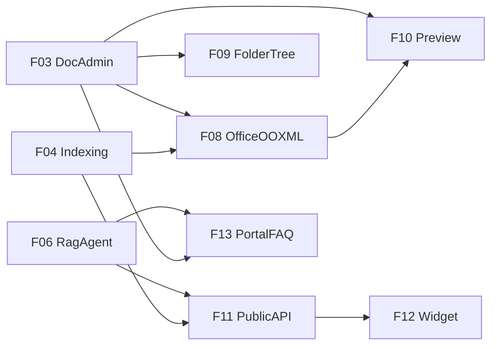

# 01 Feature 清单（Phase 2）

Phase 索引见 [../01-phase-list.md](../01-phase-list.md)。  
状态规则见 [00-constraints.mdc](../../../.cursor/rules/00-constraints.mdc) §8；**仅 `approved` / `done` 可实现**。

| ID | 名称 | Status | 域名表面 | 依赖 | Spec |
|----|------|--------|----------|------|------|
| F08 | Office OOXML（docx/xlsx/pptx） | `done` | `/admin` + 索引 | F03, F04 | [F08-office-ooxml.md](features/F08-office-ooxml.md) |
| F09 | Admin 文件夹树 | `draft` | `{subdomain}.lxzxai.com/admin` | F03 | [F09-admin-folder-tree.md](features/F09-admin-folder-tree.md) |
| F10 | 文档预览 | `draft` | `{subdomain}.lxzxai.com/admin` | F03, F08 | [F10-doc-preview.md](features/F10-doc-preview.md) |
| F11 | 租户对外 API | `draft` | `{subdomain}.lxzxai.com/api` | F04, F06 | [F11-tenant-public-api.md](features/F11-tenant-public-api.md) |
| F12 | Embed Widget | `draft` | 客户站点嵌入 | F11 | [F12-embed-widget.md](features/F12-embed-widget.md) |
| F13 | Portal FAQ 推荐 | `draft` | `{subdomain}.lxzxai.com` | F03, F06 | [F13-portal-faq-suggestions.md](features/F13-portal-faq-suggestions.md) |

