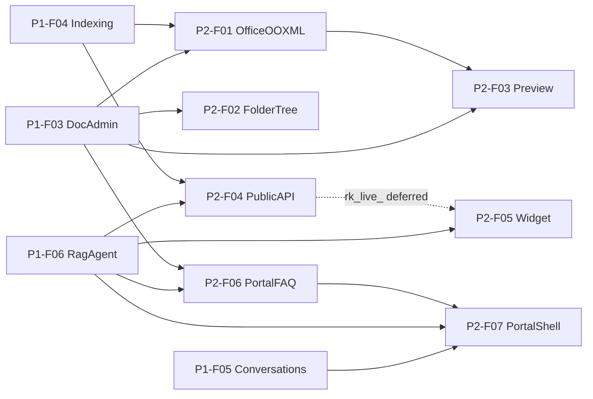

# 01 Feature 清单（Phase 2）

Phase 索引见 [../01-phase-list.md](../01-phase-list.md)。  
状态规则见 [00-constraints.mdc](../../../.cursor/rules/00-constraints.mdc) §8；**仅 `approved` / `done` 可实现**。

| ID | 名称 | Status | 域名表面 | 依赖 | Spec |
|----|------|--------|----------|------|------|
| P2-F01 | Office OOXML（docx/xlsx/pptx） | `done` | `/admin` + 索引 | P1-F03, P1-F04 | [P2-F01-office-ooxml.md](features/P2-F01-office-ooxml.md) |
| P2-F02 | Admin 文件夹树 | `draft` | `{subdomain}.lxzxai.com/admin` | P1-F03 | [P2-F02-admin-folder-tree.md](features/P2-F02-admin-folder-tree.md) |
| P2-F03 | 文档预览 | `draft` | `{subdomain}.lxzxai.com/admin` | P1-F03, P2-F01 | [P2-F03-doc-preview.md](features/P2-F03-doc-preview.md) |
| P2-F04 | 租户对外 API | `done` | `{subdomain}.lxzxai.com/api` | P1-F04, P1-F06 | [P2-F04-tenant-public-api.md](features/P2-F04-tenant-public-api.md) |
| P2-F05 | Embed Widget | `done` | 客户站点嵌入 | P1-F06（P2-F04 `rk_live_` 延后） | [P2-F05-embed-widget.md](features/P2-F05-embed-widget.md) |
| P2-F06 | Portal FAQ 推荐 | `done` | `{subdomain}.lxzxai.com` | P1-F03, P1-F06 | [P2-F06-portal-faq-suggestions.md](features/P2-F06-portal-faq-suggestions.md) |
| P2-F07 | Portal 壳与延迟会话 | `done` | `{subdomain}.lxzxai.com` | P1-F05, P1-F06, P2-F06 | [P2-F07-portal-shell.md](features/P2-F07-portal-shell.md) |

```mermaid
flowchart LR
  P1-F03[P1-F03 DocAdmin] --> P2-F01[P2-F01 OfficeOOXML]
  P1-F04[P1-F04 Indexing] --> P2-F01
  P1-F03 --> P2-F02[P2-F02 FolderTree]
  P1-F03 --> P2-F03[P2-F03 Preview]
  P2-F01 --> P2-F03
  P1-F06[P1-F06 RagAgent] --> P2-F04[P2-F04 PublicAPI]
  P1-F04 --> P2-F04
  P1-F06 --> P2-F05[P2-F05 Widget]
  P2-F04 -.->|rk_live_ deferred| P2-F05
  P1-F06 --> P2-F06[P2-F06 PortalFAQ]
  P1-F03 --> P2-F06
  P1-F05[P1-F05 Conversations] --> P2-F07[P2-F07 PortalShell]
  P1-F06 --> P2-F07
  P2-F06 --> P2-F07
```
