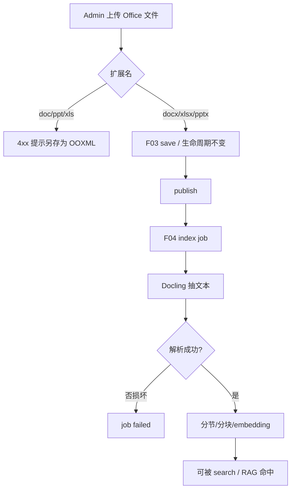

# F08 Office OOXML 支持

> 实现 Office OOXML（`.docx` / `.xlsx` / `.pptx`）的上传、管理与索引解析。Phase 1 仅 `.txt` / `.md` / `.pdf`；本 Feature 补齐 Office 三件套。

| 字段 | 值 |
|------|-----|
| **Status** | `draft` |
| **Owner** | |
| **Approved by** | |
| **Approved at** | |

> Status：`draft` → `review` → `approved` → `done`。未 `approved` 不得实现，见 [00-constraints.mdc](../../../../.cursor/rules/00-constraints.mdc) §8。

## 范围

- Admin（F03 扩展）允许上传 / save：`.docx` / `.xlsx` / `.pptx`（单文件 ≤20MB）
- 索引（F04 扩展）解析上述类型并进入 published 文档的 section/chunk 流程
- 解析路径固定：**Docling**（`parse_route=docling`，`do_ocr=false`）
- 拒绝旧版二进制：`.doc` / `.ppt` / `.xls`，提示另存为对应 OOXML

## 非范围

- 改动 `.pdf` / `.txt` / `.md` 的 Phase 1 解析路由（PyMuPDF / text）
- 公式求值、图表 OCR、宏、嵌入音视频
- SOP 门禁（Phase 3）
- 预览 UI（F10）；本 Feature 只保证可存储与可索引

## Flow

## 行为规则

1. 在 Phase 1 白名单（`.txt` / `.md` / `.pdf`）上 **增加** `.docx` / `.xlsx` / `.pptx`。
2. 拒绝 `.doc` / `.ppt` / `.xls` 及 `.exe` 等；错误信息须提示对应 OOXML 扩展名。
3. publish / review / 版本 / 租户隔离规则与其它类型相同。
4. 索引：published 后入队；三种 OOXML 均为 `parse_route=docling`；空文档/空表 → job succeeded、0 chunk（与空 txt 一致）。
5. 损坏无法打开 → job failed、`index_status=failed`。
6. `.xlsx` 不要求公式计算结果；以 Docling 可见文本为准。
7. **实现归属**：`.docx` / `.pptx` / `.xlsx` 的上传校验与 Docling 解析均在本 Feature 验收；不得拆回 Phase 1 F03/F04 单独做完就算数。

## 数据与边界

> 时间戳列见 constraints §3.2。无新表；扩展 `document_files` 类型校验与 F04 `parse_route`。

| 实体 | 关键约束 |
|------|----------|
| document_files | 允许 `.docx` / `.xlsx` / `.pptx` 及对应 OOXML MIME |
| parse_route | 上述三类 → `docling` |

## Test Cases

| ID | 步骤 | 期望 | 类型 |
|----|------|------|------|
| F08-T01 | Given 成员登录 When 分别上传合法 `.docx` / `.xlsx` / `.pptx` 并 save | Then 均为 draft；文件可取回 | api |
| F08-T02 | Given 上传 `.doc` 或 `.ppt` 或 `.xls` When save | Then 4xx；提示另存为对应 OOXML | api |
| F08-T03 | Given `.docx` 含独特段落 publish When 索引完成 | Then `parse_route=docling`；search 可命中 | api |
| F08-T04 | Given `.pptx` 含独特幻灯文本 publish When 索引完成 | Then `parse_route=docling`；search 可命中 | api |
| F08-T05 | Given `.xlsx` 含独特单元格文本 publish When 索引完成 | Then `parse_route=docling`；search 可命中 | api |
| F08-T06 | Given 空 `.xlsx` 或近空 `.docx` publish When 索引 | Then job=succeeded；0 section/chunk | api |
| F08-T07 | Given 损坏 OOXML When 索引 | Then job=failed；无 `is_latest` chunk | api |
| F08-T08 | Given Phase 1 基线（无本 Feature）When 上传 `.docx` | Then 4xx（不在 P1 白名单）；本 Feature 落地后以 T01 为准 | api |
