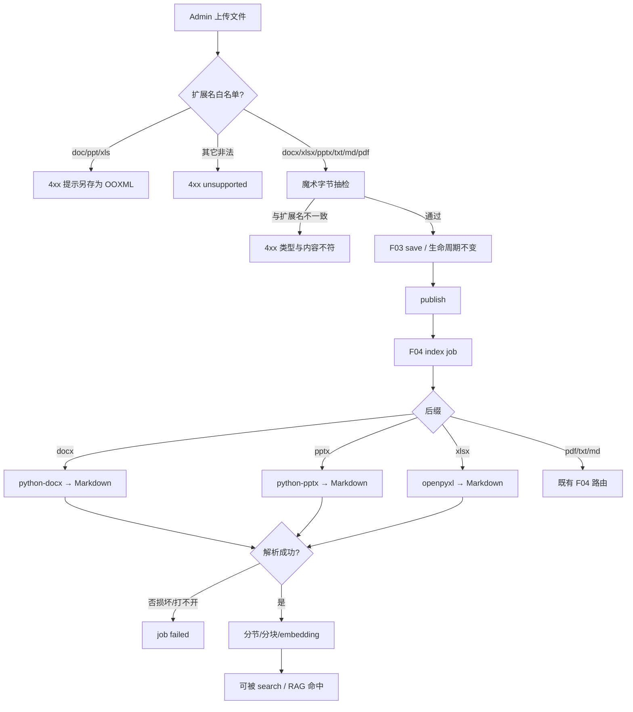

# F08 Office OOXML 支持

> 实现 Office OOXML（`.docx` / `.xlsx` / `.pptx`）的上传、管理与索引解析。Phase 1 仅 `.txt` / `.md` / `.pdf`；本 Feature 补齐 Office 三件套。

| 字段 | 值 |
|------|-----|
| **Status** | `done` |
| **Owner** | |
| **Approved by** | |
| **Approved at** | |

> Status：`draft` → `review` → `approved` → `done`。未 `approved` 不得实现，见 [00-constraints.mdc](../../../../.cursor/rules/00-constraints.mdc) §8。

## 范围

- Admin（F03 扩展）允许上传 / save：`.docx` / `.xlsx` / `.pptx`（单文件 ≤20MB）
- 索引（F04 扩展）解析上述类型并进入 published 文档的 section/chunk 流程
- **解析路由（轻量库，不用 Docling）**：
  - `.docx` → `python-docx`（`parse_route=docx`）
  - `.pptx` → `python-pptx`（`parse_route=pptx`）
  - `.xlsx` → `openpyxl`（`parse_route=xlsx`）
- 对外仍统一：`DocumentParser` → Markdown → 既有 H1–H6 节树 / 切块 / embedding
- **文件类型识别**：扩展名准入 + 魔术字节检测（见行为规则）
- 拒绝旧版二进制：`.doc` / `.ppt` / `.xls`，提示另存为对应 OOXML
- **不改** `.pdf` / `.txt` / `.md` 的 Phase 1 路由（PDF 仍为 PyMuPDF / Docling）

## 非范围

- 用 Docling / Unstructured 解析 Office（本 Feature 明确不用）
- 公式求值、图表 OCR、宏、嵌入音视频
- SOP 门禁（Phase 3）
- 预览 UI（F10）；本 Feature 只保证可存储与可索引
- 根据魔数「改判」扩展名并改走其它解析器（不一致则拒绝/失败，见下）

## Flow

## 行为规则

### 上传与类型识别

1. 在 Phase 1 白名单（`.txt` / `.md` / `.pdf`）上 **增加** `.docx` / `.xlsx` / `.pptx`。
2. 拒绝 `.doc` / `.ppt` / `.xls` 及 `.exe` 等；旧版错误信息须提示对应 OOXML 扩展名。
3. **类型识别（两道门，均须通过）**：
   1. **扩展名准入**：对文件名做小写规范化；按最长后缀匹配；仅白名单可通过。`Content-Type` 可写入 `document_files.content_type`，**不得**单独作为准入依据。
   2. **魔术字节检测**（上传 save 时强制；索引侧可再校验一次作双保险）：
      | 宣称扩展名 | 魔术字节 / 内容约束 |
      |------------|---------------------|
      | `.pdf` | 文件头为 `%PDF` |
      | `.docx` / `.pptx` / `.xlsx` | 文件头为 ZIP（`PK\x03\x04` 或等价 ZIP 签名）；且 ZIP 内分别存在 `word/`、`ppt/`、`xl/` 条目前缀（至少一类） |
      | `.txt` / `.md` | 无明显二进制特征（例如前 8KiB 不含 `\x00`）；按文本解码路径处理 |
   3. **扩展名与魔数不一致** → **4xx**（上传），不得存盘成功；**禁止**按魔数改判类型后改走其它解析器。
4. 单文件大小上限仍为 **20MB**。

### 索引解析

5. publish / review / 版本 / 租户隔离规则与其它类型相同。
6. 索引：published 后入队；Office 三类 `parse_route` 分别为 `docx` / `pptx` / `xlsx`（写结构化日志）；空文档/空表 → job succeeded、0 chunk（与空 txt 一致）。
7. 损坏、无法打开、或魔数二次校验失败 → job `failed`、`index_status=failed`，无 `is_latest` section/chunk。
8. `.xlsx`：**不**要求公式计算结果；以 `openpyxl` 读到的单元格**显示值/已缓存值**中的可见文本为准（无缓存公式结果则按实现固定策略跳过或留空，须在测试中可预期）。
9. Markdown 出口约定（便于节树）：
   - `.docx`：段落与标题映射为 Markdown 标题/正文；表尽量 Markdown 表。
   - `.pptx`：按幻灯顺序；可用 `## Slide N` 或标题形状作 H2；备注可并入正文。
   - `.xlsx`：按 sheet 分节（如 `## {sheet_name}`）；sheet 内按业界表形态处理：
     1. **单行表头**：第 1 行列名 + `|---|` + 数据行；
     2. **多行/分组表头**（首行稀疏分组标签、次行稠密列名）：展平为单行表头，**列名取末行稠密列名**；分组行不进入数据区；
     3. **合并单元格**：仅对**数据区**按列向下填充空单元格；
     4. **多表共 sheet**：以**整行空白**分隔，拆成多个独立表（或正文块）顺序输出；不跨 sheet 混切；
     5. **透视/交叉表**：识别「左上角空/行维 + 首行列维 + 主体多为数值」时，转为长表 `| 行 | 列 | 值 |`（跳过空值单元格）；
     6. **非表区域**：单行说明/标题（仅 1 个非空单元格，或整块不足以成表）输出为**普通正文**，不包成 Markdown 表；
     7. 日期优先 ISO（`YYYY-MM-DD`）；单元格内 `|` 转义；
     8. **切块**：小表整表一条 leaf；超 `CHUNK_TARGET_TOKENS` 时按 F04 表感知规则（表头+行组）；同 sheet 多表/正文由节内表边界切开。
10. **实现归属**：OOXML 的上传校验（扩展名+魔数）、轻量解析与 F08 Test Cases 均在本 Feature 验收；不得拆回 Phase 1 F03/F04「顺手做完」就算数。PDF 继续只用 Docling（结构路径），**Office 不调用 Docling**。

## 数据与边界

> 时间戳列见 constraints §3.2。无新表；扩展 `document_files` 类型校验与 F04 `parse_route` 枚举。

| 实体 | 关键约束 |
|------|----------|
| document_files | 允许 `.docx` / `.xlsx` / `.pptx`；MIME 仅元数据 |
| parse_route | `docx` / `pptx` / `xlsx`（另：既有 `text` / `pymupdf` / `docling` 仅用于非 Office） |

依赖：`python-docx`、`python-pptx`、`openpyxl`（或经 Spec 批准的等价轻量库）；**不**为 Office 引入 Docling/Unstructured。

## Test Cases

| ID | 步骤 | 期望 | 类型 |
|----|------|------|------|
| F08-T01 | Given 成员登录 When 分别上传合法 `.docx` / `.xlsx` / `.pptx`（魔数正确）并 save | Then 均为 draft；文件可取回 | api |
| F08-T02 | Given 上传 `.doc` 或 `.ppt` 或 `.xls` When save | Then 4xx；提示另存为对应 OOXML | api |
| F08-T03 | Given `.docx` 含独特段落 publish When 索引完成 | Then `parse_route=docx`；search 可命中 | api |
| F08-T04 | Given `.pptx` 含独特幻灯文本 publish When 索引完成 | Then `parse_route=pptx`；search 可命中 | api |
| F08-T05 | Given `.xlsx` 含独特单元格文本 publish When 索引完成 | Then `parse_route=xlsx`；search 可命中 | api |
| F08-T06 | Given 空 `.xlsx` 或近空 `.docx` publish When 索引 | Then job=succeeded；0 section/chunk | api |
| F08-T07 | Given 损坏 OOXML（扩展名合法但无法打开）When 索引 | Then job=failed；无 `is_latest` chunk | api |
| F08-T08 | Given Phase 1 基线语义 When 仅讨论未启用本 Feature 的环境 | Then OOXML 上传应 4xx；本 Feature 落地后以 T01 为准 | api |
| F08-T09 | Given 文件名 `.docx` 但内容为纯文本/非 ZIP When save | Then 4xx（魔数与扩展名不符） | api |
| F08-T10 | Given 文件名 `.pdf` 但内容为 ZIP/OOXML When save | Then 4xx（魔数与扩展名不符） | api |
| F08-T11 | Given 文件名 `.xlsx` 且为 ZIP 但包内无 `xl/` When save | Then 4xx（OOXML 包类型与扩展名不符） | unit/api |
| F08-T13 | Given `.xlsx` 多行表且首列有空单元格（合并单元格形态）When 解析 | Then Markdown 含 `|---|`；空单元格已按列向下填充；可被识别为 table 结构 | unit |
| F08-T14 | Given `.xlsx` 双行表头（稀疏分组行 + 稠密列名行）When 解析 | Then 展平为单行表头且列名为末行；数据行不以列名行冒充；首行数据为真正记录 | unit |
| F08-T15 | Given 同一 sheet 上下两张表且中间有空行 When 解析 | Then 输出两张独立 Markdown 表（均可含 `|---|`），不粘成一张 | unit |
| F08-T16 | Given 交叉表（左上角空、首行列维、首列行维、主体数值）When 解析 | Then 转为长表，含列 `行`/`列`/`值`；原宽表交叉单元格出现在长表中 | unit |
| F08-T17 | Given sheet 顶部单行标题 + 下方数据表 When 解析 | Then 标题为普通正文（非 `|` 表行）；表为独立 Markdown 表 | unit |
