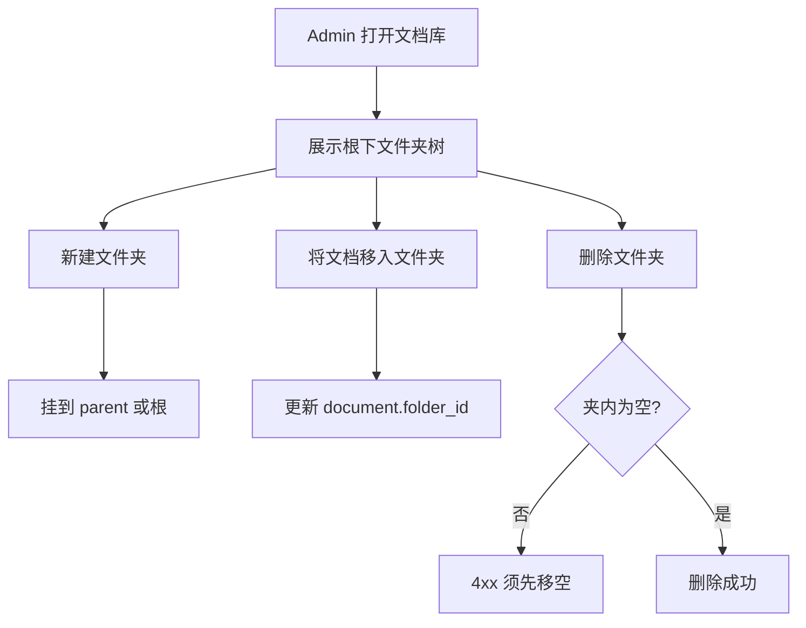

# F09 Admin 文件夹树

> `/admin` 以文件夹树组织文档：建夹、移动、树形展现；文档可归属文件夹。

| 字段 | 值 |
|------|-----|
| **Status** | `draft` |
| **Owner** | |
| **Approved by** | |
| **Approved at** | |

> Status：`draft` → `review` → `approved` → `done`。未 `approved` 不得实现，见 [00-constraints.mdc](../../../../.cursor/rules/00-constraints.mdc) §8。

## 范围

- 租户内文件夹 CRUD（创建、重命名、移动、删除）
- 文档 `folder_id`（可空 = 根目录）
- Admin 树形列表 + 面包屑；按当前文件夹列出子夹与文档
- 跨租户隔离

## 非范围

- F04 标题层级（H1/H2）加深
- 文件夹级 ACL / 分享链接
- 回收站（软删文件夹可选；Phase 2：**硬规则见下，不用回收站**）

## Flow

## 行为规则

1. 文件夹属 `tenant_id`；名称在**同一父节点下**唯一（大小写不敏感）。
2. 允许嵌套；Phase 2 深度上限 **10**；成环移动拒绝（4xx）。
3. 文档 `folder_id` 可空（根）；移动文档只改归属，不改 publish/index 状态。
4. **禁止删除非空文件夹**（含子夹或文档）；须先移空再删。
5. 列表 API：给定 `folder_id`（或缺省根）返回该层子文件夹 + 文档（latest）；另提供整树接口供侧栏。
6. 跨租户读写文件夹/文档 → 404 或 403。

## 数据与边界

| 实体 | 关键字段 / 约束 |
|------|----------------|
| folder | `id`, `tenant_id`, `parent_id` NULL=根, `name`, 唯一 `(tenant_id, parent_id, lower(name))` |
| documents（版本组或 latest 视图） | 增加 `folder_id` NULL=根；FK → folder，同租户 |

## Test Cases

| ID | 步骤 | 期望 | 类型 |
|----|------|------|------|
| F09-T01 | Given 成员 When 在根创建文件夹 `A` | Then 201；树中可见 | api |
| F09-T02 | Given 同父下已有 `A` When 再创建 `a` | Then 4xx 重名 | api |
| F09-T03 | Given 文档在根 When 移入文件夹 A | Then `folder_id=A`；在 A 列表可见、根列表不可见（除非查询含） | api |
| F09-T04 | Given 文件夹含文档 When DELETE 夹 | Then 4xx；夹仍在 | api |
| F09-T05 | Given 空文件夹 When DELETE | Then 204；树中消失 | api |
| F09-T06 | Given 深度已 10 When 再嵌套子夹 | Then 4xx | api |
| F09-T07 | Given 移动 B 使其 parent 变为 B 的子孙 | Then 4xx 成环 | api |
| F09-T08 | Given tenant-A 文件夹 id When tenant-B GET | Then 404 或 403 | api |
