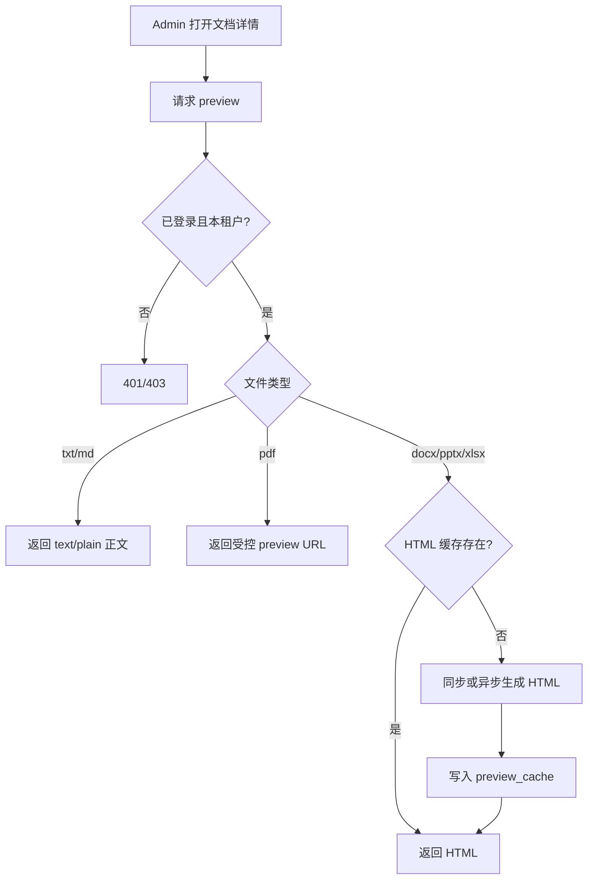

# F10 文档预览

> `/admin` 对已上传文档提供只读预览，便于 verify / publish 前人工查看。

| 字段 | 值 |
|------|-----|
| **Status** | `draft` |
| **Owner** | |
| **Approved by** | |
| **Approved at** | |

> Status：`draft` → `review` → `approved` → `done`。未 `approved` 不得实现，见 [00-constraints.mdc](../../../../.cursor/rules/00-constraints.mdc) §8。

## 范围

- 已上传（任意 `publish_status`）文档的**只读预览** API + Admin UI
- 按类型策略：
  - `.txt` / `.md`：返回纯文本（UTF-8）
  - `.pdf`：返回可内嵌的预览 URL（同源受控，短时签名或会话鉴权流）
  - `.docx` / `.pptx` / `.xlsx`：服务端转为 **只读 HTML** 预览（固定 Docling/等价转换一次缓存）；依赖 F08 已允许上传这些类型；不提供下载式编辑
- 仅租户成员；跨租户拒绝

## 非范围

- 在线编辑、批注、协同
- 对外匿名预览链接
- OCR 扫描件增强（Phase 3+）

## Flow

## 行为规则

1. Preview **不改变** publish/index 状态。
2. Office HTML 预览：**只读**；生成失败 → 4xx/502 + 可重试；成功后按 `content_sha256`（或 file id + size + mtime）缓存，文件替换后失效。
3. PDF 预览 URL 仅当前会话可访问（或短 TTL 签名，≤15min）；禁止无鉴权永久外链。
4. 单次预览响应体上限与文件 20MB 上传上限一致；超大转换超时（固定 **60s**）→ 失败可测。
5. 未上传文件 / 已软删 → 404。

## 数据与边界

| 实体 | 关键字段 / 约束 |
|------|----------------|
| preview_cache（可选表或对象存储元数据） | `document_file_id`, `tenant_id`, `format=html`, `storage_key`, `source_fingerprint` |

## Test Cases

| ID | 步骤 | 期望 | 类型 |
|----|------|------|------|
| F10-T01 | Given 已上传 `.md` When GET preview | Then 200；body 含原文关键片段 | api |
| F10-T02 | Given 已上传 `.pdf` When GET preview | Then 200；返回可取流的受控 URL；无 cookie 访问该 URL → 401/403 | api |
| F10-T03 | Given 已上传 `.docx` When GET preview | Then 200；`Content-Type` 含 html；只读内容可断言标题/段落文本 | api |
| F10-T04 | Given `.xlsx` When GET preview | Then 200 HTML；含单元格可见文本 | api |
| F10-T05 | Given tenant-A 文件 When tenant-B preview | Then 404 或 403 | api |
| F10-T06 | Given 未登录 When preview | Then 401 | api |
| F10-T07 | Given 替换同文档文件后 When preview | Then 新内容生效（旧 cache 不命中） | api |
