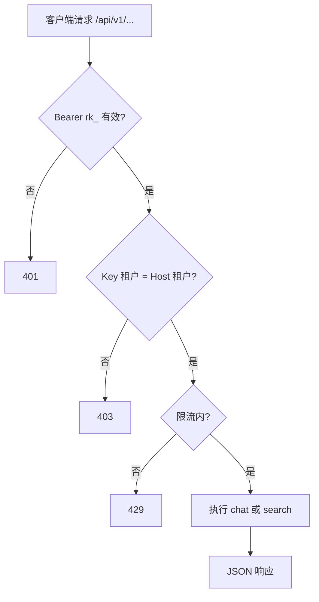

# F11 租户对外 API

> 在 `{subdomain}.lxzxai.com/api` 提供可整合的对外 API；以 API Key 认证，复用检索与 RAG 语义。

| 字段 | 值 |
|------|-----|
| **Status** | `draft` |
| **Owner** | |
| **Approved by** | |
| **Approved at** | |

> Status：`draft` → `review` → `approved` → `done`。未 `approved` 不得实现，见 [00-constraints.mdc](../../../../.cursor/rules/00-constraints.mdc) §8。

## 范围

- 路由前缀：`https://{subdomain}.lxzxai.com/api/v1/...`
- **API Key** 认证：`Authorization: Bearer rk_live_...`（前缀固定可测）
- Admin 创建 / 列表 / 吊销 Key；明文 **仅创建时返回一次**；库中只存哈希
- 最小端点：
  - `POST /api/v1/chat` — 多轮问答（语义对齐 F06；可传 `conversation_id`）
  - `POST /api/v1/search` — 知识检索（语义对齐 F04 内部 search）
- 租户隔离：Key 绑定 `tenant_id`，且 Host subdomain 必须匹配该租户
- 限流：每 Key **60 req/min**（超出 429）

## 非范围

- OAuth2 / JWT 用户联邦（可 Phase 3+）
- Embed Widget 的 site key（F12，与本 Feature 的 rk_ 服务端 Key 分离）
- 管理类 API（上传文档、改文件夹）— Phase 2 对外 API **不做** admin 能力

## Flow

## 行为规则

1. Key 状态：`active` | `revoked`；吊销后立即 401。
2. 创建 Key：可设可选 `name`；响应含完整 secret 一次；之后列表仅显示 `rk_live_…` 前 8 位掩码。
3. `chat`：无成员 cookie；会话可挂在 `api_key_id` 下或匿名 conversation；仍须租户隔离与 F06 防编造规则。
4. `search`：仅 `published` + ready 索引；返回节 `content`/`path` 级结果，不含其它租户数据。
5. 错误体固定：`{ "error": { "code", "message" } }`；`code` 含 `unauthorized` / `forbidden` / `rate_limited` / `validation_error`。
6. 不在日志中打印完整 API Key。

## 数据与边界

| 实体 | 关键字段 / 约束 |
|------|----------------|
| api_key | `id`, `tenant_id`, `name`, `key_prefix`, `key_hash`, `status`, `last_used_at` |
| 限流 | 按 `api_key_id` 滑动窗口 60/min |

## Test Cases

| ID | 步骤 | 期望 | 类型 |
|----|------|------|------|
| F11-T01 | Given 成员在 admin 创建 Key When 响应 | Then 201；含一次明文 `rk_live_`；DB 无明文仅 hash | api |
| F11-T02 | Given 有效 Key When POST /api/v1/search 本租户语料 | Then 200；命中本租户；无其它租户 | api |
| F11-T03 | Given 有效 Key When POST /api/v1/chat 问已索引事实 | Then 200；回复含依据或可检索路径 | api |
| F11-T04 | Given 无/错 Key When 调 API | Then 401 | api |
| F11-T05 | Given tenant-A Key + Host=tenant-B When 调 API | Then 403 | api |
| F11-T06 | Given Key 已吊销 When 调 API | Then 401 | api |
| F11-T07 | Given 同一 Key 短时 >60 次 When 再请求 | Then 429 | api |
| F11-T08 | Given 列表 Keys When GET | Then 无完整 secret；仅前缀掩码 | api |
