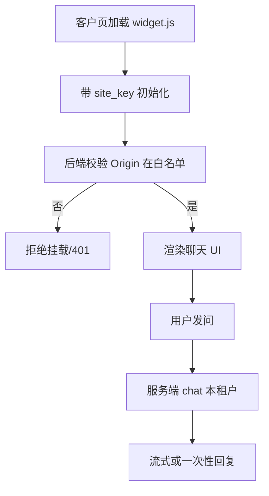

# F12 Embed Widget

> 提供可嵌入客户 App/页面的聊天 Widget；公开 site key + Origin 白名单，走租户问答能力。

| 字段 | 值 |
|------|-----|
| **Status** | `draft` |
| **Owner** | |
| **Approved by** | |
| **Approved at** | |

> Status：`draft` → `review` → `approved` → `done`。未 `approved` 不得实现，见 [00-constraints.mdc](../../../../.cursor/rules/00-constraints.mdc) §8。

## 范围

- Admin 生成 **site key**（公开，可出现在前端）与 **允许 Origin 列表**
- 托管脚本：`https://{subdomain}.lxzxai.com/widget.js`（或 CDN 同源等价）
- 嵌入方式：脚本自动挂载 iframe/浮层；提供可复制 snippet
- Widget 内发问走后端（经 site key + Origin 校验），语义对齐 F06/F11 chat（**不**把 `rk_live_` 服务端 Key 下发给浏览器）
- 可配置：主题色、欢迎语、默认打开/关闭（最小集）

## 非范围

- 原生 iOS/Android SDK（可用 WebView 嵌同一 widget）
- 自定义 CSS 任意注入（防 XSS：仅允许受控主题 token）
- 用 API Key 代替 site key 放进前端

## Flow



## 行为规则

1. Site key 绑定 `tenant_id`；与 F11 `api_key` 分表；可独立吊销。
2. 每个请求校验 `Origin`/`Referer` 命中白名单（精确 scheme+host[:port]）；未命中 → 403。
3. Snippet 形态固定可测，例如：
   ```html
   <script src="https://{subdomain}.lxzxai.com/widget.js"
           data-site-key="pk_..."
           async></script>
   ```
4. Widget 不得暴露服务端 `rk_live_` Key；浏览器只持 `pk_` site key。
5. 限流：每 site key **30 req/min**（可与 F11 不同）。
6. Admin 可增删白名单 Origin；空白名单 → Widget 全部 Origin 拒绝（安全默认）。

## 数据与边界

| 实体 | 关键字段 / 约束 |
|------|----------------|
| widget_site_key | `id`, `tenant_id`, `public_key`, `status`, `allowed_origins` text[] |

## Test Cases

| ID | 步骤 | 期望 | 类型 |
|----|------|------|------|
| F12-T01 | Given admin 创建 site key 并加 Origin `https://app.example.com` When 保存 | Then 可取 `pk_`；白名单含该 Origin | api |
| F12-T02 | Given 合法 Origin + site key When 初始化 Widget 会话/发问 | Then 200；本租户可答 | api |
| F12-T03 | Given Origin 不在白名单 When 发问 | Then 403 | api |
| F12-T04 | Given 错误 site key When 发问 | Then 401 | api |
| F12-T05 | Given site key 吊销 When 发问 | Then 401 | api |
| F12-T06 | Given GET snippet 配置 When admin 复制 | Then 含 `widget.js` 与 `data-site-key` | api |
| F12-T07 | Given 响应/前端包 When 检查 | Then 无 `rk_live_` 字符串 | e2e |
