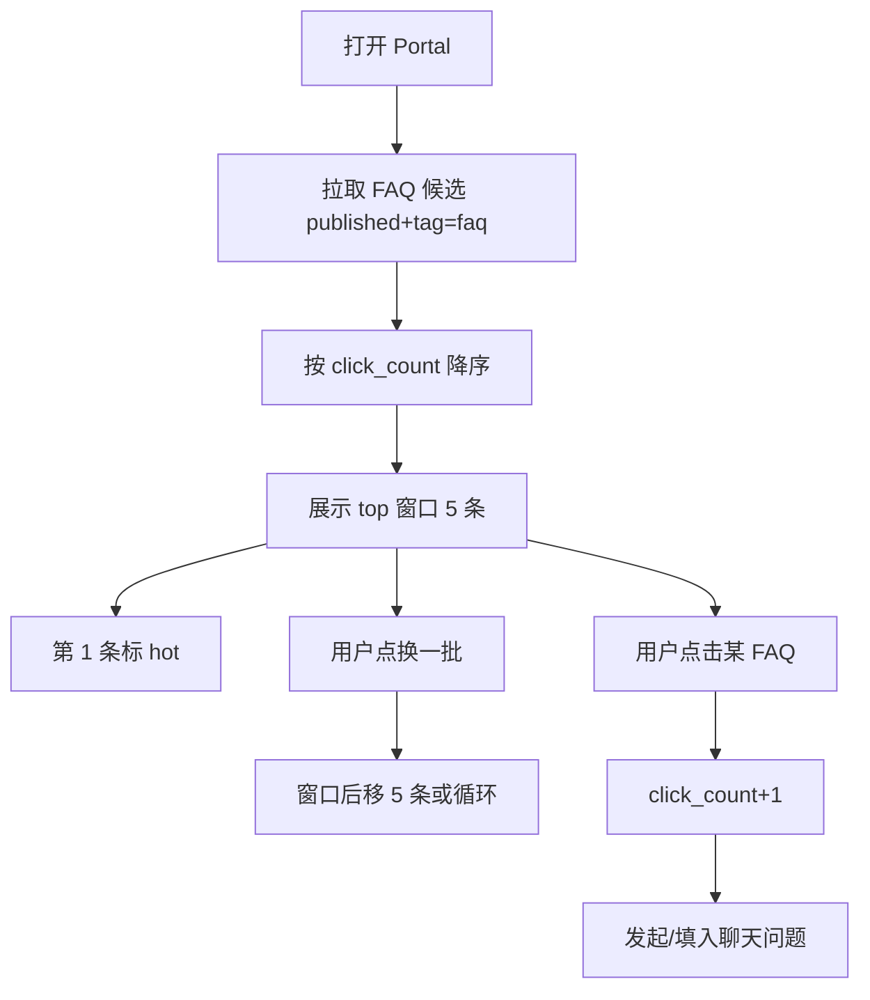

# F13 Portal FAQ 推荐

> Portal（`{subdomain}.lxzxai.com`）展示可点击 FAQ 快捷问；最热置顶带 `hot`；支持「换一批」。

| 字段 | 值 |
|------|-----|
| **Status** | `done` |
| **Owner** | |
| **Approved by** | |
| **Approved at** | 2026-07-24 |

> Status：`draft` → `review` → `approved` → `done`。未 `approved` 不得实现，见 [00-constraints.mdc](../../../../.cursor/rules/00-constraints.mdc) §8。

## 范围

- Portal 首屏/聊天区旁展示 **N=5** 条 FAQ 建议题（**布局壳、空态、Composer 归属 [F14](F14-portal-shell.md)**）
- 数据源：本租户 **published** 且 `tag=faq` 的 latest 文档（题面优先 `title`；可选截断摘要）
- 排序：按 **点击次数** 降序；**第 1 条展示 `hot` 标签**
- 「换一批」：在候选池中翻页/洗牌下一批（固定：**按热度序的下一段 5 条**；不足则从头循环）
- 点击某 FAQ：计入热度 +1，并预填/发送为用户问题进入 F06 会话（draft 态下的落库时机见 F14）

## 非范围

- Portal 整体布局 / 色调 / New task 延迟会话（F14）
- 人工置顶运营位（除热度自然排序外）
- 非 faq tag 文档进入推荐池
- 跨租户热度

## Flow

## 行为规则

1. 候选不足 5 条：有几条展示几条；无候选则隐藏 FAQ 区（不报错）。
2. `hot` **仅**当前窗口排序后的第一条；换一批后新窗口第一条也带 `hot`。
3. 热度存储按 `document_group_id`（或 latest document id）计 **click_count**；仅点击推荐条 +1，自由输入聊天不加 FAQ 热度。
4. 未 published / 非 faq / 软删 → 不出现在池中。
5. 租户隔离；Portal 需按现有 F05/F06 登录策略（与 Phase 1 一致：成员登录后使用）。

## 数据与边界

| 实体 | 关键字段 / 约束 |
|------|----------------|
| faq_suggestion_stats | `tenant_id`, `document_group_id`, `click_count` ≥ 0；或挂在 documents 扩展列 |

常量：`FAQ_PAGE_SIZE=5`。

## Test Cases

| ID | 步骤 | 期望 | 类型 |
|----|------|------|------|
| F13-T01 | Given 租户有 ≥5 条 published FAQ When GET suggestions | Then 返回 5 条；按 click_count 降序；首条 `hot=true` 其余 false | api |
| F13-T02 | Given 首条 click 最多 When 展示 | Then 该条排第一且带 hot | api |
| F13-T03 | Given 点击某条 FAQ When 计数 | Then 该条 `click_count` +1；可触发聊天内容=题面 | api |
| F13-T04 | Given 第一批后 When 换一批 | Then 返回下一段 5 条（或循环）；新列表首条 hot=true | api |
| F13-T05 | Given 仅 2 条 FAQ When GET | Then 返回 2 条；不 500 | api |
| F13-T06 | Given draft/非 faq When GET suggestions | Then 不出现 | api |
| F13-T07 | Given tenant-A 热度 When tenant-B GET | Then 不可见 A 的题与计数 | api |
