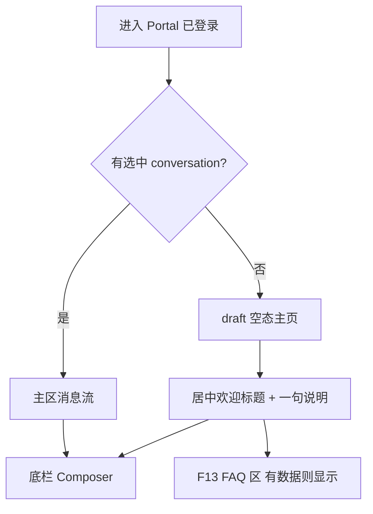
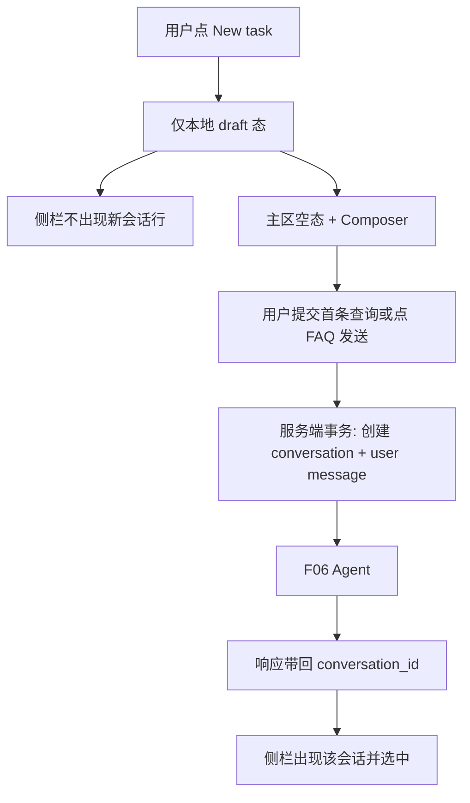

# F14 Portal 壳与延迟会话

> Portal（`{subdomain}.lxzxai.com`）采用业界常见聊天壳布局与增强空态主页；New task 不立即落库 conversation，待首条查询提交时一并创建会话与消息。

| 字段 | 值 |
|------|-----|
| **Status** | `done` |
| **Owner** | |
| **Approved by** | |
| **Approved at** | 2026-07-24 |

> Status：`draft` → `review` → `approved` → `done`。未 `approved` 不得实现，见 [00-constraints.mdc](../../../../.cursor/rules/00-constraints.mdc) §8。

## 范围

- Portal **壳层 UI**：ChatGPT / Claude 类 RAG 门户布局（左栏会话、主区对话、底栏 Composer）
- **默认主页面 / draft 空态**：欢迎区 + Composer；嵌入 [F13](F13-portal-faq-suggestions.md) FAQ 区（有候选才显示）
- **New task 延迟落库**：点击 New task 仅进入本地 draft 态；**首条用户查询**（含点 FAQ 发送）时服务端一次创建 `conversation` + user `message`，再进入 F06
- 桌面侧栏可折叠；窄屏侧栏为抽屉

## 非范围

- FAQ 数据源、热度、换一批算法（F13）
- Agent 推理细节（F06）
- Admin UI（F03）
- Embed Widget UI（F12）
- 像素级视觉回归 / 第三方品牌资产拷贝
- 取消 F05 的显式 `POST /v1/conversations`（仍保留给兼容/非 Portal 客户端）
- 对标稿中的 Search / Scheduled / Kits / Skills / MCP / 快捷操作条等扩展导航（本 Feature 不实现）

## Flow

### 壳与空态

### New task 延迟落库

## 行为规则

### UI 布局 / 元素 / 色调

1. **布局（桌面）**：左栏会话列表（active / archived 切换）+ 主区（空态或消息流）+ 底栏宽 Composer；三者同时可见（侧栏未折叠时）。
2. **元素**：New task 按钮、会话标题截断、发送（及可选停止）、侧栏折叠；移动端侧栏为抽屉，不挤压主区成仪表盘多卡片。
3. **色调**：经 CSS 变量定义浅色中性底（白/浅灰）+ **单一**强调色（teal，与品牌方块一致）；**禁止**默认紫雾/多阴影卡片堆空态。
4. 风格对标：**ChatGPT / Claude 类**对话壳布局语言；品牌资产为本产品方块图标，不拷贝第三方 Logo/字体。

### 默认主页面

5. 进入 Portal 且无选中会话，或点 New task 后：进入 **draft 空态**（本地无 `conversation_id`）。
6. 空态主区：居中品牌方块图标（`apps/web/public/brand-cube.png`）+ 时段问候（Good morning / afternoon / evening）+ 产品名级说明（如「I'm lxzxai, …」）+ Composer；其下或旁嵌入 F13 FAQ（无候选则整区隐藏，不报错）。
7. 选中已有会话后：主区为消息流；**不**显示空态 hero。
8. 点击 F13 FAQ：等价于在 draft（或当前 active 会话）提交该题面；若当时为 draft，走延迟落库路径。

### 延迟保存 conversation

9. New task / 回到 draft：**禁止**调用 `POST /v1/conversations`；仅清除本地选中态与消息草稿。
10. 首条发送：Portal 使用 `POST /v1/conversations/messages`（及 `/messages/stream`）；body 中 **`conversation_id` 可缺省或 null**。
11. 服务端在同一事务中：创建 `conversation`（`status=active`；`title` 由首条用户内容截断，否则「新会话」）+ 写入该 user `message`；再进入 F06；响应 / SSE `started` 必须含 `conversation_id`。
12. 用户进入 draft 后离开且从未发送：DB **不得**新增 conversation 行。
13. 已有 `conversation_id` 的后续消息：行为与 F05/F06 一致（追加消息，不新建会话）；亦可走同一 collection 路由并传 `conversation_id`。
14. F05 显式创建 API 仍可用；**Portal UI 不得**在 New task 路径使用它。

## 数据与边界

> 无新表。复用 F05 `conversation` / `message`；时间戳见 constraints §3.2。

| 项 | 约束 |
|----|------|
| draft 态 | 纯前端；无服务端资源 id |
| 首条 API | `conversation_id` 可选；缺省则服务端创建 |
| 租户隔离 | 与 F05 相同（`tenant_id` + `user_id`） |

## Test Cases

| ID | 步骤 | 期望 | 类型 |
|----|------|------|------|
| F14-T01 | Given 已登录 When 点 New task | Then 无 `POST /conversations`（或等价创建）；DB 无新 conversation；侧栏无新增行 | e2e |
| F14-T02 | Given draft 态 When 提交首条查询 | Then 恰新增 1 条 conversation + 含该 user message；响应含 `conversation_id`；侧栏出现并选中 | api |
| F14-T03 | Given 桌面视口 When 打开 Portal | Then 同时存在侧栏、主区、Composer 结构（侧栏未折叠） | e2e |
| F14-T04 | Given draft 空态 When 查看主区 | Then 可见欢迎/标题区；When 选中已有会话 Then 欢迎区消失、为消息流 | e2e |
| F14-T05 | Given 有 F13 FAQ 候选且 draft When 点击某 FAQ 发送 | Then click_count+1（F13）；落库路径与 T02 相同 | api |
| F14-T06 | Given draft 打开后直接离开从未发送 When 查 DB | Then 无新 conversation | api |
| F14-T07 | Given tenant-A draft 首问 When tenant-B 列表 | Then 不可见 A 的新会话（隔离） | api |
