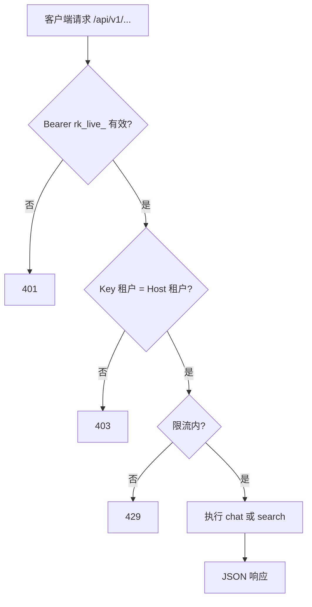

# P2-F04 租户对外 API

> 在 `{subdomain}.lxzxai.com/api` 提供可整合的对外 API；以 API Key 认证，复用检索与 RAG 语义。

| 字段 | 值 |
|------|-----|
| **Status** | `done` |
| **Owner** | |
| **Approved by** | |
| **Approved at** | 2026-07-24 |

> Status：`draft` → `review` → `approved` → `done`。未 `approved` 不得实现，见 [00-constraints.mdc](../../../../.cursor/rules/00-constraints.mdc) §8。

## 范围

- 路由前缀：`https://{subdomain}.lxzxai.com/api/v1/...`（反代到 FastAPI；与 Portal 的 `/backend/*` 并存）
- **API Key** 认证：`Authorization: Bearer rk_live_...`（前缀固定可测）
- Admin **HTTP API** 创建 / 列表 / 吊销 Key；明文 **仅创建时返回一次**；库中只存哈希
- 最小对外端点：
  - `POST /api/v1/chat` — 多轮问答（语义对齐 P1-F06；可传 `conversation_id`）
  - `POST /api/v1/search` — 知识检索（语义对齐 P1-F04 内部 `search`）
- 租户隔离：Key 绑定 `tenant_id`，且 Host subdomain 必须匹配该租户
- 限流：每 Key **60 req/min**（超出 429）

## 非范围

- OAuth2 / JWT 用户联邦（可 Phase 3+）
- Embed Widget 的 site key（P2-F05，与本 Feature 的 `rk_live_` 服务端 Key 分离）
- 管理类**对外** API（上传文档、改文件夹）— Phase 2 对外 API **不做** 文档 admin 能力
- Admin **UI 页面**（Key 管理仅需成员 cookie 下的 HTTP API；本 Feature Test Cases 均为 `api`）

## Flow



## 行为规则

1. Key 状态：`active` | `revoked`；吊销后立即 **401**（`unauthorized`）。
2. 创建 Key：可设可选 `name`；响应含完整 `secret`（`rk_live_…`）**一次**；库仅存 `key_hash` 与 `key_prefix`。之后列表/详情**不得**再返回完整 secret。
3. 列表掩码：仅暴露 `key_prefix`；约定为明文 secret 的前缀 `rk_live_` + 其后 **8** 个字符（例：`rk_live_abcd1234`），其余不可推断完整 secret。
4. `chat`：无成员 cookie；会话挂在 `conversations.api_key_id`（`user_id` / `site_key_id` 为空）；调用 P1-F06 `run_user_turn`；仍须租户隔离与 P1-F06 防编造规则。
5. `search`：委托 P1-F04 `search(tenant_id, query, top_k)`；仅 `published` + `index_status=ready` + `is_latest`；返回节 `content` / `path` 级结果；不含其它租户数据。
6. 限流：按 `api_key_id` **滑动窗口 60 req / 60s**；超出 → **429**（`rate_limited`）。Admin Key CRUD **不**计入该对外限流（成员 cookie 路径）。
7. 公开端点错误体固定：`{ "error": { "code", "message" } }`；`code` 含 `unauthorized` / `forbidden` / `rate_limited` / `validation_error`。
8. 不在日志中打印完整 API Key / Bearer secret。
9. 成功使用 Key 时可更新 `last_used_at`（可选审计；不作为验收字段）。

## API

### Admin（成员 cookie）

应用内前缀 `/v1`（对外经反代为 `/backend/v1/...`）。需已登录且为 Host 对应租户成员（同 P1-F03/P2-F05 admin）。跨租户资源 → **403** 或 **404**（不泄露他租户细节）。

| Method | Path | 行为 |
|--------|------|------|
| `POST` | `/v1/admin/api-keys` | 创建；可选 `name` → **201** |
| `GET` | `/v1/admin/api-keys` | 列表本租户 Keys；无完整 secret |
| `POST` | `/v1/admin/api-keys/{id}/revoke` | `active` → `revoked`；已吊销可幂等 |

#### `POST /v1/admin/api-keys`

请求：

```json
{ "name": "optional-label" }
```

`name` 可省略或 `null`。

响应 **201**：

```json
{
  "id": "<uuid>",
  "name": "optional-label",
  "key_prefix": "rk_live_abcd1234",
  "status": "active",
  "secret": "rk_live_abcd1234…",
  "create_at": "<timestamp>"
}
```

- `secret`：**仅本响应**出现；完整明文，前缀固定 `rk_live_`。
- 库中写入 `key_hash`（不可逆）；**不得**持久化 `secret`。

#### `GET /v1/admin/api-keys`

响应 **200**：数组，元素形如：

```json
{
  "id": "<uuid>",
  "name": "optional-label",
  "key_prefix": "rk_live_abcd1234",
  "status": "active",
  "last_used_at": null,
  "create_at": "<timestamp>"
}
```

- **禁止**字段：`secret`、`key_hash`、完整 plaintext。

#### `POST /v1/admin/api-keys/{id}/revoke`

响应 **200**（或 **204**）：该 Key `status=revoked`。非本租户 id → **404**/**403**。

### Public（API Key）

路径挂在 FastAPI：`/api/v1/...`。对外入口：`https://{subdomain}.lxzxai.com/api/v1/...`（须 Host → 租户；与 `/backend` Portal 反代并存）。

每个请求：

1. 解析 Host → `tenant_id`（未知 subdomain → **404**）。
2. 校验 `Authorization: Bearer rk_live_…`：缺失 / 格式错 / 未知 / `revoked` → **401**（`unauthorized`）。
3. Key 的 `tenant_id` 必须等于 Host 租户 → 否则 **403**（`forbidden`）。
4. 限流（上节）→ 否则 **429**（`rate_limited`）。
5. 请求体校验失败 → **400**（`validation_error`）。

公开端点错误体示例：

```json
{ "error": { "code": "unauthorized", "message": "Invalid API key" } }
```

#### `POST /api/v1/search`

请求：

```json
{ "query": "退款时效", "top_k": 5 }
```

- `query`：必填非空字符串。
- `top_k`：可选；默认 **5**；须为正整数（上限实现可夹紧，但须可测默认）。

响应 **200**：

```json
{
  "hits": [
    {
      "document_id": "<uuid>",
      "chunk_id": "<uuid>",
      "section_id": "<uuid>",
      "path": "退款政策 > 时效",
      "content": "<节全文>",
      "score": 0.0
    }
  ]
}
```

- 命中语义与形状对齐 P1-F04 `search`（节全文 + `path`）；同一 `section_id` 去重规则同 P1-F04。
- 无命中 → `hits: []`。

#### `POST /api/v1/chat`

请求：

```json
{
  "message": "退款要多久？",
  "conversation_id": null
}
```

- `message`：必填非空。
- `conversation_id`：可选；省略或 `null` 时创建新会话（`api_key_id` 归属）；已有 id 须属于**同一** `api_key_id` + 本租户，否则 **404**/**403**。

响应 **200**：

```json
{
  "conversation_id": "<uuid>",
  "message": "<assistant 最终回复文本>",
  "used_search": true
}
```

- 语义对齐 P1-F06：无相关知识时明确说明；禁止编造文档事实。
- `used_search`：本轮 Agent 是否调用了检索（可测布尔）。

## 数据与边界

> 全表强制含 `create_at` / `update_at`（`timestamp` + trigger `tr_{表名}_lmt`），见 [00-constraints.mdc](../../../../.cursor/rules/00-constraints.mdc) §3.2；下表省略不写。

| 实体 | 关键字段 / 约束 |
|------|----------------|
| `api_key`（表名实现可用 `api_keys`） | `id`, `tenant_id`, `name`（可空）, `key_prefix`, `key_hash`, `status`（`active`\|`revoked`）, `last_used_at`（可空）；明文 secret **永不**落库 |
| `conversations` | 增加可空 `api_key_id`（FK → `api_keys`）；**CHECK** 恰好其一非空：`user_id` \| `site_key_id` \| `api_key_id`（扩展 P2-F05 XOR） |
| 限流 | 进程内（或等价）按 `api_key_id` 滑动窗口 **60 / 60s**；与 P2-F05 site key 的 30/min **分实例** |

## Test Cases

| ID | 步骤 | 期望 | 类型 |
|----|------|------|------|
| P2-F04-T01 | Given 租户成员 cookie When `POST /v1/admin/api-keys`（可选 `name`） | Then **201**；响应含一次明文 `secret`（前缀 `rk_live_`）与 `key_prefix`；DB 无 plaintext、仅有 `key_hash` | api |
| P2-F04-T02 | Given 有效 `rk_live_` Key + Host=本租户 When `POST /api/v1/search` 本租户已索引语料 | Then **200**；`hits` 仅本租户；含 `content`/`path`；无其它租户数据 | api |
| P2-F04-T03 | Given 有效 Key + Host=本租户 When `POST /api/v1/chat` 问已索引事实（可省略 `conversation_id`） | Then **200**；含 `conversation_id` 与 assistant `message`；回复含依据或可检索路径（不编造） | api |
| P2-F04-T04 | Given 无 `Authorization` 或错误 Bearer When `POST /api/v1/search` 或 `/chat` | Then **401**；`error.code=unauthorized` | api |
| P2-F04-T05 | Given tenant-A 的有效 Key + Host=`{tenant-B}.lxzxai.com` When 调 `/api/v1/search` 或 `/chat` | Then **403**；`error.code=forbidden` | api |
| P2-F04-T06 | Given Key 已 `POST .../revoke` When 再用该 secret 调公开 API | Then **401**；`error.code=unauthorized` | api |
| P2-F04-T07 | Given 同一有效 Key 在窗口内请求次数 **>60** When 再请求公开 API | Then **429**；`error.code=rate_limited` | api |
| P2-F04-T08 | Given 已创建至少一把 Key When `GET /v1/admin/api-keys` | Then **200**；无 `secret`/`key_hash`；仅有 `key_prefix` 掩码形态 | api |
