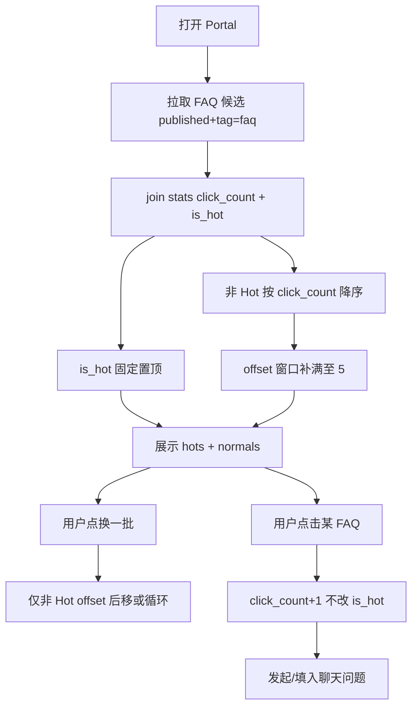

# P2-F06 Portal FAQ 推荐

> Portal（`{subdomain}.lxzxai.com`）展示可点击 FAQ 快捷问；`is_hot` 置顶带 `hot`；支持「换一批」（仅轮换非 Hot）。

| 字段 | 值 |
|------|-----|
| **Status** | `done` |
| **Owner** | |
| **Approved by** | |
| **Approved at** | 2026-07-24 |

> Status：`draft` → `review` → `approved` → `done`。未 `approved` 不得实现，见 [00-constraints.mdc](../../../../.cursor/rules/00-constraints.mdc) §8。

## 范围

- Portal 首屏/聊天区旁展示 **N=5** 条 FAQ 建议题（**布局壳、空态、Composer 归属 [P2-F07](P2-F07-portal-shell.md)**）
- 数据源：本租户 **published** 且 `tag=faq` 的 latest 文档（题面优先 `title`；可选截断摘要）
- **Hot**：由 `faq_suggestion_stats.is_hot` **字段**标识；`response.hot === is_hot`；所有 Hot 固定置顶
- 非 Hot：按 **click_count** 降序，补位至 `FAQ_PAGE_SIZE=5`
- 「换一批」：仅轮换 **非 Hot** 段（circular）；Hot 段不动
- 点击某 FAQ：计入热度 +1，并预填/发送为用户问题进入 P1-F06 会话（draft 态下的落库时机见 P2-F07）

## 非范围

- Portal 整体布局 / 色调 / New task 延迟会话（P2-F07）
- Admin UI 开关 Hot（可用种子/脚本写 `is_hot`）
- 非 faq tag 文档进入推荐池
- 跨租户热度

## Flow

## 行为规则

1. 候选不足 5 条：有几条展示几条；无候选则隐藏 FAQ 区（不报错）。
2. `hot` **仅**来自 `is_hot` 字段；Hot 条始终排在非 Hot 之前。
3. 「换一批」只推进非 Hot 池的 `offset`；返回列表中 Hot 段不变。
4. 热度存储按 `document_group_id` 计 **click_count**；仅点击推荐条 +1，自由输入聊天不加 FAQ 热度；点击 **不改** `is_hot`。
5. 无 stats 行视为 `is_hot=false`、`click_count=0`。
6. 未 published / 非 faq / 软删 → 不出现在池中。
7. 租户隔离；Portal 需按现有 P1-F05/P1-F06 登录策略（与 Phase 1 一致：成员登录后使用）。

## 数据与边界

| 实体 | 关键字段 / 约束 |
|------|----------------|
| faq_suggestion_stats | `tenant_id`, `document_group_id`, `click_count` ≥ 0，`is_hot` boolean NOT NULL DEFAULT false |

常量：`FAQ_PAGE_SIZE=5`。

## Test Cases

| ID | 步骤 | 期望 | 类型 |
|----|------|------|------|
| P2-F06-T01 | Given 租户有 ≥5 条 published FAQ 且 2 条 `is_hot` When GET suggestions | Then 返回 5 条；前 2 条 `hot=true`；后 3 条 `hot=false` | api |
| P2-F06-T02 | Given 有 `is_hot` 条且非 Hot 的 click 更高 When 展示 | Then `is_hot` 条仍排在非 Hot 之前且带 hot | api |
| P2-F06-T03 | Given 点击某条 FAQ When 计数 | Then 该条 `click_count` +1；`is_hot` 不变；可触发聊天内容=题面 | api |
| P2-F06-T04 | Given 有 Hot + 多条非 Hot When 换一批 | Then Hot 仍在前；下方非 Hot 变为下一段（或循环） | api |
| P2-F06-T05 | Given 仅 2 条 FAQ When GET | Then 返回 2 条；不 500 | api |
| P2-F06-T06 | Given draft/非 faq When GET suggestions | Then 不出现 | api |
| P2-F06-T07 | Given tenant-A 热度 When tenant-B GET | Then 不可见 A 的题与计数 | api |
