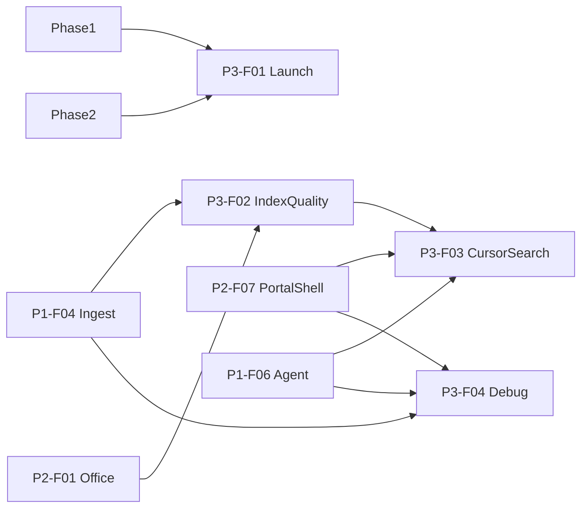

# 01 Feature 清单（Phase 3）

Phase 索引见 [../01-phase-list.md](../01-phase-list.md)。  
状态规则见 [00-constraints.mdc](../../../.cursor/rules/00-constraints.mdc) §8；**仅 `approved` / `done` 可实现**。  
ID 格式：`P3-F{nn}`。

| ID | 名称 | Status | 域名表面 | 依赖 | Spec |
|----|------|--------|----------|------|------|
| P3-F01 | 生产上线与主 Flow | `draft` | `lxzxai.com` / `*.lxzxai.com` | P1 + P2 主路径 | [P3-F01-production-launch.md](features/P3-F01-production-launch.md) |
| P3-F02 | 索引质量增强 | `draft` | 后台 / 摄入 | P1-F04, P2-F01 | [P3-F02-index-quality.md](features/P3-F02-index-quality.md) |
| P3-F03 | Portal 搜索 Cursor 风 | `draft` | `{tenant}.lxzxai.com` | P2-F07, P1-F06, P3-F02 | [P3-F03-portal-cursor-search.md](features/P3-F03-portal-cursor-search.md) |
| P3-F04 | Debug Page（检索 / Agent 透视） | `draft` | `{tenant}.lxzxai.com/admin/debug` | P1-F04, P1-F06, P2-F07 | [P3-F04-debug-page.md](features/P3-F04-debug-page.md) |

