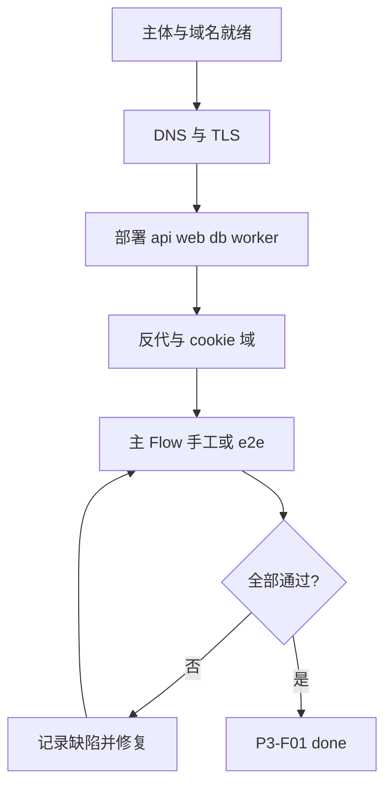

# P3-F01 生产上线与主 Flow

> 完成主体/域名就绪记录、生产部署与证书，并按主业务路径做可勾选验收（本 Spec 描述验收标准，不代替真实注册与运维操作本身）。

| 字段 | 值 |
|------|-----|
| **Status** | `approved` |
| **Owner** | fanghouhong |
| **Approved by** | fanghouhong |
| **Approved at** | 2026-07-29 |

> ID：`P3-F01`。未 `approved` 不得实现，见 [00-constraints.mdc](../../../../.cursor/rules/00-constraints.mdc) §8。

## 范围

- **主体与域名就绪**：公司/主体注册完成有据可查；`lxzxai.com` 与通配 `*.lxzxai.com` DNS 指向生产入口；TLS 证书有效
- **生产部署**：`apps/api` + `apps/web` + PostgreSQL/pgvector 按 [deploy](../../../../deploy) 约定上线；反代提供 `/backend/*`；cookie `Domain=.lxzxai.com`
- **主 Flow 验收清单**（端到端可测）：
  1. 主站 Email 注册 → 选定 `tenant_name` → 进入 `{tenant}.lxzxai.com`
  2. 登录会话跨主站/子域可用
  3. `/admin` 上传 → review → publish → 摄入 `ready`
  4. Portal 提问命中已发布知识（或明确无相关内容）
  5. 冒烟：对外 API 或 Embed Widget（若该租户已配置）至少一条成功路径
- 运行手册：回滚、日志位置、密钥仅环境变量

## 非范围

- 微信登录、SOP 门禁（Phase 4）
- 索引算法增强（P3-F02）、Portal Cursor 风 UI（P3-F03）
- 本仓库 CI 代替生产放量；多区域多活

## Flow

## 行为规则

1. 生产配置不得提交密钥；`.env` / 密钥托管在部署环境。
2. 未知 `tenant_name` Host → 404；跨租户 403/404（与 constraints 一致）。
3. 主 Flow 每步须有可保存证据（截图、e2e 报告或 runbook 勾选记录）。
4. 证书到期前须有续期说明（runbook 一节即可）。
5. 本地 `/etc/hosts` 模拟**不算**本 Feature 生产验收通过。
6. 主域名由 `APEX_HOST` 配置；API 与 Web 必须据此识别主站及 `{tenant_name}.{APEX_HOST}`，默认值仍为 `lxzxai.com`。
7. 集成镜像上传脚本从未提交的 `scripts/integration_env.conf` 读取服务器与密码；真实密码不得写入脚本、示例配置或 Git。

## 数据与边界

| 项 | 说明 |
|----|------|
| 证据包 | 域名解析记录、证书有效期、部署版本 git SHA、主 Flow 勾选表 |
| 环境 | `production`；与 local-dev 分离 |

## Test Cases

| ID | 步骤 | 期望 | 类型 |
|----|------|------|------|
| P3-F01-T01 | Given 生产 DNS When 查询 `lxzxai.com` 与 `*.lxzxai.com` | Then 指向约定入口；HTTPS 证书链有效 | e2e |
| P3-F01-T02 | Given 生产环境 When 完成注册+选定 tenant | Then 可打开 `{tenant}.lxzxai.com`；会话 cookie Domain 含 `.lxzxai.com` | e2e |
| P3-F01-T03 | Given 成员 When admin 上传 txt/pdf 并 publish | Then 摄入 `ready`；Portal 可问到独特短语或明确无命中话术 | e2e |
| P3-F01-T04 | Given 未知子域 Host When 访问 | Then 404 | e2e |
| P3-F01-T05 | Given 已配置 API Key 或 Widget When 冒烟调用 | Then 至少一条 200 成功路径（或显式跳过并记录「未配置」） | e2e |
| P3-F01-T06 | Given 部署文档与上传脚本 When 审查 | Then 含回滚步骤与日志位置；上传脚本从被忽略的配置读取服务器与密码；无密钥入库 | unit |
| P3-F01-T07 | Given `APEX_HOST=lxzai.dev.com` When 解析主站和租户 Host | Then 接受 `lxzai.dev.com` 与 `{tenant}.lxzai.dev.com`，不再接受其他主域名下的租户 Host | unit |
