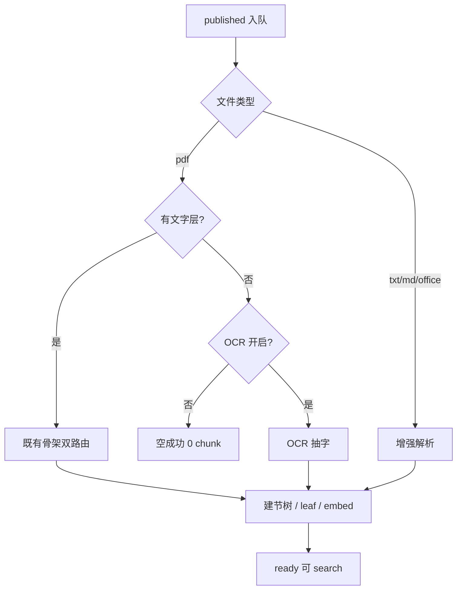

# P3-F02 索引质量增强

> 增强 txt / pdf / Office 摄入质量：可选 OCR、更稳的表格与标题结构；在不破坏租户隔离与 published 门禁的前提下提升可检索性。

| 字段 | 值 |
|------|-----|
| **Status** | `draft` |
| **Owner** | |
| **Approved by** | |
| **Approved at** | |

> ID：`P3-F02`。依赖 [P1-F04](../../phase1/features/P1-F04-doc-ingestion.md)、[P2-F01](../../phase2/features/P2-F01-office-ooxml.md)。未 `approved` 不得实现。

## 范围

- **OCR（可配置）**：扫描件/无文字层 PDF 在 `PDF_OCR=true`（或等价 Settings）时可抽取文字再进节树；默认关闭以兼容 P1 空成功语义
- **结构增强**：PDF/Office 表格与标题边界更稳（减少碎节、跨表粘连）；txt/md 标题识别保持与 P1-F04 一致并修边界 bug
- **标题深度**：在现有 H1–H6 叶节模型上，允许配置「展示/path 保留更深标题信息」；**默认仍映射到 ≤H6 叶节**（无限深物理树属后续，不在本 Feature 强制）
- 回归：仅 `published` + ready 可检索；`tenant_id` 强制过滤；Office 仍走 P2-F01 轻量路径（非 Docling），PDF 结构路径规则不回退为「假结构成功」

## 非范围

- 改 publish 状态机（P1-F03）
- Portal UI（P3-F03）
- 跨租户共享索引
- 商业云 OCR 强绑定（可适配接口，但须可 mock 验收）

## Flow

## 行为规则

1. 默认 `PDF_OCR=false`：无字 PDF 行为与 P1-F04 一致（succeeded + 0 chunk）。
2. `PDF_OCR=true`：无字 PDF 须尝试 OCR；成功则有可检索文本；失败 → `ingest_status=failed` + 可诊断错误（与损坏文件一致可测）。
3. 表格：优先整表进节；超长按 P1-F04 表感知切分，禁止无意义碎条爆炸（单测：表行不跨叶乱序）。
4. Office：延续 P2-F01；本 Feature 只验收质量回归与表格/标题边界增强，不改魔数准入。
5. 租户隔离与 published 门禁测试必须保留（从 P1-F04 抽至少 2 条回归）。

## 数据与边界

| 项 | 约束 |
|----|------|
| Settings | `PDF_OCR`（bool，默认 false）；可选 `PDF_OCR_LANG` |
| parse_route | 可新增 `ocr` 或在日志标注 `ocr=true`；须可观测 |
| 表结构 | 不强制新表；chunk/section 语义同 P1-F07 |

## Test Cases

| ID | 步骤 | 期望 | 类型 |
|----|------|------|------|
| P3-F02-T01 | Given OCR 关闭 + 无字 PDF publish When 摄入 | Then ready；0 chunk（P1 兼容） | api |
| P3-F02-T02 | Given OCR 开启 + 无字但可 OCR 的 PDF When 摄入 | Then ready；search 命中 OCR 文本独特短语 | api |
| P3-F02-T03 | Given 含复杂表的 pdf/docx/xlsx When 摄入 | Then 表内容可检索；无明显跨表粘连（断言 path/content） | api |
| P3-F02-T04 | Given tenant-A 语料 When tenant-B search | Then 0 命中 | api |
| P3-F02-T05 | Given review 未 publish When 强行索引 | Then 无可检索 is_latest chunk | api |
| P3-F02-T06 | Given OCR 开启但引擎失败 When 摄入 | Then failed；error 非空；可重试 | api |
