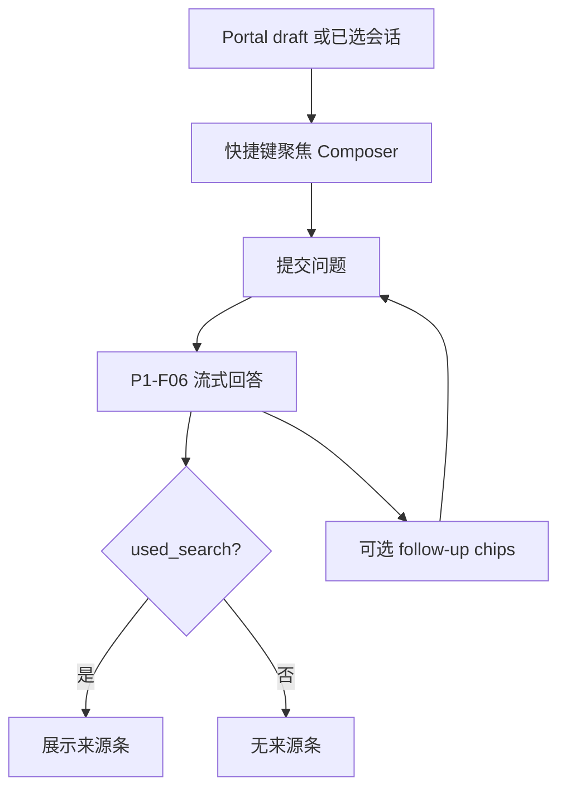

# P3-F03 Portal 搜索 Cursor 风

> 在 P2-F07 Portal 壳上，将搜索/对话体验增强为接近 Cursor 产品节奏：键盘优先、高密度对话、清晰引用来源、流式回答（不复制 Cursor 品牌资产）。

| 字段 | 值 |
|------|-----|
| **Status** | `draft` |
| **Owner** | |
| **Approved by** | |
| **Approved at** | |

> ID：`P3-F03`。依赖 [P2-F07](../../phase2/features/P2-F07-portal-shell.md)、[P1-F06](../../phase1/features/P1-F06-rag-agent.md)、[P3-F02](P3-F02-index-quality.md)。未 `approved` 不得实现。

## 范围

- **键盘优先**：`/` 或 `⌘K`（Windows：`Ctrl+K`）聚焦 Composer；Esc 失焦/关闭辅助面板
- **高密度对话区**：消息列表紧凑；代码/引用块可读；减少装饰性卡片
- **引用来源**：当 Agent 使用了 `search_knowledge` 时，UI 展示可展开的来源条（文档标题 / path / 节摘要）；无检索则不展示空来源壳
- **流式回答**：沿用 SSE/流式接口；首 token 与完成态可感知（loading / 完成）
- **Follow-up**：回答后提供 0–3 条建议追问（可来自模型或规则）；点击即发送（draft 延迟落库规则同 P2-F07）
- 视觉：延续 P2-F07 中性壳；**禁止**套用 Cursor 商标/官方配色照搬

## 非范围

- 重构 Agent Loop 工具白名单（仍仅 `search_knowledge`，除非另开 Feature）
- Admin、Widget 外观
- 多模态附件聊天

## Flow

## 行为规则

1. 快捷键不与浏览器原生冲突到无法使用；在输入框已聚焦时 `/` 可插入字符而非抢焦点（与常见 IDE 习惯一致：仅全局未聚焦时触发）。
2. 来源条数据来自本轮工具结果（section path / document title）；点击来源可复制 path 或滚动高亮（Phase 3：**至少复制 path**）。
3. Follow-up 不超过 3 条；可关闭；不强制每轮都有。
4. 延迟会话（P2-F07）仍然有效：New task 不落库。
5. 租户隔离与防编造话术不变（P1-F06）。

## 数据与边界

| 项 | 约束 |
|----|------|
| 来源 UI 模型 | `{ document_title?, path, snippet? }[]` 由 chat 响应或 SSE 事件带出 |
| 无新业务表 | follow-up 可不落库 |

## Test Cases

| ID | 步骤 | 期望 | 类型 |
|----|------|------|------|
| P3-F03-T01 | Given Portal 未聚焦输入 When 按 ⌘K 或 / | Then Composer 获焦 | e2e |
| P3-F03-T02 | Given 知识库可命中 When 提问 | Then 流式完成后可见至少一条来源（path 非空） | e2e |
| P3-F03-T03 | Given 寒暄无检索 When 提问 | Then 不展示空来源面板 | e2e |
| P3-F03-T04 | Given 有 follow-up chip When 点击 | Then 发送该文案为用户消息（draft 则触发延迟落库） | e2e |
| P3-F03-T05 | Given 桌面布局 When 查看对话区 | Then 无多卡片仪表盘空态；侧栏+主区+Composer 仍在（P2-F07） | e2e |
| P3-F03-T06 | Given tenant-A 来源 When tenant-B | Then 不可见 A 的 path/内容 | api |
