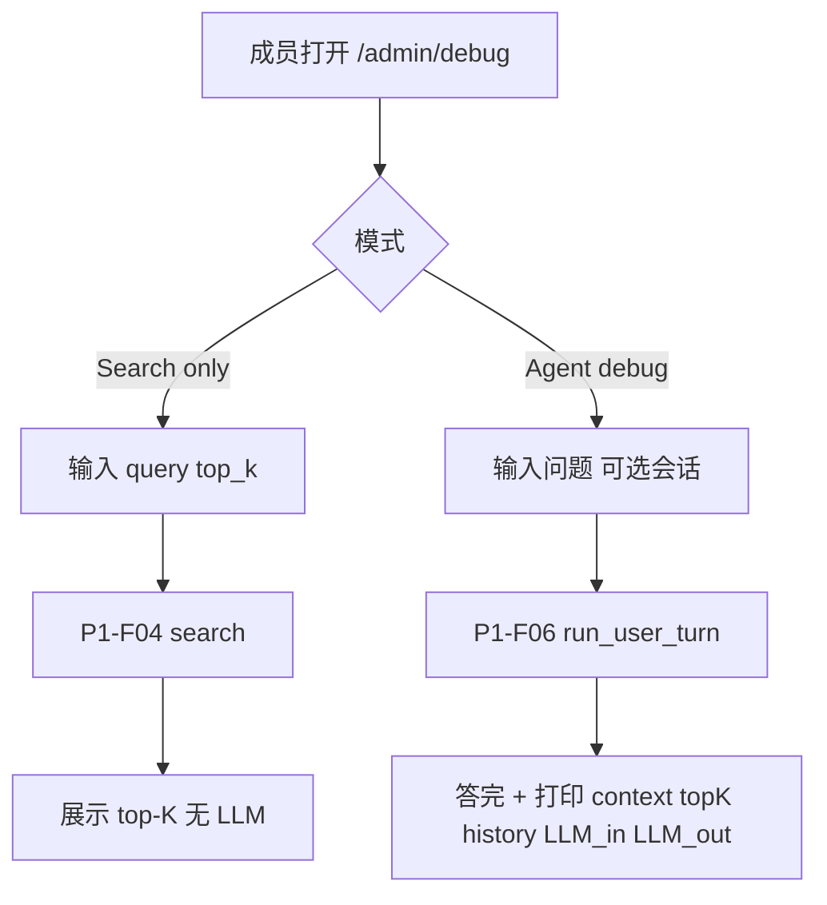

# P3-F04 Debug Page

> 租户 Debug 页：① 纯向量/知识检索（不进 LLM）验证索引质量；② 与 Portal 同路径的问答，但展开打印上下文、top-K、历史、LLM 请求与返回，便于排障。

| 字段 | 值 |
|------|-----|
| **Status** | `approved` |
| **Owner** | |
| **Approved by** | |
| **Approved at** | |

> ID：`P3-F04`。依赖 [P1-F04](../../phase1/features/P1-F04-doc-ingestion.md)、[P1-F06](../../phase1/features/P1-F06-rag-agent.md)、[P2-F07](../../phase2/features/P2-F07-portal-shell.md)。未 `approved` 不得实现。

## 范围

- 路由：`{tenant_name}.lxzxai.com/admin/debug`（仅租户成员；与 `/admin` 同会话门禁）
- **模式 A — Search only**：输入 query + `top_k` → 调用与 Portal/Agent 相同的 `search(tenant_id, query, top_k)`（P1-F04）；**不**调用 LLM；页面展示命中列表（path、节全文/摘要、分数若有）
- **模式 B — Agent debug**：输入与 Portal 等价（可带 `conversation_id` 或 draft 首问）；走 P1-F06 Agent Loop；UI **额外**只读面板打印：
  1. 组装后的 **上下文**（system / 规则 / 压缩历史摘要 / 本轮注入片段的结构化视图）
  2. **top-K** 检索原始结果（与模式 A 同形）
  3. **历史消息**（本会话送入模型前的列表）
  4. **LLM 调用信息**（模型名、超时、step、tool_calls 摘要；**禁止**打印 API Key）
  5. **LLM 返回**（各 step 的 raw/规范化 content 与最终 answer）
- 检索语义、租户隔离、published 门禁与 Portal/生产路径一致（同一 `search` / `run_user_turn`；独立 debug HTTP 门面附加 `debug` 字段，不另写检索或 Agent）

## 非范围

- 对匿名用户或跨租户开放 Debug
- 修改索引算法（P3-F02）或 Portal 正式 UI（P3-F03）
- 在生产对所有租户默认开启；环境开关 `ENABLE_ADMIN_DEBUG`（默认 `false`；Staging/本地建议 `true`）
- 持久化 debug dump 到长期表（可选一次性下载 JSON；Phase 3 不强制落库）
- 在 Portal chat 契约上加 `debug=true`（Debug 仅走独立 Admin API）
- 前端另设 `NEXT_PUBLIC_ENABLE_ADMIN_DEBUG`（开关以 API 侧 `ENABLE_ADMIN_DEBUG` 为准；关闭时页面/API 均 404）

## Flow

## 行为规则

1. 未登录访问 `/admin/debug` 页面 → 与现有 `/admin` 一致（前端重定向登录）；未登录调用 debug API → **401**；非本租户成员 → **403**（同 P1-F02）。
2. Search only：**零** LLM HTTP 调用（测试可用 mock 计数断言）。
3. Agent debug：行为结果（最终用户可见回答）须与同输入的 Portal 路径一致（允许时间戳等非功能差异）；debug 面板仅附加信息。
4. Debug 载荷不得包含其他租户数据；`tenant_id` 仅来自 Host/会话。
5. 密钥、完整 `Authorization`、embedding API Key 不得出现在 UI/日志面板。
6. `top_k` 默认 **5**（与 P1-F06），页面可改，请求上限 **20**。
7. 若 `ENABLE_ADMIN_DEBUG=false`：`/admin/debug` 页面与 `POST /v1/admin/debug/*` 均返回 **404**。

## 实现约束

独立 `POST /v1/admin/debug/*` 仅为 **HTTP 门面**（成员鉴权 + `ENABLE_ADMIN_DEBUG` + 响应塑形），**禁止**复制检索或 Agent 业务逻辑：

1. `POST /v1/admin/debug/search` 必须调用与 P1-F04 / public search 相同的 `KnowledgeSearcher.search(tenant_id, query, top_k)`。
2. `POST /v1/admin/debug/chat` 必须调用与 Portal 相同的 `resolve_conversation_for_portal_message` + `run_user_turn(..., user_id=...)`。
3. 禁止另写向量查询或第二套 Agent Loop。
4. `debug` 载荷从既有 `LoopResult` / 上下文组装（如 `assemble_messages`）导出；响应与日志中不得出现 API Key / embedding key。

## 数据与边界

| 项 | 约束 |
|----|------|
| API | `POST /v1/admin/debug/search`；`POST /v1/admin/debug/chat` |
| Search 请求 | `{ query, top_k? }`；`top_k` 默认 5，范围 1–20 |
| Search 响应 | `{ hits: [{ path, content, score?, document_id?, section_id?, chunk_id? }] }` |
| Chat 请求 | 与 Portal 等价：`content` + 可选 `conversation_id`（缺省则 draft 首问） |
| Chat debug 响应 | 正常 chat 字段（对齐 Portal `TurnReply`）+ `debug: { context_messages, top_k_hits, history, llm_calls: [{ step, request_summary, response_summary }] }` |
| 无新业务表 | 是 |

## Test Cases

| ID | 步骤 | 期望 | 类型 |
|----|------|------|------|
| P3-F04-T01 | Given 成员 + 已索引独特短语 When Search only | Then 命中含该短语；过程无 LLM 调用 | api |
| P3-F04-T02 | Given 未 publish 文档短语 When Search only | Then 不命中 | api |
| P3-F04-T03 | Given tenant-A 语料 When tenant-B Search only | Then 0 命中 | api |
| P3-F04-T04 | Given 成员 When Agent debug 可命中问题 | Then 有最终回答；debug 含 top_k、context、history、至少一次 llm_calls；无 API Key 字符串 | api |
| P3-F04-T05 | Given 未登录 When 访问 `/admin/debug` | Then 与现有 `/admin` 一致（重定向登录）；When 调 debug API | Then 401 | e2e |
| P3-F04-T06 | Given `ENABLE_ADMIN_DEBUG=false` When 访问 `/admin/debug` 或 debug API | Then **404** | api |
| P3-F04-T07 | Given 同一 mock LLM + 同一输入 When Portal chat vs Agent debug | Then 最终 `assistant.content` **逐字一致** | api |
